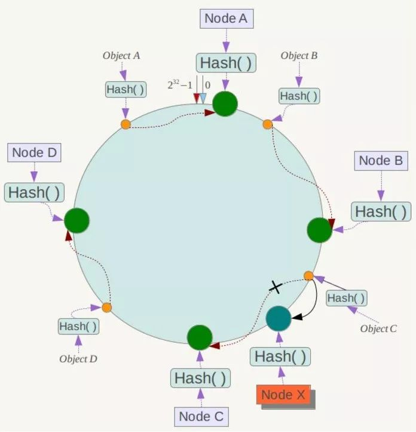

[TOC]

# 为什么需要一致性哈希算法

## 1. 如果没有一致性哈希算法，会出现什么为题

### 1.1 取模哈希的问题

1. 假设计算哈希后，对服务器数量取模来进行负载均衡。那么当服务器数量变化时，大部分哈希值就会改变：8%5=3, 8%4=0. 但是3%4=3%5. 这将导致，原来通过哈希取模存储的数据，很多都找不到了（如扩容之后）。当应用无法从缓存中获取数据时，则会向后端数据库请求数据（造成[缓存雪崩](https://mp.weixin.qq.com/s?__biz=MzI1NDQ3MjQxNA==&mid=2247485464&idx=1&sn=8d690fc6f878aadf75977aa7e76cfd08&chksm=e9c5f1a9deb278bf512d8b40c30240d0168cdf2cf02142ee913bc11ec39637ca380a4dad524b&scene=21#wechat_redirect)）。

# 一致性哈希算法如何解决这个问题

1. 一致性哈希中，被除数不变（如2^32），那么哈希值也不会变。
2. 那么没有和服务器数量关联起来，哈希取模后如何找到对应的服务器呢？将模看做一个圆环（0~2^32），将服务器也映射到这个圆环上，一个普通key映射到这环上后，然后顺时针找第一个服务器节点，就是要找的服务器节点。
   1. 是否是均匀的？是不均匀的，节点少时，可能大量的都会映射到一个节点上。
      1. 增加虚拟节点，如：`nodeA#1、nodeA#2、nodeB#1、nodeB#2`来减少不均匀性。（这样好像也不能保证解决了问题）
      2. [一致性哈希算法的理解与实践](https://yikun.github.io/2016/06/09/%E4%B8%80%E8%87%B4%E6%80%A7%E5%93%88%E5%B8%8C%E7%AE%97%E6%B3%95%E7%9A%84%E7%90%86%E8%A7%A3%E4%B8%8E%E5%AE%9E%E8%B7%B5/)这里面介绍了一种将环等分，然后节点负责的环区域，由其所在的环等分区域决定的办法。如果节点数刚好和分区数相等，理论上是可以均匀分布的（似乎需要看当前等分区是否被占用，占用了就找下一个等分区这样的方法来保证均匀。那么此时增删节点后，会增加不均匀性）。
   2. 这个查找耗时么？二分查找么？
   3. 增删节点时怎么办？增加删除节点后，变化的只是一小段环的数据（新增删除节点的环空间：逆时针方向的那一段）
   4. 

# 优缺点分析

1. 与普通的取模哈希相比，一致性哈希节点变化时，只有一小段哈希会受影响，有效的避免了缓存雪崩问题。
2. 查找节点，大概需要log(节点数)级别的时间。
3. 均匀性问题，似乎还是没有那么好的解决。环等分发似乎要在增删节点后，定期重整等分才能保证等分。

# 参考资料

1. [面试必备：什么是一致性Hash算法？](https://zhuanlan.zhihu.com/p/34985026)