[TOC]

**本文主要是对[理解分布式事务](<https://juejin.im/post/5c0e5bf8e51d45063322fe50>) 的学习整理**

# 1. 什么是分布式事物

## 1.1 什么是事物

1. 事务提供一种机制将一个活动涉及的所有操作纳入到一个不可分割的执行单元，组成事务的所有操作只有在所有操作均能正常执行的情况下方能提交，只要其中任一操作执行失败，都将导致整个事务的回滚。简单地说，事务提供一种“ **要么什么都不做，要么做全套（All or Nothing）**”机制。

## 1.2 数据库事物的ACID**属性**，注意是属性

1. 原子性（atomic）： 事物的所有操作，要么全部执行成功，要么全部执行失败，不能停留在某个中间环节。
2. 一致性（consistency）：事物开始和接收后，数据的一致性约束没有被破坏。例如：现有完整性约束A+B=100，如果一个事务改变了A，那么必须得改变B，使得事务结束后依然满足A+B=100，否则事务失败。
3. 隔离性（isolation）：多个并发执行的事物相互不影响。
4. 持久性（durable）：事务处理结束后，对数据的修改就是永久的，即便系统故障也不会丢失。

注：什么时候该使用数据库事务？业务上有一组数据操作，需要如果其中有任何一个操作执行失败，整组操作全部不执行并恢复到未执行状态。

## 1.3 什么是分布式事务

1. 分布式事务是指事务的参与者、支持事务的服务器、资源服务器以及事务管理器分别位于不同的分布式系统的不同节点之上。

- 如减少库存和生成订单的功能分布在不同的服务和数据库中。

# 2. 分布式事物的难点

1. **事务的原子性** 事务操作跨不同节点，当多个节点某一节点操作失败时，需要保证多节点操作的**要么什么都不做，要么做全套（All or Nothing）**的原子性。
2. **事务的一致性** 当发生网络传输故障或者节点故障，节点间数据复制通道中断，在进行事务操作时需要保证数据一致性，保证事务的任何操作都不会使得数据违反数据库定义的约束、触发器等规则。
3. **事务的隔离性** 事务隔离性的本质就是如何正确多个并发事务的处理的读写冲突和写写冲突，因为在分布式事务控制中，可能会出现提交不同步的现象，这个时候就有可能出现“部分已经提交”的事务。此时并发应用访问数据如果没有加以控制，有可能出现“脏读”问题。

# 3. 分布式系统的一致性

前面介绍到的分布式事务的难点涉及的问题，最终影响是导致数据出现不一致，下面对分布式系统的一致性问题进行理论分析，后面将基于这些理论进行分布式方案的介绍。

## 3.1 可用性和一致性的冲突 —— CAP理论

1. **CAP理论**:在一个分布式系统（指互相连接并共享数据的节点的集合）中，当涉及读写操作时，只能保证一致性（Consistence）、可用性（Availability）、分区容错性（PartitionTolerance）三者中的两个，另外一个必须被牺牲
   - **C - Consistency 一致性**: A read is guaranteed to return the most recent write for a given client. 对某个指定的客户端来说，读操作保证能够返回最新的写操作结果。
     - 这里并不是强调同一时刻拥有相同的数据，对于系统执行事务来说，在事务执行过程中，系统其实处于一个不一致的状态，不同的节点的数据并不完全一致
     - 一致性强调客户端读操作能够获取最新的写操作结果，是因为事务在执行过程中，客户端是无法读取到未提交的数据的，只有等到事务提交后，客户端才能读取到事务写入的数据，而如果事务失败则会进行回滚，客户端也不会读取到事务中间写入的数据
   - **A - Availability 可用性**: A non-failing node will return a reasonable response within a reasonable amount of time (no error or timeout). 非故障的节点在合理的时间内返回合理的响应（不是错误和超时的响应）
     - 这里强调的是合理的响应，不能超时，不能出错。注意并没有说“正确”的结果，例如，应该返回 100 但实际上返回了 90，肯定是不正确的结果，但可以是一个合理的结果。
   - **P - Partition Tolerance 分区容忍性**:The system will continue to function when network partitions occur. 当出现**网络分区**后，系统能够继续“履行职责”。
     - 这里**网络分区**是指： 一个分布式系统里面，节点组成的网络本来应该是连通的。然而可能因为一些故障（节点间网络连接断开、节点宕机），使得有些节点之间不连通了，整个网络就分成了几块区域，数据就散布在了这些不连通的区域中。
     - 因为网络本身无法做到 100% 可靠，有可能出故障，所以分区是一个必然的现象

### 3.1.1 一致性、可用性、分区容忍性的选择

1. CAP 定理又被称作布鲁尔定理，是加州大学的计算机科学家布鲁尔在 2000 年提出的一个猜想。2002 年，麻省理工学院的赛斯·吉尔伯特和南希·林奇发表了布鲁尔猜想的证明，使之成为分布式计算领域公认的一个定理。
2. 因为网络本身无法做到 100% 可靠，有可能出故障，所以分区是一个必然的现象。也就是考虑网络间连接断开、节点宕机这些情况会发生。
   1. 如果需要系统继续履行职责(P)，那么为了让节点能获取最新的写结果（C），只有禁止写入，此时写入操作会返回error，违反可用性（A）。
   2. 如果需要系统继续履行职责(P)，且要让节点返回合理的结果（A），那么此时就有一些节点不能获取到最新的写入结果，违反一致性（C）。
   3. 如果让系统不继续履行职责(P)，那么系统就被破坏了。
3. 为了在出现网络故障、宕机时，系统能继续履行职责。那么能获取最写新结果和在合理时间内获取合理的结果就要二选一。要么禁止写入来让所有节点都是最新写结果，要么让某些节点不是最新结果来允许写入。

## 3.2 CAP理论的延伸——BASE**理论**

1. BASE 是指基本可用（Basically Available）、软状态（ Soft State）、最终一致性（ Eventual Consistency），核心思想是即使无法做到强一致性（CAP 的一致性就是强一致性），但应用可以采用适合的方式达到最终一致性。
   - **BA - Basically Available 基本可用** 分布式系统在出现故障时，允许损失部分可用性，即保证核心可用。
   - **S - Soft State 软状态** 允许系统存在中间状态，而该中间状态不会影响系统整体可用性。这里的中间状态就是 CAP 理论中的数据不一致。
   - **E - Eventual Consistency 最终一致性** 系统中的所有数据副本经过一定时间后，最终能够达到一致的状态。
2. AP 方案中牺牲一致性只是指发生分区故障期间，而不是永远放弃一致性。 这一点其实就是 BASE 理论延伸的地方，分区期间牺牲一致性，但分区故障恢复后，系统应该达到最终一致性。

## 3.3 数据一致性模型

1. **强一致性** 要求无论更新操作是在哪个数据副本上执行，之后所有的读操作都要能获得最新的数据。对于单副本数据来说，读写操作是在同一数据上执行的，容易保证强一致性。对多副本数据来说，则需要使用分布式事务协议。
2. **弱一致性** 在这种一致性下，用户读到某一操作对系统特定数据的更新需要一段时间，我们将这段时间称为"不一致性窗口"。
   1. **最终一致性** 是弱一致性的一种特例，在这种一致性下系统保证用户最终能够读取到某操作对系统特定数据的更新（读取操作之前没有该数据的其他更新操作）。"不一致性窗口"的大小依赖于交互延迟、系统的负载，以及数据的副本数等。

## 3.4 柔性事物

### 3.4.1 柔性事务的概念

> 在电商等互联网场景下，传统的事务在数据库性能和处理能力上都暴露出了瓶颈。在分布式领域基于CAP理论以及BASE理论，有人就提出了**柔性事务**的概念。
>
> 基于BASE理论的设计思想，柔性事务下，在不影响系统整体可用性的情况下(Basically Available 基本可用)，允许系统存在数据不一致的中间状态(Soft State 软状态)，在经过数据同步的延时之后，最终数据能够达到一致。**并不是完全放弃了ACID，而是通过放宽一致性要求，借助本地事务来实现最终分布式事务一致性的同时也保证系统的吞吐**。

### 3.4.2 实现柔性事务的一些特性

#### 1. **可见性(对外可查询)**

> 在分布式事务执行过程中，如果某一个步骤执行出错，就需要明确的知道其他几个操作的处理情况，这就需要其他的服务都能够提供查询接口，保证可以通过查询来判断操作的处理情况。
>
> 为了保证操作的可查询，需要对于每一个服务的每一次调用都有一个全局唯一的标识，可以是业务单据号（如订单号）、也可以是系统分配的操作流水号（如支付记录流水号）。除此之外，操作的时间信息也要有完整的记录。

#### 2. **操作幂等性**

> 幂等性，其实是一个数学概念。幂等函数，或幂等方法，是指可以使用相同参数重复执行，并能获得相同结果的函数。幂等操作的特点是其任意多次执行所产生的影响均与一次执行的影响相同。也就是说，同一个方法，使用同样的参数，调用多次产生的业务结果与调用一次产生的业务结果相同。
>
> 之所以需要操作幂等性，是因为为了保证数据的最终一致性，很多事务协议都会有很多重试的操作，如果一个方法不保证幂等，那么将无法被重试。幂等操作的实现方式有多种，如在系统中缓存所有的请求与处理结果、检测到重复操作后，直接返回上一次的处理结果等。

# 4. 常见分布式事物解决方案

## 4.1 2PC(二阶段提交)方案 —— 强一致性

### **阶段1：准备阶段**

> 1、协调者向所有参与者发送事务内容，询问是否可以提交事务，并等待所有参与者答复。
>
> 2、**各参与者执行事务操作，将undo和redo信息记入事务日志中（但不提交事务）**。
>
> 3、如参与者执行成功，给协调者反馈yes，即可以提交；如执行失败，给协调者反馈no，即不可提交。

### **阶段2：提交阶段**

如果协调者收到了参与者的失败消息或者超时，直接给每个参与者发送回滚(rollback)消息；否则，发送提交(commit)消息；参与者根据协调者的指令执行提交或者回滚操作，释放所有事务处理过程中使用的锁资源。

#### **情况1，当所有参与者均反馈yes，提交事务**：

> - 1、协调者向所有参与者发出正式提交事务的请求（即commit请求）。
> - 2、参与者执行commit请求，并释放整个事务期间占用的资源。
> - 3、各参与者向协调者反馈ack(应答)完成的消息。
> - 4、协调者收到所有参与者反馈的ack消息后，即完成事务提交。

#### **情况2，当任何阶段1一个参与者反馈no，中断事务**：

> - 1、协调者向所有参与者发出回滚请求（即rollback请求）。
> - 2、参与者使用阶段1中的undo信息执行回滚操作，并释放整个事务期间占用的资源。
> - 3、各参与者向协调者反馈ack完成的消息。
> - 4、协调者收到所有参与者反馈的ack消息后，即完成事务中断。

### 方案总结

2PC方案实现起来简单，实际项目中使用比较少，主要因为以下问题：

- 性能问题 所有参与者在事务提交阶段处于同步阻塞状态，占用系统资源，容易导致性能瓶颈。（缺少开启事物前的事先检查，一收到参与者的准备请求就开始执行事物）
- 可靠性问题 如果协调者存在单点故障问题，如果协调者出现故障，参与者将一直处于锁定状态。（缺少超时处理?）
- 数据一致性问题 在阶段2中，如果发生局部网络问题，一部分事务参与者收到了提交消息，另一部分事务参与者没收到提交消息，那么就导致了节点之间数据的不一致。

## 4.2 3PC(三阶段提交)方案

### **阶段1：canCommit** : 事先检查，减少加锁时间

协调者向参与者发送commit请求，参与者如果可以提交就返回yes响应(参与者不执行事务操作)，否则返回no响应

### **阶段2：preCommit**：检查通过，执行事务；否则终止事物。

协调者根据阶段1 canCommit参与者的反应情况来决定是否可以基于事务的preCommit操作。根据响应情况，有以下两种可能。

- **情况1：阶段1所有参与者均反馈yes，参与者预执行事务：**

> - 1、协调者向所有参与者发出preCommit请求，进入准备阶段。
> - 2、**参与者收到preCommit请求后，执行事务操作，将undo和redo信息记入事务日志中（但不提交事务）**。
> - 3、各参与者向协调者反馈ack响应或no响应，并等待最终指令。

- **情况2：阶段1任何一个参与者反馈no，或者等待超时后协调者尚无法收到所有参与者的反馈，即中断事务:**

> - 1、协调者向所有参与者发出abort请求。
> - 2、无论收到协调者发出的abort请求，或者在等待协调者请求过程中出现超时，参与者均会中断事务。

- 也即参与者在阶段1后收到abort或者超时，都会结束。从里看阶段1是个事先检查步骤，两阶段中收到就开始执行，没有事先检查步骤。通过事先检查，能大大减少加锁时间。

### **阶段3：do Commit** 该阶段进行真正的事务提交：发起者收到上一步的错误就abort，协调者没收到abort就提交

- **阶段2所有参与者均反馈ack响应，执行真正的事务提交：**

> 1、如果协调者处于工作状态，则向所有参与者发出do Commit请求。
>
> 2、参与者收到do Commit请求后，会正式执行事务提交，并释放整个事务期间占用的资源。
>
> 3、各参与者向协调者反馈ack完成的消息。
>
> 4、协调者收到所有参与者反馈的ack消息后，即完成事务提交。

- **阶段2任何一个参与者反馈no，或者等待超时后协调者尚无法收到所有参与者的反馈，即中断事务：**

> - 1、如果协调者处于工作状态，向所有参与者发出abort请求。
> - 2、参与者使用阶段1中的undo信息执行回滚操作，并释放整个事务期间占用的资源。
> - 3、各参与者向协调者反馈ack完成的消息。
> - 4、协调者收到所有参与者反馈的ack消息后，即完成事务中断

- 注意：进入阶段3后，无论协调者出现问题，或者协调者与参与者网络出现问题，都会导致**参与者无法接收到协调者发出的do Commit请求或abort请求。此时，参与者都会在等待超时之后，继续执行事务提交。** 也即阶段2参与者执行成功后，只有收到abort时才会中断事物，否则要么收到就提交事物。这样就比避免了参与者一直处于锁定状态。

### 方案总结

1. 优点： 相比二阶段提交，通过引入协调者发起执行事物前检查和执行者开始执行事物后未收到协调者请求就超时提交来降低了阻塞范围。执行者选定超时提交来避免了协调者单点问题（感觉这里有问题，为什么不是超时回滚？猜测原因：1 有事先执行检查成功，那么此时其他执行者执行成功的概率应该大一些；因为在协调者出问题的情况下，不管执行者选择回滚或者提交，都有可能造成不一致，因为执行前检查全部通过，所以倾向于执行成功；避免由于执行者和某个协调者之间的网路问题导致不一致。）。
2. 缺点：数据不一致问题依然存在，当在参与者收到preCommit请求后等待do commite指令时，此时如果协调者请求中断事务，而协调者无法与参与者正常通信，会导致参与者继续提交事务，造成数据不一致。

## 4.3 TCC （Try-Confirm-Cancel）事务 —— 最终一致性

### 4.3.1 方案简介

> TCC（Try-Confirm-Cancel）的概念，最早是由Pat Helland于2007年发表的一篇名为《Life beyond Distributed Transactions:an Apostate’s Opinion》的论文提出。
>
> TCC是服务化的二阶段编程模型，其Try、Confirm、Cancel 3个方法均由业务编码实现；
>
> - Try操作作为一阶段，负责资源的检查和预留。
> - Confirm操作作为二阶段提交操作，执行真正的业务。
> - Cancel是预留资源的取消。
>
> TCC事务的Try、Confirm、Cancel可以理解为SQL事务中的Lock、Commit、Rollback。

### 4.3.2 处理流程

以电商下单为例进行方案解析，这里把整个过程简单分为扣减库存，订单创建2个步骤，库存服务和订单服务分别在不同的服务器节点上。

**1、Try 阶段** 从执行阶段来看，与传统事务机制中业务逻辑相同。但从业务角度来看，却不一样。TCC机制中的Try仅是一个初步操作，它和后续的确认一起才能真正构成一个完整的业务逻辑，这个阶段主要完成：

- 完成所有业务检查( 一致性 )
- 预留必须业务资源( 准隔离性 )
- Try 尝试执行业务 TCC事务机制以初步操作（Try）为中心的，确认操作（Confirm）和取消操作（Cancel）都是围绕初步操作（Try）而展开。因此，Try阶段中的操作，其保障性是最好的，即使失败，仍然有取消操作（Cancel）可以将其执行结果撤销。

**2、Confirm / Cancel 阶段**

根据Try阶段服务是否全部正常执行，继续执行确认操作（Confirm）或取消操作（Cancel）。 Confirm和Cancel操作满足幂等性，**如果Confirm或Cancel操作执行失败，将会不断重试直到执行完成**（这里，库存服务和订单服务可以超时重试来返回try是否成功，以避免主业务逻辑单点；然后主业务逻辑的comfirm/cancel是幂等的，也可以重试）。

- **Confirm：当Try阶段服务全部正常执行， 执行确认业务逻辑操作**

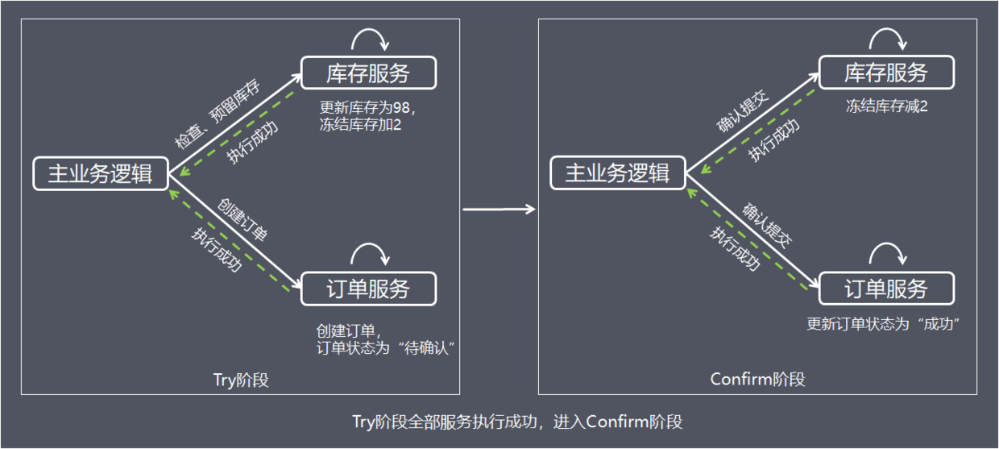

- **Cancel：当Try阶段存在服务执行失败， 进入Cancel阶段**

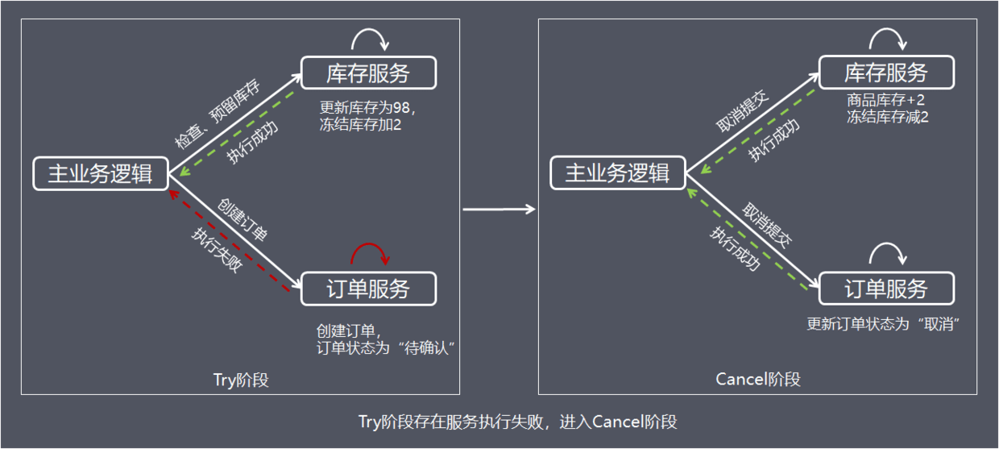

Cancel取消执行，释放Try阶段预留的业务资源，上面的例子中，Cancel操作会把冻结的库存释放，并更新订单状态为取消。

### 4.3.3 方案总结

TCC事务机制相对于传统事务机制（X/Open XA），TCC事务机制相比于上面介绍的XA事务机制，有以下优点:

- 性能提升 具体业务来实现控制资源锁的粒度变小，不会锁定整个资源。
- 数据最终一致性 基于Confirm和Cancel的幂等性，保证事务最终完成确认或者取消，保证数据的一致性。
- 可靠性 解决了XA协议的协调者单点故障问题，由主业务方发起并控制整个业务活动，业务活动管理器也变成多点，引入集群。

缺点： TCC的Try、Confirm和Cancel操作功能要按具体业务来实现，业务耦合度较高，提高了开发成本。

## 4.4 本地消息表 —— 最终一致性

### 4.4.1 方案简介

1. 本地消息表的方案核心思路是将分布式事务拆分成本地事务进行处理。
2. 方案通过在事务主动发起方额外新建事务消息表，事务发起方处理业务和记录事务消息在本地事务中完成，轮询事务消息表的数据发送事务消息，事务被动方基于消息中间件消费事务消息表中的事务。
3. 这样设计可以避免”**业务处理成功 + 事务消息发送失败**"，或"**业务处理失败 + 事务消息发送成功**"的棘手情况出现，保证2个系统事务的数据一致性。

### 4.4.2 处理流程

1. 为了方便理解，下面继续以电商下单为例进行方案解析，库存服务是事务主动方，订单服务是事务被动方。事务的主动方需要额外新建事务消息表，用于记录分布式事务的消息的发生、处理状态。
2. 业务处理流程如下：

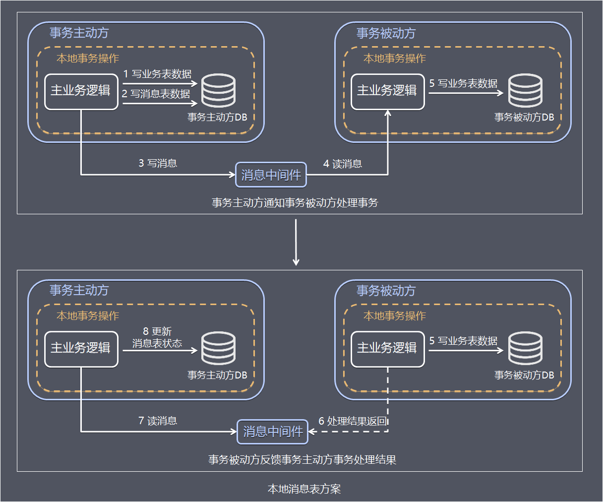

> **步骤1 事务主动方处理本地事务。** 事务主动发在本地事务中处理业务更新操作和写消息表操作。 上面例子中库存服务阶段再本地事务中完成扣减库存和写消息表(图中1、2)。
>
> **步骤2 事务主动方通过消息中间件，通知事务被动方处理事务通知事务待消息**。 消息中间件可以基于Kafka、RocketMQ消息队列，事务主动方法主动写消息到消息队列，事务消费方消费并处理消息队列中的消息。 上面例子中，库存服务把事务待处理消息写到消息中间件，订单服务消费消息中间件的消息，完成新增订单（图中3 - 5）。
>
> **步骤3 事务被动方通过消息中间件，通知事务主动方事务已处理的消息。** 上面例子中，订单服务把事务已处理消息写到消息中间件，库存服务消费中间件的消息，并将事务消息的状态更新为已完成(图中6 - 8)

为了数据的一致性，当处理错误需要重试，事务发送方和事务接收方相关业务处理需要支持幂等。具体保存一致性的容错处理如下：

> 1、当步骤1处理出错，事务回滚，相当于什么都没发生。
>
> 2、当步骤2、步骤3处理出错，由于未处理的事务消息还是保存在事务发送方，事务发送方可以定时轮询为超时消息数据，再次发送的消息中间件进行处理。事务被动方消费事务消息重试处理。
>
> 3、如果是业务上的失败，事务被动方可以发消息给事务主动方进行回滚。
>
> 4、如果多个事务被动方已经消费消息，事务主动方需要回滚事务时需要通知事务被动方回滚。

### 4.4.3 方案总结

1. 方案的优点如下：

- 从应用设计开发的角度实现了消息数据的可靠性，消息数据的可靠性不依赖于消息中间件，弱化了对MQ中间件特性的依赖。
- 方案轻量，容易实现。

2. 缺点如下：

- 与具体的业务场景绑定，耦合性强，不可公用。
- 消息数据与业务数据同库，占用业务系统资源。
- 业务系统在使用关系型数据库的情况下，消息服务性能会受到关系型数据库并发性能的局限。

## 4.5 MQ事务 —— 最终一致性

### 4.5.1 方案简介

1. 基于MQ的分布式事务方案其实是对本地消息表的封装，将本地消息表基于MQ 内部，其他方面的协议基本与本地消息表一致。

### 4.5.2 处理流程

下面主要基于RocketMQ4.3之后的版本介绍MQ的分布式事务方案。**在本地消息表方案中，保证事务主动方发写业务表数据和写消息表数据的一致性是基于数据库事务，RocketMQ的事务消息相对于普通MQ，相对于提供了2PC的提交接口**，方案如下：

- **正常情况——事务主动方发消息** 这种情况下，事务主动方服务正常，没有发生故障，发消息流程如下：

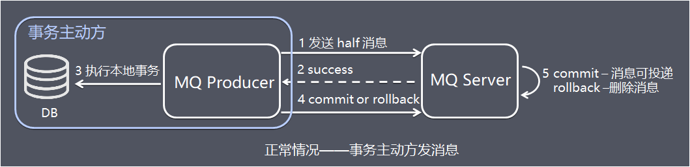

> 图中1、发送方向 MQ服务端(MQ Server)发送half消息。
>
> 图中2、MQ Server 将消息持久化成功之后，向发送方 ACK 确认消息已经发送成功。
>
> 图中3、发送方开始执行本地事务逻辑。
>
> 图中4、发送方根据本地事务执行结果向 MQ Server 提交二次确认（commit 或是 rollback）。
>
> 图中5、MQ Server 收到 commit 状态则将半消息标记为可投递，订阅方最终将收到该消息；MQ Server 收到 rollback 状态则删除半消息，订阅方将不会接受该消息。

- **异常情况——事务主动方消息恢复** 在断网或者应用重启等异常情况下，图中4提交的二次确认超时未到达 MQ Server，此时处理逻辑如下：

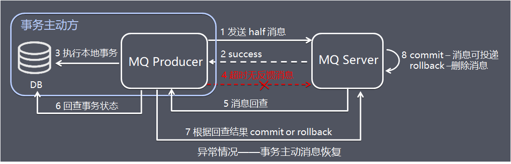

> 图中5、MQ Server 对该消息发起消息回查。
>
> 图中6、发送方收到消息回查后，需要检查对应消息的本地事务执行的最终结果。
>
> 图中7、发送方根据检查得到的本地事务的最终状态再次提交二次确认
>
> 图中8、MQ Server基于commit / rollback 对消息进行投递或者删除

### 4.5.3 方案总结

1. 相比本地消息表方案，MQ事务方案优点是:

- 消息数据独立存储 ，降低业务系统与消息系统之间的耦合。
- 吞吐量优于使用本地消息表方案。

2. 缺点是：

- 一次消息发送需要两次网络请求(half消息 + commit/rollback消息)
- 业务处理服务需要实现消息状态回查接口

## 4.6 Saga事务 —— 最终一致性

### 4.6.1 方案简介

1. Saga事务核心思想是将长事务拆分为多个本地短事务，由Saga事务协调器协调，如果正常结束那就正常完成，如果某个步骤失败，则根据相反顺序一次调用补偿操作。
2. **Saga事务基本协议如下**：

- 每个Saga事务由一系列幂等的有序子事务(sub-transaction) Ti 组成。
- 每个Ti 都有对应的幂等补偿动作Ci，补偿动作用于撤销Ti造成的结果。

3. 和TCC相比，Saga没有“预留”动作，它的Ti就是直接提交到库

### 4.6.2 处理流程

1. 以下单流程为例，整个操作包括：创建订单、扣减库存、支付、增加积分 Saga的执行顺序有两种：

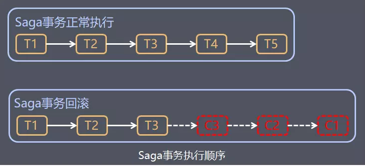

> 事务正常执行完成 T1, T2, T3, ..., Tn，例如：扣减库存(T1)，创建订单(T2)，支付(T3)，依次有序完成整个事务。
>
> 事务回滚 T1, T2, ..., Tj, Cj,..., C2, C1，其中0 < j < n，例如：扣减库存(T1)，创建订单(T2)，支付(T3，支付失败)，支付回滚(C3)，订单回滚(C2)，恢复库存(C1)。

2. Saga定义了两种恢复策略:

- 向前恢复(forward recovery):

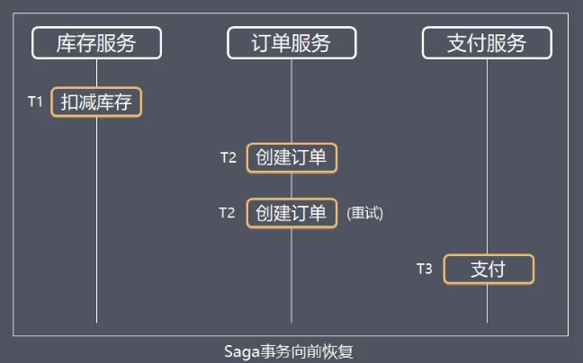

> **对应于上面第一种执行顺序，适用于必须要成功的场景，发生失败进行重试**，执行顺序是类似于这样的：T1, T2, ..., Tj(失败), Tj(重试),..., Tn，其中j是发生错误的子事务(sub-transaction)。该情况下不需要Ci。

- 向后恢复(backward recovery)

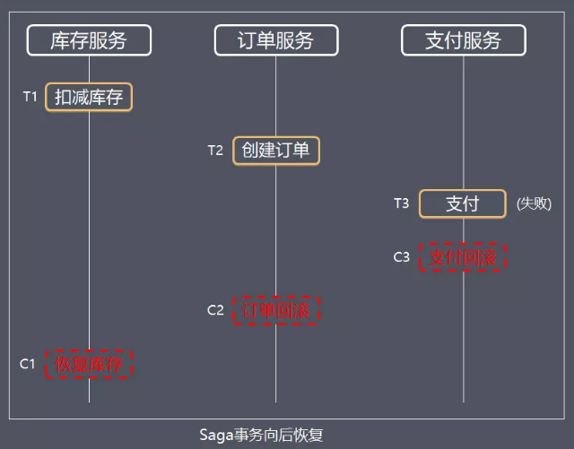

> **对应于上面提到的第二种执行顺序，其中j是发生错误的子事务(sub-transaction)，这种做法的效果是撤销掉之前所有成功的子事务**，使得整个Saga的执行结果撤销。

3. Saga事务常见的有两种不同的实现方式

   1. **命令协调(Order Orchestrator)：中央协调器负责集中处理事件的决策和业务逻辑排序。**

   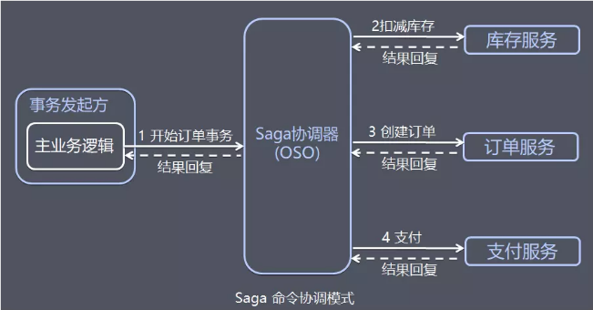

   以电商订单的例子为例：

   > 1、事务发起方的主业务逻辑请求OSO服务开启订单事务 2、OSO向库存服务请求扣减库存，库存服务回复处理结果。 3、OSO向订单服务请求创建订单，订单服务回复创建结果。 4、OSO向支付服务请求支付，支付服务回复处理结果。 5、主业务逻辑接收并处理OSO事务处理结果回复。

   中央协调器必须事先知道执行整个订单事务所需的流程(例如通过读取配置)。如果有任何失败，它还负责通过向每个参与者发送命令来撤销之前的操作来协调分布式的回滚。基于中央协调器协调一切时，回滚要容易得多，因为协调器默认是执行正向流程，回滚时只要执行反向流程即可。

   2. **事件编排 (Event Choreography：没有中央协调器（没有单点风险）时，每个服务产生并观察其他服务的事件，并决定是否应采取行动**。

   在事件编排方法中，第一个服务执行一个事务，然后发布一个事件。该事件被一个或多个服务进行监听，这些服务再执行本地事务并发布（或不发布）新的事件。

   当最后一个服务执行本地事务并且不发布任何事件时，意味着分布式事务结束，或者它发布的事件没有被任何Saga参与者听到都意味着事务结束。

   以电商订单的例子为例：

   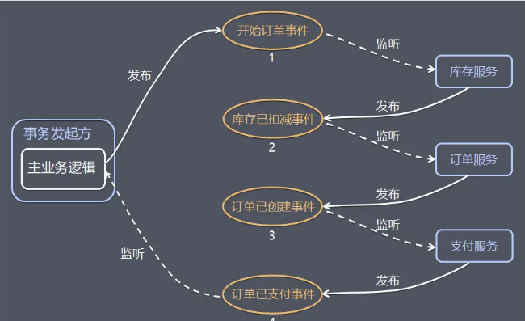

   > 1、事务发起方的主业务逻辑发布开始订单事件 2、库存服务监听开始订单事件，扣减库存，并发布库存已扣减事件 2、订单服务监听库存已扣减事件，创建订单，并发布订单已创建事件 4、支付服务监听订单已创建事件，进行支付，并发布订单已支付事件 5、主业务逻辑监听订单已支付事件并处理。

   事件/编排是实现Saga模式的自然方式，它很简单，容易理解，不需要太多的代码来构建。如果事务涉及2至4个步骤，则可能是非常合适的。

   ### 4.6.3 方案总结

   1. **命令协调设计的优点和缺点**

   - 优点如下
     - 服务之间关系简单，避免服务之间的循环依赖关系，因为Saga协调器会调用Saga参与者，但参与者不会调用协调器
     - 程序开发简单，只需要执行命令/回复(其实回复消息也是一种事件消息)，降低参与者的复杂性
     - 易维护扩展，在添加新步骤时，事务复杂性保持线性，回滚更容易管理，更容易实施和测试
   - 缺点如下：
     - 中央协调器容易处理逻辑容易过于复杂，导致难以维护。
     - 存在协调器单点故障风险。

   2. **事件/编排设计的优点和缺点**

   - 优点如下：
     - 避免中央协调器单点故障风险。
     - 当涉及的步骤较少服务开发简单，容易实现。
   - 缺点如下：
     - 服务之间存在循环依赖的风险。
     - 当涉及的步骤较多，服务间关系混乱，难以追踪调测。

   3. **值得补充的是，由于Saga模型中没有Prepare阶段，因此事务间不能保证隔离性，当多个Saga事务操作同一资源时，就会产生更新丢失、脏数据读取等问题，这时需要在业务层控制并发，例如：在应用层面加锁，或者应用层面预先冻结资源**。

   # 5. 总结

   ## 5.1 各方案使用场景

   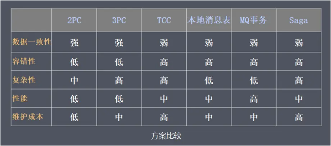

   1. 2PC/3PC 依赖于数据库，能够很好的提供强一致性和强事务性，但相对来说延迟比较高，比较适合传统的单体应用，在同一个方法中存在跨库操作的情况，不适合高并发和高性能要求的场景。
   2. TCC 适用于执行时间确定且较短，实时性要求高，对数据一致性要求高，比如互联网金融企业最核心的三个服务：交易、支付、账务。
   3. 本地消息表/MQ事务 都适用于事务中参与方支持操作幂等，对一致性要求不高，业务上能容忍数据不一致到一个人工检查周期，事务涉及的参与方、参与环节较少，业务上有对账/校验系统兜底。
   4. Saga事务 由于Saga事务不能保证隔离性，需要在业务层控制并发，适合于业务场景事务并发操作同一资源较少的情况。 Saga相比缺少预提交动作，导致补偿动作的实现比较麻烦，例如业务是发送短信，补偿动作则得再发送一次短信说明撤销，用户体验比较差。Saga事务较适用于补偿动作容易处理的场景。

   ## 5.2 分布式事务方案设计

   1. > 有些问题，看起来很重要，但实际上我们可以通过**合理的设计**或者将**问题分解**来规避。设计分布式事务系统也不是需要考虑所有异常情况，不必过度设计各种回滚，补偿机制。如果硬要把时间花在解决问题本身，实际上不仅效率低下，而且也是一种浪费。
      >
      > 如果系统要实现回滚流程的话，有可能系统复杂度将大大提升，且很容易出现Bug，估计出现Bug的概率会比需要事务回滚的概率大很多。在设计系统时，我们需要衡量是否值得花这么大的代价来解决这样一个出现概率非常小的问题，可以考虑当出现这个概率很小的问题，能否采用**人工解决**的方式，这也是大家在解决疑难问题时需要多多思考的地方。

# 参考资料

1. [事务一致性与原子性的区别](<https://blog.csdn.net/H12KJGJ/article/details/65937405>) 简言之，原子性强调一组操作，要么成功，要么失败。事物一致性强调相互关联的各方都按照预期去执行，得到公认的结果。但是关联各方都按照约定的去执行，原子性满足了，不一定能得到公认预期一致的结果，比如逻辑缺陷导致少了一步关键操作。一致性的核心一部分是靠原子性实现的，而另一部分是逻辑正确实现。
2. [理解分布式事务](<https://juejin.im/post/5c0e5bf8e51d45063322fe50>)