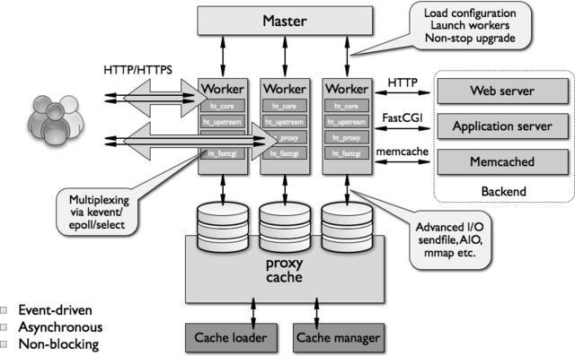
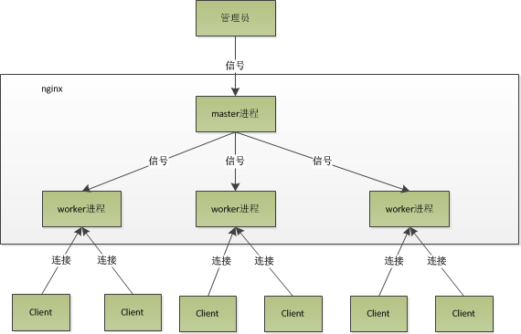

[TOC]

# 1. 方案简介

## 1.1 服务热更新

1. 一架行驶在高速上的大卡车，行驶过程中突然遭遇爆胎，热更新则是要求在不停车的情况下将车胎修补好，且补胎过程中卡车需要保持正常行驶

## 1.2 nginx方案

1. nginx方案

> - 1）首先备份原有的Nginx二进制文件，并用新编译好的Nginx二进制文件替换旧的
> - 2）然后向master进程发送`USR2`信号.此时Nginx进程会启动一个新版本Nginx，该新版本Nginx进程会发起一个新的master进程与work进程.即此时会有两个Nginx实例在运行，一起处理新来的请求.(lhf：请求依然发送到老的nginx端口，新的nginx实例如何处理新的请求?答案是多个进程监听同一个ip端口，这样问题是每个进程都会受到并处理请求，nginx解决办法是fork后没有获取到锁的进程将从父进程中继承的socket连接去除掉，多个进程会轮流的去获取锁来成为当前工作线程。（lhf：简单实现就是在某个固定路径文件总写入当前pid，工作时判断与当前进程pid相等就工作，配合定时器啥的）)
> - 3）再向原master进程发送`WINCH`信号，它会逐渐关闭相关work进程，此时原master进程仍保持监听新请求但不会发送至其下work进程，而是交给新的work进程。（lhf:根据前面的锁轮询方案，那么此时应该是给原来的工作进程设置一个状态，然后这个状态下的进程不去获取锁）
> - 4）最后等到所有原work进程全部关闭，向原master进程发送`QUIT`信号，终止原master进程，至此，完成Nginx热升级.





- 多线程在多并发情况下，线程的**内存占用大，线程上下文切换造成CPU大量的开销**
- 与Memcached的经典多线程模型相比，Nginx是经典的多进程模型。 
- TODO：源码级别学习nginx，高负载就看这个了。

## 1.3 golang实现类似nginx的服务热更新

### 1.3.1  流程

1. 备份老文件，替换新文件。向服务发送USR2信号。
2. 进程收到`USR2`信号后，fork子进程（启动新版本服务，并和老进程监听在同一端口），并将当前socket句柄等进程环境交给它。
3. 新进程开始监听socket请求。
4. 让老的进程停止接受新的请求。
5. 老进程停止工作。

### 1.3.2 实现

```go
    func (a *app) signalHandler(wg *sync.WaitGroup) {
        ch := make(chan os.Signal, 10)
        signal.Notify(ch, syscall.SIGINT, syscall.SIGTERM, syscall.SIGUSR2)
        for {
            sig := <-ch
            switch sig {
            case syscall.SIGINT, syscall.SIGTERM:
                // 确保接收到INT/TERM信号时可以触发golang标准的进程终止行为
                signal.Stop(ch)
                a.term(wg)
                return
            case syscall.SIGUSR2:
                err := a.preStartProcess()
                if err != nil {
                    a.errors <- err
                }
                // 发起新进程
                if _, err := a.net.StartProcess(); err != nil {
                    a.errors <- err
                }
            }
        }
    }

// 复制当前进程socket连接，发起新进程
    execSpec := &syscall.ProcAttr{
    Env: os.Environ(),
    Files: []uintptr{os.Stdin.Fd(), os.Stdout.Fd(), os.Stderr.Fd()},
        // 其他socket，由老进程处理，新的由新的socket处理，那么此时需要客户端重新连接socket才能使用新的服务。最好是在父进程对某个连接处理完某个阶段后，接下来由子进程进行处理。
        // 如果想做到客户端无感知，那么需要将老的socket一并传递给子进程，子进程进行接下来的处理。
    }
    fork, err := syscall.ForkExec(os.Args[0], os.Args, execSpec)
    ...
```

## 1.4 配置文件更新

1. 与本方案类似，子进程重新读取配置文件即可。

## 1.5 子进程pid变化，可能导致systemd & supervisor这类监控进程失败

1. 使用pidfile，每次进程重启更新一下pidfile，让进程管理者通过这个文件感知到main pid的变更。
2. 更通用的做法：**起一个master来管理服务进程**，每次热重启master拉起一个新的进程，把旧的kill掉。这时master的pid没有变化，对于进程管理者来说进程处于正常的状态。[一个简洁的实现](https://link.juejin.im/?target=https%3A%2F%2Fgithub.com%2Fkuangchanglang%2Fgraceful)

# 成熟的开源实现

1. `github.com/facebookgo/grace/gracehttp`

```go
    func main() {
        app := gin.New()// 项目中时候的是gin框架
        router.Route(app)
        var server *http.Server
        server = &http.Server{
            Addr:    ":8080",
            Handler: app,
        }
        gracehttp.Serve(server)
    }
```

2. [4.2 grace 模块](<http://www.kancloud.cn:8080/hello123/beego/126136> )
   1. [beego高级编程---->grace模块热重启导致旧进程未处理完请求直接退出](<https://studygolang.com/articles/3233>)
3. TODO:实战测试

# 参考资料

1. [golang hotfix热更新详解](<https://mojotv.cn/2018/12/26/golang-hot-restart>)
2. [Golang服务器热重启、热升级、热更新(safe and graceful hot-restart/reload http server)详解](https://www.cnblogs.com/sunsky303/p/9778466.html)
3. [nginx架构模型分析](<https://juejin.im/post/5cdea826e51d4510b934dcb5>)