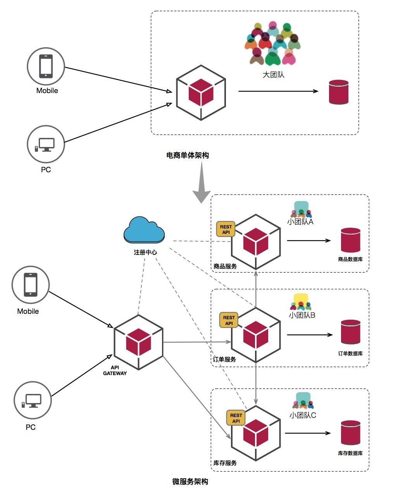

[TOC]

# 1. 为什么需要微服务

## 1.1 什么是微服务

1. 微服务是一种软件架构

> **微服务** (Microservices) 是一种软件架构风格，它是以专注于单一责任与功能的小型功能区块 (Small Building Blocks) 为基础，利用模块化的方式组合出复杂的大型应用程序，各功能区块使用与语言无关 (Language-Independent/Language agnostic) 的 API 集相互通信。

2. 与微服务相比较的是单体应用：程序所有的功能打包成一个独立的单元。
3. 两者对比：

## 1.2 微服务和单体应用优缺点对比：微服务架构要解决的问题和带来的挑战

### 1.2.1 单体应用的优缺点

1.  单体应用优缺点
   1. 优点: 

      - 便于开发:只需借助IDE的开发、调试功能即可完成
      - 易于测试:只需要通过单元测试或浏览器即可完成测试
      - 易于部署:打包成单一可执行jar包，执行jar包即可完成部署

   2. 缺点：应用程序随着业务需求的迭代，功能的追加扩展,最终成为一个庞然大物。造成如下缺点

      1. 复杂性高

          - 代码难以理解
            在业务规模和团队规模发展的一定阶段，这些不足表现的更加明显，单体架构的不足首先表现在复杂性上, maven模块增多，多个模块耦合在一起，代码结构混乱，使得团队成员没有一个人理解整个代码逻辑
          - 难以理解导致代码质量低，复杂性进一步增加
            难以理解导致代码复用度降低，因为你不知道哪些可以复用的；即便修改，影响范围也不好确定，这导致这样开发宁愿新建一个新方法和新的类，进一步导致重复代码越积越多；
          - 代码难以被修改和重构
            不理解代码当然也就写不出高内聚低耦合的代码，和代码质量持续下降；复杂性进一步增加随着复杂度的增加，耦合度越来越高，代码牵一发而动全身，代码已经很难修改和重构了
          - 团队职责不清晰
            高度耦合的单体工程使得逻辑边界模糊不清，新的业务需求开发任务无法有效分配到人，团队人员职责不清晰，沟通成本增加。
      2. 交付效率低
          - 构建和部署耗时长，难以定位问题，开发效率低
          - 代码复杂和变更影响难以理解，需要数天完成全量测试
          - 全量部署耗时长、影响范围广、风险大，发布频次低
      3. 伸缩性(scalable)差
          - 单体只能按整体横向扩展，无法分模块垂直扩展
          - IO密集型模块和CPU密集型模块无法独立升级和扩容
      4. 可靠性差
          - 一个bug有可能引起整个应用的崩溃
      5. 阻碍技术创新
          - 受技术栈限制，团队成员使用同一框架和语言
          - 升级和变革技术框架变得困难
          - 尝试新语言变得困难

### 1.2.2 微服务架构的优缺点

#### 1.2.2.1 微服务优点
1.  微服务优点：

    - 易于开发与维护

      - 微服务相对小，易于理解
      - 启动时间短，开发效率高

    - 独立部署

      - 一个微服务的修改不需要协调其它服务

    - 伸缩性强

      - 每个服务都可以在横向和纵向上扩展
      - 每个服务都可按硬件资源的需求进行独立扩容

    - 与组织结构相匹配

      - 微服务架构可以更好将架构和组织相匹配
      - 每个团队独立负责某些服务，获得更高的生产力

    - 技术异构性

      - 使用最适合该服务的技术
      - 降低尝试新技术的成本

#### 1.2.2.2 微服务带来的挑战

**1.服务拆分**

- 微服务拆分原则:领域模型、限定上下文、组织架构、康威定律
  现实中没有一个具体明确的方法可以将拆分一步到位，而是遵守一定的原则，比如根据领域模型、组织架构、单一职责这些进行拆分在拆分的过程中还要结合经验判断，并且随着需求迭代，架构持续优化演进，优化服务的拆分。
- 每个微服务拥有独立数据库
- 微服务之间确定服务边界,通过共享模型建立联系

**2.数据一致性**

1. 在单体架构中，我们通过数据库事务完成关联操作。微服务中，不同服务有不同的数据库，需要进行分布式事务操作,而分布式事务具有延迟较高、nosql数据库不支持等缺点。这些缺点导致分布式事务无法应用到微服务中在微服务场景下，我们通常使用最终一致性来代替强一致性。

**3.服务通信**

- 通信技术方案: RPC vs REST vs 异步消息

- - RPC、REST API、异步消息
    - 异步消息我们可以借助一些消息队列框架来实现比如kafka、rrabbitMQ。那现在我们说下rpc和使用http协议的类似REST API之间 如何选择。
    - http的好处是方便调试、跨语言、门槛低、广泛接受；同样缺点是协议文档不好维护，协议较为繁琐，性能较TCP要差是http协议的不足。
    - Rpc通信通常基于Tcp，常用的技术选型是thrift、grpc、dubbo，像thrift、grpc需要定义idl文件，通过idl文件来生成java代码，通过rpc的好处是IDE友好，有代码提示，协议维护在代码中，传参和响应结果都通过代码可以知道。但同时也有缺点比如很多rpc方案不支持跨语言，所支持的语言有限，需要定义和维护idl文件，且有一定的学习成本，另外rpc不容易方便的调试和测试
    - 其实在应用最开始，就要日后可能的微服务化做准备，有的微服务框架对输入输出参数有限制（如rpcx只接受三个参数：上下文，输入，输出；返回值是error），若一开始就按照这样的规范来进行开发，那么后面进行微服务拆分的时候，大部分函数可以直接用rpc来直接调用，微服务拆分的改动会比较小。

- 服务注册和发现

  - 在服务实例变化不定的环境中，用硬编码指定IP地址的方式是行不通的，需要通过某种发现机制让服务能相互查找。这就需要我们将我们的服务信息注册到一个分布式存储中，这些服务信息就叫做服务注册表服务注册表可以作为信息的权威来源。其中包含有关可用服务的信息，以及服务网络位置比如ip、端口号这些信息。那借助什么组件进行实现呢，一般有Eureka和zookeeper，除此之外我们还可以借助etcd，consul，redis这些。

- 负载均衡

  - 有了注册发现功能，客户端通过服务注册表发现实例清单并决定要连接哪个实例，在客户端做负载均衡，基于客户端做负载均衡相比服务端负载均衡有诸多好处：首先节省了硬件均衡设备，减少了运维成本，其次可以实现多种负载均衡策略比如响应感知的负载均衡策略

**4.服务网关**

- API Gateway：一般将身份认证，安全防御，流量控制这些功能放到服务网关中，向业务服务屏蔽网络边界服务的细节，使得业务服务专注于业务逻辑的开发维护和测试。

- 为前端服务的后端(Backends For Forntends)
  服务网关可以根据终端产品形态来划分，比如公共API,桌面客户端，移动客户端分别对应一个服务网关，而服务网关可以是API Gateway只输出api，或者是为前端服务的后端，这里的为前端服务的后端，比如将来自多个服务的数据聚合到一起返回给前端

**5.高可观察**

- 健康检测、集中监控
- 日志聚合及检索: 日志格式标准化，并通过一些手段聚合到一起进行检索查询。同时可跨越所有服务、特定的某个服务，或服务的某个实例搜索日志. 将日志发送至集中化日志系统所用的代码可包含在共享库中或通过代码脚手架提供。
- 分布式追踪
  - 在微服务架构场景中，一个客户端发起的请求要经过多个服务的调用最终聚合数据结构返回给客户端，但我们不知道这个请求不知道经过哪些服务，调用哪个服务出现了问题，每个服务的输入输出是什么，这给我们定位问题带来了困扰，除此以外，如果一个请求耗时较长，我们不知道到底哪个服务耗时最长，好有针对性的性能优化。随着架构的演进，我们在架构设计规划时需要知道 服务之间的依赖关系，这有需要什么技术来实现呢，这就是我们要介绍的分布式追踪，分布式追踪借助关联id，在请求源头创建这个关联id，并且在服务间进行透传，最终将关联id等信息聚合到一起进行查询分析

**6.可靠性**

1. 问题: 在讲单体的过程中，我们讲到，一个业务模块的内存泄露会导致整个进程退出。 在微服务场景下，如果一个服务出现内存泄露是不会影响 没有依赖关系的服务的。 但是却可以因为该异常服务的僵死或不可用造成上游服务线程hang住，进而产生级联效应，故障进一步向上游传播。
2. 解决办法

- 流量控制，超时控制

  - 可靠性技术通过流量的控制和超时控制，保证服务消费者不被下游服务拖慢，及时对业务线程循环复用。

- 舱壁隔离，熔断机制

  - 熔断是指服务调用出错次数在一定时间达到一定数量，自动关闭对该服务的调用开关，改为返回错误或者将请求转交给降级方法，降低资源耗尽的风险，当服务不可用时，作为服务消费者应该对接口方法编写一个降级方法。

- 服务降级, 幂等重试

  - 由于服务间通信是通过网络传输的，网络异常和网络分区故障 就会经常出现，我们遇到这种情况可以进行调用重试，重试时要注意两点，一个是接口必须是幂等的，无论运行一次或多次，最终结果必须相同。幂等性保证了重试不会产生负面影响。在重试过程时休眠时间应该是指数增长的，否则会产生惊群效应，比如：故障后的服务恢复上线后，如果有大量其他服务正在同一个重试窗口内重试，此时很容易给系统造成巨大压力。

**7. 提炼代码脚手架**

除了开发业务逻辑，我们还需要搭建一套微服务工程可用框架，这样是是为了加快团队工作效率，微服务解决方案保持统一，增强代码复用性，统一进行优化，微服务要解决的问题非常多，所以抽取服务代码模板是有必要的，它包括服务注册发现、服务通信、监控、日志、异常处理等等。

**本部分内容主要参考: <https://zhuanlan.zhihu.com/p/32945365>**

# 2. 微服务框架主要要解决哪些问题

1. 见**1.2.2.2 微服务带来的挑战**，这些挑战就是微服务框架要解决的问题。

# 3. go微服务框架对比

| 微服务带来的挑战 | go-micro |rpcx|Go Kit|
| - | - |-| - |
| 介绍 | 可插入的 RPC 框架 ||一个用于导入二进制包的库|
| 服务拆分：原始函数是否可以直接作为RPC函数来调用 |          |||
| 数据一致性 | |||
| 服务通信：RPC | RPC 客户机 / 服务器包 ||gRPC|
| 服务通信：REST API | ||HTTP|
| 服务通信：异步消息 | 内置发布 / 订阅功能 ||Nats|
| 服务通信：服务注册和发现 | 应用程序自动注册到服务发现系统 ||Consul、Etcd、Eureka|
| 服务通信：负载均衡 | 客户端负载平衡：随机，轮循，最小康 |||
| 服务网关: 身份认证 | ||Basic 认证和 JWT 认证|
| 服务网关: 安全防御 | |||
| 服务网关: 流量控制 | |||
| 高可观察：健康检测 | |||
| 高可观察：集中监控 | |||
| 高可观察：日志聚合及检索 | ||用于结构化服务日志记录的通用接口。|
| 高可观察：分布式追踪 | ||Zipkin 和 Opentracing。|
| 可靠性：流量控制，超时控制；熔断机制；服务降级, 幂等重试 | ||Hystrix 的 Go 实现|
| 代码脚手架 | |||
| 跨语言 | 提供了 Sidecar 等功能。这使您可以使用以 Go 以外的语言编写的服务。 Sidecar 提供服务注册，gRPC 编码 / 解码和 HTTP 处理程序。它支持多种语言。 |||
| 编解码器 | 支持的格式包括 json，bson，protobuf，msgpack |||
|  | |||
|  | |||
|  | |||

# 4. go微服务最佳实践

# 5. 微服务和rpc的关系

1. rpc是微服务的一种常用通信方式。
2. 系统设计之初，最好就考虑日后的微服务化，比如 各个子系统、[rpc对输入输出格式的要求](rpcx/golang_rpc框架调研.md)。

# 6. 微服务和serverless的对比

1. Serverless是BaaS+FaaS的结合体，其中云函数更多的是说FaaS平台，或者FaaS平台的一种形态。Serverless倡导的是开发者只实现和兴业务逻辑，其他的都有云厂商提供云函数来实现。   -- <https://www.zhihu.com/question/335301678>
2. 从服务粒度上来看，Serverless是对微服务服务力度的进一步细化。
3. Serverless可以实现基础设施和基础服务的复用。
4. 一个很大的不同点是，微服务中开发者对整个应用有把控，换一个云厂商也同样部署；Serverless中，应用和云厂商深度绑定，换一个地方，很可能部署不起来。关键是，这些服务还是收费的，还是不可或缺的。
5. 对开发者来说，如果项目初期人手少，可以尝试Serverless快速实现，如果云厂商的Serverless服务足够好用的话。
6. 其实Serverless适合在公司内部实现，避免重复造轮子。那么对有一定的能力的公司来说，serverless形式的大中台是比较高效的。
7. 微服务的发展，是为了解决大单体应用中的各种问题。Serverless的发展，是为了提高公司效能，但是并非每个公司都有强大易用的大中台，Serverless能否高效，就不好说了，因为serverless实际上是一个开发者平台。当然，每个项目组都可以在优先保证业务的前提下，用serverless的架构，进行技术输出。
8. 对于云厂商来说，可能需要一般的FaaS免费，来带动IaaS消费，然后内部给FaaS分成。当然如果FaaS所提的服务足够优秀，别人实现不了同样的功能和效果，那么确实可以FaaS收费。对云厂商来说，其实应该以SaaS/FaaS来对外，这样才能主键提供更多的服务，带来更多的收入，实现可持续发展。

# 参考资料

1. [为什么要使用微服务架构？](<https://juejin.im/post/5b8c9db7e51d4538e710b88b>)  [1 WHY-为什么需要微服务](<https://zhuanlan.zhihu.com/p/95684483>) [学习微服务首先要了解为什么使用微服务](<https://zhuanlan.zhihu.com/p/32945365>)
2. [Go 微服务框架对比：Go Micro, Go Kit, Gizmo, Kite](<https://learnku.com/go/t/36973>)
3. [云函数（Serverless）能取代微服务吗？](https://www.zhihu.com/question/335301678)

