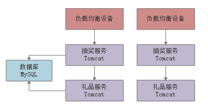

[TOC]

**本文是对[如何设计一个百万级用户的抽奖系统？](https://juejin.im/post/5ce1975af265da1bd42450b5)的学习整理**

# 1. 抽奖系统的特点

1. 抽奖、抢红包、秒杀，这类系统其实都有一些共同的特点，那就是在某个时间点会瞬间涌入大量的人来点击系统，给系统造成瞬间高于平时百倍、千倍甚至几十万倍的流量压力。
2. 问题：瞬时超高并发的流量，应该如何设计流量削峰的架构来应对，才能保证系统不会突然跨掉？

# 2. 需求细化

1. 假设现在有一个抽奖的业务场景，用户在某个时间可以参与抽奖，比如一共有1万个奖，奖品就是某个礼物。
2. 然后参与抽奖的用户可能有几十万，一瞬间可能几十万请求涌入过来，接着瞬间其中1万人中奖了，剩余的人都是没中奖的。然后中奖的1万人的请求会联动调用礼品服务，完成这1万中奖人的礼品发放。
3. 一个简单的系统：

# 3. 架构优化

## 3.1 防止用户重复抽奖，防程序刷单

TODO: 如何用nginx实现

## 3.2 全部开奖后拦截剩余流量

1. 抽一万个奖品，可能前N万个用户就把将品抽完了。在奖品抽完后，可以直接通知负载均衡层拦截剩余流量，返回抽奖结束的标志。
2. 可以基于`Redis`来进行同步。（TODO:nginx如何结合redis来限流）

## 3.3 抽奖服务并发度预估与配置优化：TODO

1. beego中用协程来处理请求，一个协程所占用的栈空间大小约为4K，4G的内存上限为百万并发。实际情况还要详细测试分析。
2. 对于秒杀服务，可以在负载均衡层只放前两万个进来，抽奖服务层最大并发为2万；但是对于抽奖服务，并不一定是前两万个参与抽奖，而是抽奖成功的前一万个结束后，后面的请求直接通过负载均衡层拦截。此时抽奖服务的并发度比较大，可能需要经过压测后，多机多部署。TODO：预估

## 3.4 基于redis实现抽奖业务逻辑

1. 抽奖服务的并发请求大概有2万个，那么到MySQL处的并发请求也大概有2万个，这里单个MySQL不一定能抗得住。这里可以改用Redis来实现抽奖逻辑。Redis单机抗两万并发度是一件比较轻松的事。（TODO：Redis并发度详细评测数据）

## 3.5 发放礼品环节进行限流削峰

1. 抽奖服务实时性要求高，但是礼品发放服务实时性要求没那么高，延后一分钟进行礼品发放也没问题。这里可以在抽奖服务和礼品服务间引入消息队列来降低礼品服务的并发度，来降低礼品服务的资源消耗。礼品服务的并发度下降后，可以基于`MySQL`来实现业务逻辑，以便进行数据持久化。

# 4. 总结

1. 其实对于商品秒杀、抽奖活动、抢红包类的系统而言，架构设计的思路很多都是类似的，核心思路都是对于这种瞬时超高流量的系统，尽可能在负载均衡层就把99%的无效流量拦截掉
2. 然后在1%的流量进入核心业务服务后，此时每秒并发还是可能会上万，那么可以基于Redis实现核心业务逻辑 ，抗住上万并发。
3. 最后对于类似秒杀商品发货、抽奖商品发货、红包资金转账之类的非常耗时的操作，完全可以基于`MQ`来限流削峰，后台有一个服务慢慢执行即可。

# 参考资料

1. [如何设计一个百万级用户的抽奖系统？](https://juejin.im/post/5ce1975af265da1bd42450b5)