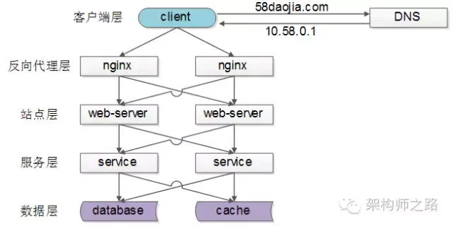
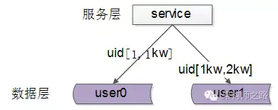
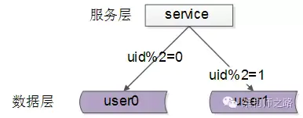
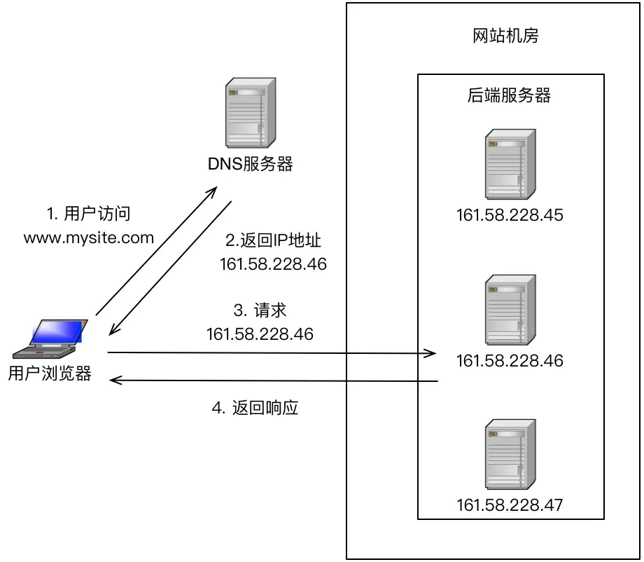
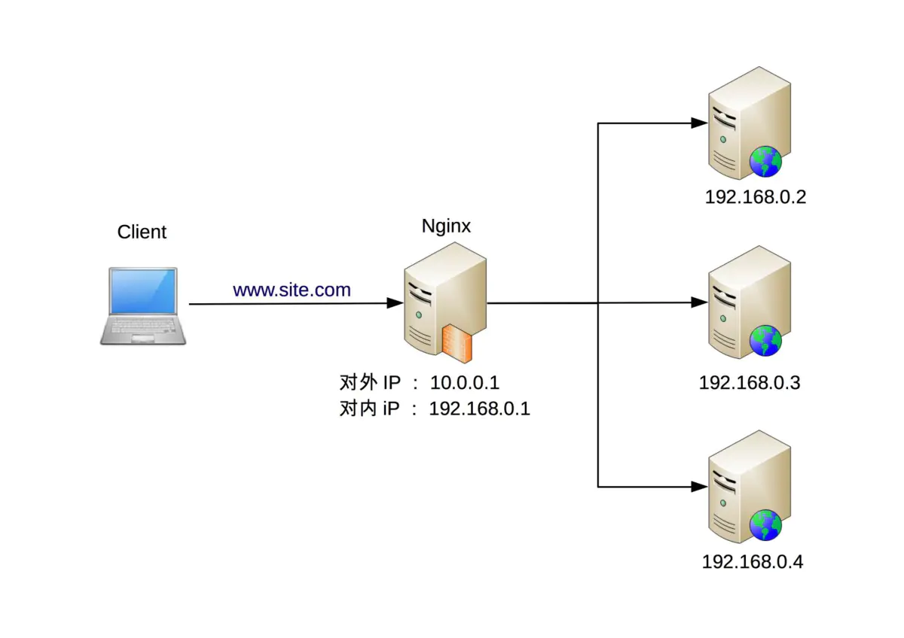
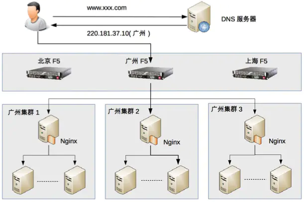

[TOC]

# 1. 哪些地方需要负载均衡和常见方案
1. 主要学习自[负载均衡基本介绍](<https://www.jianshu.com/p/3e09f7c77e98>)
2. 

## 1.1【客户端层->反向代理层】的负载均衡

> 【客户端层】到【反向代理层】的负载均衡，是通过“DNS轮询”实现的：DNS-server对于一个域名配置了多个解析ip，每次DNS解析请求来访问DNS-server，会轮询返回这些ip，保证每个ip的解析概率是相同的。这些ip就是nginx的外网ip，以做到每台nginx的请求分配也是均衡的。

## 1.2 【反向代理层->站点层】的负载均衡

> 【反向代理层】到【站点层】的负载均衡，是通过“nginx”实现的。通过修改nginx.conf，可以实现多种负载均衡策略

## 1.3 【站点层->服务层】的负载均衡

> 【站点层】到【服务层】的负载均衡，是通过“服务连接池”实现的。
> 上游连接池会建立与下游服务多个连接，每次请求会“随机”选取连接来访问下游服务。（也即是rpc框架实现的）

1. 关于站点层到服务层之间的负载均衡，简单的就是让站点感知到有多个服务，然后根据业务规则将请求发送到其中一些服务上去，比如简单的轮询。服务连接池大概就是这么个意思?

## 1.4 【服务层->数据层】的负载均衡

> 在数据量很大的情况下，由于数据层（db，cache）涉及数据的水平切分，所以数据层的负载均衡更为复杂一些，它分为“数据的均衡”，与“请求的均衡”。
>  **数据的均衡是指**：水平切分后的每个服务（db，cache），数据量是差不多的。
>  **请求的均衡是指**：水平切分后的每个服务（db，cache），请求量是差不多的。
>
> （1）按照range水平切分
>
> 
>
> 
>
> 按range水平切分
>
> 
>
> > **存储均匀，容易扩展，但是请求会不均价（存在新老用户，活跃用户僵尸用户等情况）**
>
> （2）按照id哈希水平切分
>
> 
>
> 
>
> > **存储均匀、请求均匀、规则简单。但是不容易扩展，扩展一个数据服务，hash方法改变时候，可能需要进行数据迁移**
>
> 

## 1.5 总结

> （1）【客户端层】到【反向代理层】的负载均衡，**是通过“DNS轮询”实现的**
>  （2）【反向代理层】到【站点层】的负载均衡，**是通过“nginx”实现的**
>  （3）【站点层】到【服务层】的负载均衡，**是通过“服务连接池”实现的**
>  （4）【数据层】的负载均衡，**要考虑“数据的均衡”与“请求的均衡”两个点，常见的方式有“按照范围水平切分”与“hash水平切分”**

# 2. 常用负载均衡方案对比

1. 常见负载均衡系统：DNS 负载均衡、硬件负载均衡（F5）和软件负载均衡(nginx lvs)

## 2.1 DNS负载均衡

> 优点：
>  （1）简单、成本低
>  （2）就近访问，提升访问速度
>  缺单：
>  （1）由于缓存存在会产生数据不一致现象，也就是服务变更不及时
>  （2）DNS 负载均衡的控制权在域名商那里，无法根据业务特点针对其做更多的定制化功能和扩展特性。
>  （3）分配策略比较简单，也就是提供的负载均衡算法少

1. 也可以在内部维护dns系统，这样就可以解决域名商那里dns不能及时更新的问题。

## 2.2 硬件负载均衡器

> 硬件负载均衡是通过单独的硬件设备来实现负载均衡功能，这类设备和路由器、交换机类似，可以理解为一个用于负载均衡的基础网络设备。比如业界非常出名的F5
>
> > 优点：
> >  （1）功能强大，支持多层负载均衡(通常是四层和七层），支持多种负载均衡算法
> >  （2）性能强大
> >  （3）稳定性和安全性强大
>
> 缺点：
>  （1）价格实在非常昂贵
>  （2）扩展性不强

## 2.3  软件负载均衡器

> 软件负载均衡通过负载均衡软件来实现负载均衡功能，常见的有 Nginx 和 LVS。
>
> 
>
> 
>
> 
>
> > 优点：
> >  （1）简单
> >  （2）便宜
> >  （3）可扩展、可定制性强
> >  缺点：
> >  （1）性能一般（相比硬件负载均衡）、功能也没有硬件负载均衡强大
> >  （2）一般不具备防火墙和防 DDoS 攻击等安全功能

## 2.4 性能预估

> Ngxin 的性能是万级，一般的 Linux 服务器上装一个 Nginx 大概能到 5 万 / 秒；LVS 的性能是十万级，据说可达到 80 万 / 秒；而 F5 性能是百万级，从 200 万 / 秒到 800 万 / 秒都有

## 2.5 一个千万级别的负载均衡架构设计

> 题目：日活跃用户 1000 万的论坛的负载均衡集群，该如何设计呢？
>  （1）评估流量
>  1000万DAU，换算成秒级（一天12小时），平均约等于232。
>  考虑每个用户操作次数，假定10，换算成平均QPS=2320。
>  考虑峰值是均值倍数，假定5，换算成峰值QPS=11600。
>  考虑静态资源、图片资源、服务拆分等，流量放大效应，假定10，QPS*10=116000。 （2）容量规划 考虑高可用、异地多活，QPS*2=232000。
>  考虑未来半年增长，QPS*1.5=348000。
>  （3）方案设计
>  可以用三级导流：
>  第一级，DNS，确定机房，以目前量级，可以不考虑。
>  第二级，确定集群，扩展优先，则选Haproxy/LVS，稳定优先则选F5。
>  第三级，Nginx+KeepAlived，确定实例。
>  （4）架构图
>  
>
> 
>
> 
>
> 架构设计
>
> 
>
> - 组合的基本原则为：DNS 负载均衡用于实现地理级别的负载均衡；硬件负载均衡用于实现集群级别的负载均衡；软件负载均衡用于实现机器级别的负载均衡。
>
> 作者：小manong
>
> 链接：https://www.jianshu.com/p/3e09f7c77e98

## 2.6 再论接入层负载均衡

1. 详见[再论接入层负载均衡](<https://www.jianshu.com/p/3e09f7c77e98>), 讲了各个接入层方案的优缺点，以及如何演进。好文章。

## 2.7 异构(不同性能)服务器的负载均衡及过载保护

1. 详见[**异构服务器的负载均衡及过载保护**](<https://www.jianshu.com/p/3e09f7c77e98>) 好文章， 内部服务间，通过连接层来获取连接池，连接池根据下层服务的新能和负载在以不同概率返回对应的链接。各个下层服务的性能，通过上层检测的超时来标识下层处理能力不够了，通过类似于**线型加乘性减**(如：成功加1，失败减10)的策略来动态调整下层服务的权重值。

# 3. 常用负载均衡算法

1. 详见[负载均衡的几种常用方案](<https://www.cnblogs.com/me115/p/5000465.html#h27>), 主要有 轮询、随机、哈希、一致性哈希、根据键的范围来分区、根据键对服务器结点数取模来负载(类似于哈希，可以结合前面的一致性哈希)、用MQ转化为异步。

# 参考资料

1. [负载均衡的几种常用方案](<https://www.cnblogs.com/me115/p/5000465.html#h27>)  介绍常见的负载均衡选节点算法
2. [负载均衡基本介绍](<https://www.jianshu.com/p/3e09f7c77e98>) (好文章) 分层进行负载均衡
3. [常用的负载均衡软件详解](<https://blog.csdn.net/chengxuyuanyonghu/article/details/78500297>) nginx LVS haproxy优缺点对比

