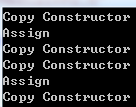
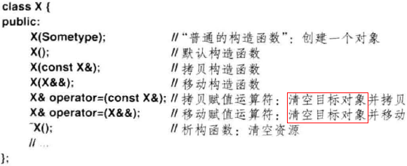

# 目录

- [1. 拷贝构造函数和赋值运算符的形式](#1.-拷贝构造函数和赋值运算符的形式)
- [2. 默认的拷贝构造函数符赋值运算符](#2.-默认的拷贝构造函数符赋值运算符)
  - [2.1 行为](#2.1-行为) 
  - [2.2 问题](#2.2-问题)
  - [2.3 防止默认拷贝函数发生](#2.3-防止默认拷贝函数发生)
- [3. 拷贝构造函数和赋值运算符什么时候会被调用](#3.-拷贝构造函数和赋值运算符什么时候会被调用)
	- [3.1 拷贝构造函数](#3.1-拷贝构造函数)
	- [3.2 赋值运算符](#3.2-赋值运算符)
	- [3.3 例子](#3.3-例子)
- [4. 总结](#4.-总结)
- [5. 移动构造函数](#5.-移动构造函数)
- [6. 赋值运算符是否会调用老的对象的析构函数](#6.-赋值运算符是否会调用老的对象的析构函数)
- [参考资料](#参考资料)

# 1. 拷贝构造函数和赋值运算符的形式

- 拷贝
`Person(const Person& p)`
- 赋值运算符
`Person& operator=(const Person& p)`
- **拷贝构造函数必须以引用的方式传递参数**。这是因为，在值传递的方式传递给一个函数的时候，会调用拷贝构造函数生成函数的实参。如果拷贝构造函数的参数仍然是以值的方式，就会无限循环的调用下去，直到函数的栈溢出。
- **对于一个类X, 如果一个构造函数的第一个参数是下列之一,且没有其他参数或其他参数都有默认值,那么这个函数是拷贝构造函数**.（volatile变量每次需要时都会从其地址读取最新值，告诉编译器不要优化器访问，因为该值可能会被一些编译器所未知的行为修改）
```
X&
const X&
volatile X&
const volatile X&
```
例如：
```
X::X(const X&);  //是拷贝构造函数      
X::X(X&, int=1); //是拷贝构造函数     
X::X(X&, int a=1, int b=2); //当然也是拷贝构造函数  
```
类中可以存在超过一个拷贝构造函数。例如：
```
class X { 
public:       
  X(const X&);      // const 的拷贝构造
  X(X&);            // 非const的拷贝构造
};
```
# 2. 默认的拷贝构造函数符赋值运算符
## 2.1 行为

使用“老对象”的数据成员的值对“新对象”的数据成员一一进行赋值，行为类似如下：
Rect::Rect(const Rect& r)  
{  
    width = r.width;  
    height = r.height;  
} 
## 2.2 问题
这两个问题好像都是两个对象的某个成员指向同一个内存块（并发问题？）
- a. 静态变量的问题

假设有个计数的静态变量，由多个对象共用。默认的拷贝构造函数只会拷贝计数值，而此时实际新增了一个对象，计数值该加1。下面的例子中，计数值最后会变成负数：
```cpp
class Rect  
{  
public:  
    Rect()      // 构造函数，计数器加1  
    {  
        count++;  
    }  
    ~Rect()     // 析构函数，计数器减1  
    {  
        count--;  
    }  
    static int getCount()       // 返回计数器的值  
    {  
        return count;  
    }  
private:  
    int width;  
    int height;  
    static int count;       // 一静态成员做为计数器  
};  
int Rect::count = 0;        // 初始化计数器  
int main()  
{  
    Rect rect1;  
    cout<<"The count of Rect: "<<Rect::getCount()<<endl;  
  
    Rect rect2(rect1);   // 使用rect1复制rect2，此时应该有两个对象  
     cout<<"The count of Rect: "<<Rect::getCount()<<endl;  
  
    return 0;  
}
```
- b. 指针问题

若指针所指的空间使用new申请的，多次delete时会出错。（calloc申请的，多次free（NULL 0x0）不会出错）。如下例子会出错：
```cpp
class Rect  
{  
public:  
    Rect()      // 构造函数，p指向堆中分配的一空间  
    {  
        p = new int(100);  
    }  
    ~Rect()     // 析构函数，释放动态分配的空间  
    {  
        if(p != NULL)  
        {  
            delete p;  
        }  
    }  
private:  
    int width;  
    int height;  
    int *p;     // 一指针成员  
};  
int main()  
{  
    Rect rect1;  
    Rect rect2(rect1);   // 复制对象  
    return 0;  
}
```
- 默认的拷贝时浅拷贝（不拷贝静态存储区和堆上的么？），否则时深拷贝。

## 2.3 防止默认拷贝函数发生
加上`=delete`,这样调用默认构造函数会出错。
```
Person(const Person& p) = delete;
Person& operator=(const Person& p) = delete;
```

# 3. 拷贝构造函数和赋值运算符什么时候会被调用
## 3.1 拷贝构造函数
- 对象作为函数的参数，以值传递的方式传给函数。（**在值传递的方式传递给一个函数的时候，会调用拷贝构造函数生成函数的实参**）　
- 对象作为函数的返回值，以值的方式从函数返回
- 使用一个对象给另一个对象初始化
```cpp
（
CExample A(100);  
CExample B = A;   
// CExample B(A);）
```
## 3.2 赋值运算符
- **将对象的值复制给一个已经存在的实例**

- **调用的是拷贝构造函数还是赋值运算符，主要是看是否有新的对象实例产生**。如果产生了新的对象实例，那调用的就是拷贝构造函数；如果没有，那就是对已有的对象赋值，调用的是赋值运算符。

# 3.3 例子
```cpp
class Person
{
public:
    Person(){}
    Person(const Person& p)
    {
        cout << "Copy Constructor" << endl;
    }

    Person& operator=(const Person& p)
    {
        cout << "Assign" << endl;
        return *this;
    }
private:
    int age;
    string name;
};

void f(Person p)
{
    return;
}
Person f1()
{
    Person p;
    return p;
}
int main()
{
    Person p;
    Person p1 = p;    // 1
    Person p2;
    p2 = p;           // 2
    f(p2);            // 3

    p2 = f1();        // 4

    Person p3 = f1(); // 5

    getchar();
    return 0;
}
```
- 结果：

- 分析如下：
	- 1 这是虽然使用了"="，但是实际上使用对象p来创建一个新的对象p1。也就是产生了新的对象，所以调用的是拷贝构造函数。
	- 2 首先声明一个对象p2，然后使用赋值运算符"="，将p的值复制给p2，显然是调用赋值运算符，为一个已经存在的对象赋值 。
	- 3 以值传递的方式将对象p2传入函数f内，调用拷贝构造函数构建一个函数f可用的实参。
	- 4 这条语句拷贝构造函数和赋值运算符都调用了。函数f1以值的方式返回一个Person对象，在返回时会调用拷贝构造函数创建一个临时对象tmp作为返回值；返回后调用赋值运算符将临时对象tmp赋值给p2.
	- 5 按照4的解释，应该是首先调用拷贝构造函数创建临时对象；然后再调用拷贝构造函数使用刚才创建的临时对象创建新的对象p3，也就是会调用两次拷贝构造函数。不过，编译器也没有那么傻，应该是直接调用拷贝构造函数使用返回值创建了对象p3。

# 4. 总结
常的原则是：
- 含有指针类型的成员或者有动态分配内存的成员都应该提供自定义的拷贝构造函数
- 在提供拷贝构造函数的同时，还应该考虑实现自定义的赋值运算符
- 对于拷贝构造函数的实现要确保以下几点：
	- 对于值类型的成员进行值复制
	- 对于指针和动态分配的空间，在拷贝中应重新分配分配空间
	- 对于基类，要调用基类合适的拷贝方法，完成基类的拷贝
# 5. 移动构造函数
是c11的新特性

- 

# 6. 赋值运算符是否会调用老的对象的析构函数

- 考虑对象中有指针指向动态内存的情况
[https://stackoverflow.com/questions/16341058/why-doesnt-default-assignment-operator-call-the-destructor-first](https://stackoverflow.com/questions/16341058/why-doesnt-default-assignment-operator-call-the-destructor-first)
取决于指针的类型
> smart pointers often delete their objects when they are deleted. Ordinary pointers do not

# 参考资料
- [C++拷贝构造函数详解](https://blog.csdn.net/lwbeyond/article/details/6202256)
- [C++ 拷贝构造函数和赋值运算符](http://www.cnblogs.com/wangguchangqing/p/6141743.html)
