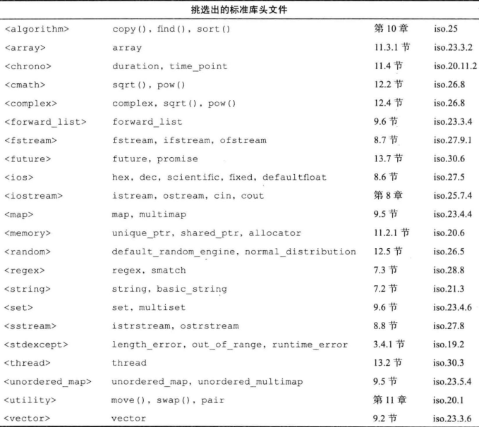
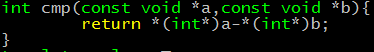
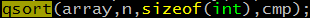

# 1. 常用标准库文件


# 2. map
## 1. 排序
- 从大到小排序
```c++
#include <iostream>
#include <string>
#include <map>
using namespace std;
int main(){
        map<int,string,greater<int> > mapstu;
        mapstu.insert(pair<int,string>(1,"one"));
        mapstu.insert(pair<int,string>(2,"two"));
        mapstu.insert(pair<int,string>(3,"three"));
        mapstu[4]="four";
        mapstu[5]="five";
        mapstu[6]="six";
        map<int,string,greater<int> >::iterator iter;
        for(iter=mapstu.begin();iter!=mapstu.end();iter++){
                cout<<iter->second<<endl;
        }
        return 0;
}
```
```shell
six
five
four
three
two
one
```
可以看到，对map来说，[]操作并没有像数组指定第几个，[]中的只是一个key，map内部在对key排序决定次序。
- key为结构体
**结构体定义<操作符就可以有less对象进而可以在map中使用了**。
```c++
class Test{
public:
        string name;
        Test():name(string("")){};
        Test(const char *_name):name(string(_name)){}
        bool operator <(const Test& ob)const{//both const are needed
                return name.length() < (ob.name.length());
        }
};
void test_struct_key(){
        map<Test,int> maptest;
        map<Test,int>::iterator testiter;
        maptest[Test("111")]=3;
        maptest[Test("11")]=2;
        maptest[Test("1")]=1;
        for(testiter=maptest.begin();testiter!=maptest.end();testiter++){
                cout<<testiter->second<<endl;
        }

}
```
```shell
1
2
3
```
- c 按value进行排序
先把map中的元素按pair插入到vector中，再按对vector用sort进行排序（需要一个比较函数，参数是两个pair）
## map的原理-红黑树
TODO:

# 3. set
## set是什么
set是**有序**的，set中每个元素的值都是**唯一**的，set内部使用红黑树实现，和map的key一样，set中的值不能被直接改变。头文件`<set>`
## set的增删查
- 增：insert;
- 删：erase;
- 查：find;
- 是否为空：empty;
- 交换数据：swap;

# 4. 排序
```cpp
#include <cstdlib>
void qsort (void* base, size_t num, size_t size, int (*compar)(const void*,const void*));
```
compare函数举例

具体使用


# 5. 字符串处理
## 5.1. 头文件
```cpp
#include <string>
```
注意：`<cstring>`和`<string.h>`都是c语言的头文件
## 5.2. 常用操作
	- `=`	赋值
	- `==`	进行比较
	- `+`	串联
## 5.3. c++字符串和c字符串的转换
1. c++到c

```cpp
std::string::data
	const char* data() const;	//以字符数组的形式返回字符串的内容，但并不添加'\0'
std::string::c_str
	const char* c_str() const;	//返回一个以'\0'结尾的字符数组
```
注意，`c_str`实现上应该是直接指向string内部的char数组，因为调用`c_str`得到的结果，在改变源string的值后也会变。只有这样才能解释得通。如果不想得到意外的结果，应该将`c_str`得到的数组在复制一遍。
```cpp
std::string::copy
	size_t copy (char* s, size_t len, size_t pos = 0) const;	//将字符串的内容写入到已有的字符数组s中
```

2. c到c++
参考string的构造函数

## 4. string和int的互换
1 string到int

[cstdlib](http://www.cplusplus.com/reference/cstdlib/)
```cpp
unsigned long long int strtoull (const char* str, char** endptr, int base);
```
有一组函数，详见上面的stdlib的连接。endptr若不为空，则存第一个非base进制的字符的位置。
- base有效值是2-36，或者为0，为0时：
- 以0x开头，16进制；否则
- 以0开头，八进制；否则
- 十进制。
- 从str开始扫描，忽略前面的空格。

2 int到string

- `int->char*->string`
 ```cpp
 snprintf  string
 ```
snprintf第二个参数size，最多写size-1个（结尾有'\0'），返回值是写入的字符个数（而非字节长度）。

## 5. string的其他常用成员函数
- 长度：size和lenth等同，返回字节数（在多字节字符集时不同于字符数）
- 是否为空：empty
- 其他：capacity max_size resize

# 6. `<vector>`
## 6.1 基本
头文件：<vector>。vector和动态数组很相似。能提供和数组一样的性能。大小和容量：
```cpp
vector::size 
vector::capacity
```
## 6.2 遍历
- 下标
```cpp
for(int i=0;i<vec.size();i++){
	vec[i];
}
```
- 迭代器
```cpp
vector<int>::iterator iter;
for(iter=vec.begin();iter!=vec.end();iter++){
	*iter;
}
```

- `for_each`
```cpp
template <class InputIterator, class Function>
   Function for_each (InputIterator first, InputIterator last, Function fn);
// 执行过程：

template<class InputIterator, class Function>
    Function for_each(InputIterator first, InputIterator last, Function fn)
{
    while (first!=last) {
    fn (*first);
    ++first;
    }
    return fn;      // or, since C++11: return move(fn);
}
	
//  vector使用：

	void func(int a){cout<<a<<" ";}
	for_each(vec.begin(),vec.end(),func);
```
## 6.3 删除元素、添加元素
- erase: 删除一个给定iterator处的元素，并返回下一个iterator或者`vec.end()`。注意迭代时，将iter指向`erase`的返回值，不然iter将变为野指针，对齐操作也会出错。正确的例子如下：
```cpp
for(vector<int>::iterator iter=vec.begin();iter != vec.end();){
    if(*iter==3){
    	iter=vec.erase(iter);//为了避免iter成为野指针
    }else{//为了指向vec.end()时不执行++操作
    	iter++;
    }
}
```
原型
```cpp
iterator erase (iterator position);
iterator erase (iterator first, iterator last);
```
与之对应的添加：

||原型|
|-|-|
|single element (1) |`iterator insert (iterator position, const value_type& val);`|
|fill (2) | `void insert (iterator position, size_type n, const value_type& val);` |
|range (3) |`template <class InputIterator>    void insert (iterator position, InputIterator first, InputIterator last);`|

- pop_back
```cpp
void pop_back();
vec.pop_back()删除vec的最后一个元素。
```
对应：
```cpp
void push_back (const value_type& val);
```
## 6.4 vector的内存管理
- 与容量相关的四个函数
标准容器中vector和string提供了所有的这四个函数
	- size : 返回存储了多少个元素
	- capacity : 返回当前已分配的内存中可以存储多少个元素（不resize）
	- resize：强制把容器改为容纳n个元素。n小于size时多余的元素会被销毁。要减少内存的resize，可以在预知有n个元素时，调用resize(n)
	- reserve： 强制把容量改为不小于n。n小于size时，vector会忽略它；string会将容量减少为size和n中大的一个。

- swap:将vector休整到当前容量大小
```cpp
vector<int>(ivec).swap(ivec);
vector<int>(ivec); //会创建一个容量为ivec.size()的零时vector，然后将零时vector的数据与ivec的数据交换。在语句结尾处，临时vector被销毁，其空间也被释放。
```
- 用swap强制释放vector内存
```cpp
vector<int>().swap(ivec);
```
## 6.5 vector类的实现

# 7. `<algorithm>`
1. `for_each`
   见[6.2 遍历](#6.2 遍历)
2. find
```cpp
template <class InputIterator, class T>
      InputIterator find (InputIterator first, InputIterator last, const T& val);
```
- 实现：
```cpp
template<class InputIterator, class T>
       InputIterator find (InputIterator first, InputIterator last, const T& val)
   {
       while (first!=last) {
       if (*first==val) return first;
       ++first;
       }
       return last;
   }
```
- vector应用：
```cpp
   vector<int>::iterator iter=find(vec.begin(),vec.end(),3);
   if(iter==vec.end()){
   //not found
   }
```
# 8 map
   map是由`key-value`对组成的，由于key有序（key必须支持<操作），所以可以进行二分查找。map内部由红黑树（一种非严格意义上的平衡二叉树）实现。头文件`<map>`。
1. map插入
- 插入pair数据，key重复插入失败
```cpp
   mapstudent.insert(pair<int,string>(1,"stu_one"));
```
- 插入`value_type`数据，key重复插入失败
```cpp
   mapstudeng.insert(map<int,string>::value_type (2,"stu_two"));
```
- 用数组方式插入数据,可以覆盖已有的数据
```cpp
mapstudeng[2]="stu_two1";
```
- 那么，ab两种如何判断是否插入成功呢，可以通过pair来判断：
```cpp
pair<map<int,string>::iterator, bool> insert_pair;
insert_pair=mapstudent.insert(map<int,string>::value_type (1,"haha"));
if(insert_pair.second== true){
	//success
}else{
	//fail
}
```
2. map的遍历
- 前向迭代器
```cpp
map<int,string>::iterator iter;
for(iter=mapstudeng.begin();iter!=mapstudent.end();iter++){

}
```
- 反向迭代器
```cpp
map<int,string>::reverse_iterator iter;
for(inter=mapstudeng.rbegin();iter!=mapstudeng.rend();iter++){

}
```
- 数组
```
int size=mapstudent.size();
for(int i=0;i<mapstudeng.size();i++){

}
```

3. map的查找
- 用find函数
```cpp
map<int,string>::iterator iter=mapstudent.find(1);
if(iter != mapstudent.end()){
	//success
}
```
4. map的删除
```cpp
mapstudent.erase(i);
mapstudent.erase(b,n);
```
i b n都是迭代器，`begin()<=i<end() , begin()<=b<=n<=end()+1`

5. map排序
- 默认按key从小到大.我们关注几个特殊场景的需求，需要我们定义自己的排序规则。map的定义可以指定排序类：
```cpp
template <class key, class T, class Compare = less<Key>, class Allocator = allocator<pair<const Key,T>>> class map;
```
第三个参数Compare默认值`less<Key>`，这是一个函数对象。less的实现如下：
```cpp
template <class T> struct less: binary_function <T,T,bool> {
    return operator()(const T& x, const T& y){
    	return x<y;
    }
}
template <class T> struct greater: binary_function<T,T,bool>{
    bool greater(T& x,T& y){
    	return x>y;
    }
}
```
