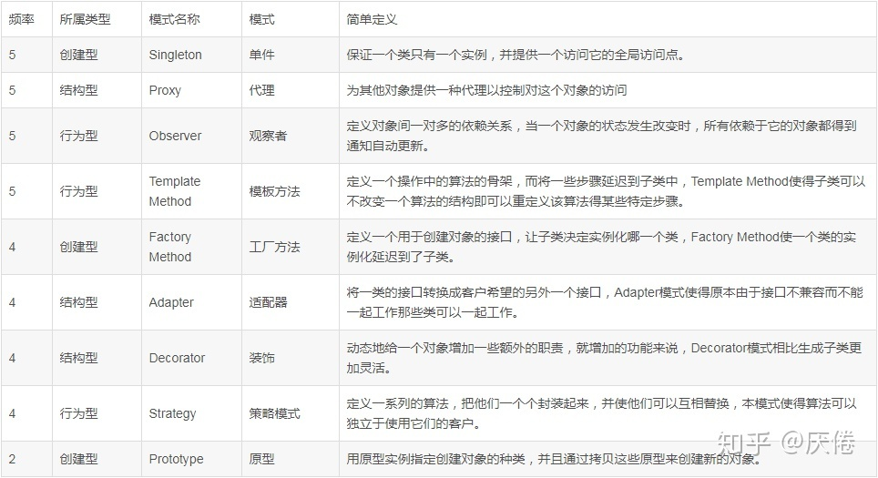

[TOC]

# 常见设计模式重要性

# 1. 创建型

## 1.1 单例模式

### 定义

1. 保证一个类只有一个实例，并提供一个全局函数来访问。

### 要解决的问题

1. 全局只能有一个的对象（如任务管理器），或者一个方便管理的对象（如池资源）。

### 应用场景

1. 全局的读取配置实例，方便配置统一管理。
2. 数据库连接池的设计一般也是采用单例模式，因为数据库连接是一种数据库资源。数据库软件系统中使用数据库连接池，主要是节省打开或者关闭数据库连接所引起的效率损耗，这种效率上的损耗还是非常昂贵的，因为何用单例模式来维护，就可以大大降低这种损耗。
3. 多线程的线程池的设计一般也是采用单例模式，这是由于线程池要方便对池中的线程进行控制。
4. 外部资源：每台计算机有若干个打印机，但只能有一个打印服务程序，以避免两个打印作业同时输出到打印机。内部资源：大多数软件都有一个（或多个）属性文件存放系统配置，这样的系统应该有一个对象管理这些属性文件

### 优点

1. 由于在系统内存中只存在一个对象，因此可以 节约系统资源，当 需要频繁创建和销毁的对象时单例模式无疑可以提高系统的性能。
2. 方便对象管理，如前面的配置读取。

### 缺点

1. 由于单利模式中没有抽象层，因此单例类的扩展有很大的困难。

### 注意事项

1. 多线程情况下，可能两个线程同时检测到单例不存在，然后都创建单例。这时需要使用锁或者CAS。（初始化时就创建单例不会有这个问题）

## 1.2 工厂模式

### 定义

1. 定义一个抽象类或者接口，工厂方法返回这个接口，子类实现这个结构。

### 优点

1. 产品使用者不需要关心产品类的创建过程，与具体产品的实现类达到解耦的效果；
2. 如果有新的产品加进来，只需要增加一个具体的创建产品工厂类和具体的产品类，不会影响其他原有的代码，后期维护更加容易，增强了系统的可扩展性。

### 缺点

1. 新增一个产品类的时候，需要修改原先的工厂方法。
2. 要额外的编写代码，增加了工作量。

### 应用

1. 如动物管理系统。工厂方法返回动物接口。

## 1.3 原型模式

### 是什么

1. 通过一个原型对象来表明要创建的类型，然后复制这个原型对象的方法来创建更多同类型的对象。有些类似拷贝构造函数。

### 为什么需要

1. TODO:

# 2. 结构型

## 2.1 代理模式（proxy）

### 是什么

1. 定义：给一个对象提供一个代理对象，由这个代理对象控制对原对象的引用，使代理类在客户端和原对象之间起到一个中介的作用。

### 为什么需要

1. 使用代理模式能够在不改变原来代码功能的基础上对某一对象进行额外的控制，是面向对象中单一职责的体现。

### 缺陷

1. 缺点：对于静态代理来说一个接口只服务于一种类型，如果要代理的方法很多则要为每一个方法定义一个接口。

### 应用场景

1. 当系统需要对某个对象进行额外的控制时。如数据库的proxy，进行重连，容灾等控制。

## 2.2 适配器adapter

### 是什么

1. 定义：将一个系统的接口转换成另外一种形式，从而使原来不能直接调用的接口变得可以调用。

### 为什么

1. 适配器模式也是一种包装模式，它与装饰模式同样具有包装的功能，此外，对象适配器模式还具有委托的意思。总的来说，适配器模式属于补偿模式，专用来在系统后期扩展、修改时使用。
2. 在软件开发中，也就是系统的数据和行为都正确，但接口不相符时，我们应该考虑用适配器，目的是使控制范围之外的一个原有对象与某个接口匹配。适配器模式主要应用于希望复用一些现存的类，但是接口又与复用环境要求不一致的情况。比如在需要对早期代码复用一些功能等应用上很有实际价值。

### 缺陷

1. 过多的使用适配器，会让系统非常零乱，不易整体进行把握。比如，明明看到调用的是 A 接口，其实内部被适配成了 B 接口的实现，一个系统如果太多出现这种情况，无异于一场灾难。因此如果不是很有必要，可以不使用适配器，而是直接对系统进行重构。

### 应用场景

1. 结构的数据结构不同，功能相同，加一层进行数据结构转换。

## 2.3 装饰decorator

### 和代理模式的区别

1. 从语意上讲，代理模式是为控制对被代理对象的访问，而装饰模式是为了增加被装饰对象的功能
2. 代理类所能代理的类完全由代理类确定，装饰类装饰的对象需要根据实际使用时客户端的组合来确定
3. 被代理对象由代理对象创建，客户端甚至不需要知道被代理类的存在；被装饰对象由客户端创建并传给装饰对象

# 3. 行为型

## 3.1 观察者模式

### 是什么

1. 让多个观察者对象同时监听某一个主题对象，这个主题对象在状态上发生变化时，会通知所有观察者对象，使它们能自动更新自己。

### 为什么

1. 降低被观察者和观察者之间的耦合度，每一个具体观察者都实现一个相同的抽象观察者接口。观察者向被观察者注册，被观察者支持广播通信。

### 缺点

1. 如果有多个观察者，通知所有观察者耗时较大。

### 应用场景

1. 股票行情系统，电脑，手机客户端都需要收到行情

## 3.2 模板方法

### 是什么

1. 定义一个算法的骨架,而将具体的算法延迟到子类中实现

### 为什么

1. 灵活地实现具体的算法，满足用户灵活多变的需求。
2. 当系统中算法的骨架是固定的时候，而算法的实现可能有很多种的时候，就需要使用模板方法模式。

### 缺陷

1. 算法骨架需要改变时需要修改抽象类。

### 应用场景

1. 做一个报表打印程序，用户规定需要表头，正文，表尾。但是客户的需求会变化，一会希望这样显示表头，一会希望那样显示。

## 3.3 策略模式

### 是什么

1. 针对一组算法，将每一个算法封装到具有共同接口的独立的类中，使得它们可以互相替换。

### 策略模式vs模板模式

1. 模板模式
   1. 定义一条线（算法流程），线上的多个点是可以变化的（具体实现在子类中完成），线上的多个点一定是会被执行的，并且一定是按照特定流程被执行的。
   2. 算法流程只有唯一的入口，对于点的访问是受限的【通常用受保护的虚函数来定义可变点】。
2. 策略模式更注重于： 一个“策略”是一个 整体的(完整的) 算法，算法是可以被整体替换的。而模板方法只能被替换其中的特定点，算法流程是固定不可变的。

# 参考文章

1. [互联网常用设计模式](https://zhuanlan.zhihu.com/p/50753534)
2. [单例模式的优缺点和使用场景](https://www.cnblogs.com/damsoft/p/6105122.html)
3. [设计模式的应用场景(2)--工厂相关模式](https://blog.csdn.net/zhi_fu/article/details/77646207)
4. [设计模式的应用场景(4)--原型模式](https://blog.csdn.net/zhi_fu/article/details/77651384)
5. [设计模式的应用场景(8)--代理模式](https://blog.csdn.net/zhi_fu/article/details/77677105)
6. [设计模式的应用场景(7)--适配器模式](https://blog.csdn.net/zhi_fu/article/details/77659484)
7. [设计模式的应用场景(9)--装饰模式](https://blog.csdn.net/zhi_fu/article/details/77677251)   [Java设计模式（六） 代理模式 vs. 装饰模式](http://www.jasongj.com/design_pattern/proxy_decorator/)   [Java中“装饰模式”和“代理模式”有啥区别？ - 知乎](https://www.zhihu.com/question/41988550/answer/462204684)
8. [设计模式的应用场景(14)--观察者模式](https://blog.csdn.net/zhi_fu/article/details/77687351)
9. [设计模式的应用场景(13)--模板方法模式](https://blog.csdn.net/zhi_fu/article/details/77685871)
10. [设计模式的应用场景(16)--策略模式](https://blog.csdn.net/zhi_fu/article/details/77688289) [模板方法模式与策略模式的区别](https://blog.csdn.net/hudashi/article/details/50978969)