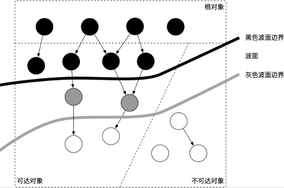

[TOC]

# golang gc简介

## 1. 根对象

1. 全局变量、goroutine执行栈（包含栈变量和指向堆内存块的指针）、寄存器（可能包含指向堆的指针）

## 2. go语言的gc方法

1. 追踪式GC：从根对象出发，一步步推进直到扫描完整个堆并确定需要保留的对象，从而回收所有可以回收的对象。
2. Go 的 GC 目前使用的是无分代（对象没有代际之分）、不整理（回收过程中不对对象进行移动与整理）、并发（与用户代码并发执行）的三色标记清扫算法。

## 3. 三色标记法

1. 从垃圾回收器的视角来看，三色抽象规定了三种不同类型的对象，并用不同的颜色相称：
   - 白色对象（可能死亡）：未被回收器访问到的对象。在回收开始阶段，所有对象均为白色，当回收结束后，白色对象均不可达（也就是能被回收）。
   - 灰色对象（波面）：已被回收器访问到的对象，但回收器需要对其中的一个或多个指针进行扫描，因为他们可能还指向白色对象。
   - 黑色对象（确定存活）：已被回收器访问到的对象，其中所有字段都已被扫描，黑色对象中任何一个指针都不可能直接指向白色对象。
2. 这样三种不变性所定义的回收过程其实是一个**波面**不断前进的过程，这个波面同时也是黑色对象和白色对象的边界，灰色对象就是这个波面。当垃圾回收开始时，只有白色对象。随着标记过程开始进行时，灰色对象开始出现（着色），这时候波面便开始扩大。当一个对象的所有子节点均完成扫描时，会被着色为黑色。当整个堆遍历完成时，只剩下黑色和白色对象，这时的黑色对象为可达对象，即存活；而白色对象为不可达对象，即死亡。这个过程可以视为以灰色对象为波面，将黑色对象和白色对象分离，使波面不断向前推进，直到所有可达的灰色对象都变为黑色对象为止的过程。如下图所示：



# 4. gc使用优化建议

1. ### **合理化内存分配的速度**

2. ### **降低并复用已经申请的内存**

3. ### **调整 GOGC**： 我们已经知道了 GC 的触发原则是由步调算法来控制的，其关键在于估计下一次需要触发 GC 时，堆的大小。可想而知，如果我们在遇到海量请求的时，为了避免 GC 频繁触发，是否可以通过将 GOGC 的值设置得更大，让 GC 触发的时间变得更晚，从而减少其触发频率，进而增加用户代码对机器的使用率呢？答案是肯定的。

   我们可以非常简单粗暴的将 GOGC 调整为 1000，来执行上一个例子中未复用对象之前的程序：

   -

   ```
   $ GOGC=1000 ./main
   ```


# 参考文章

1. [Go GC 20 问](https://mp.weixin.qq.com/s?__biz=MjM5MDUwNTQwMQ==&mid=2257484062&idx=1&sn=40a8cca15b9c215f8a29e60e6d8a3542&chksm=a53919c8924e90de345abb48b2e0789f8f8ca1557c607680ca366112fd4d7668e57c742700e3&mpshare=1&scene=1&srcid=&sharer_sharetime=1582118623661&sharer_shareid=f580f8e189ec9d3db6e796ce2712126a&key=7a968b619e4662bc362cc5fa5af892fce6c895904b0440f08442043d82381b5bb9fd8d5063b56ede024c43dd4606a2ce5c2962f323e4591d83b919120a643bc187ac73c5f153b1b9480d742bd1bc40ab&ascene=1&uin=Mjc4NTAyMjgwNg%3D%3D&devicetype=Windows+10&version=6208006f&lang=zh_CN&exportkey=AdQwQyw1WGptz7OC1ksEVZs%3D&pass_ticket=DQVi4QilkH1wPXzbFBMjKx6uxcoY5slcveMQSDF2MKjNCN5yGd93XKiZpBGwtkTU)