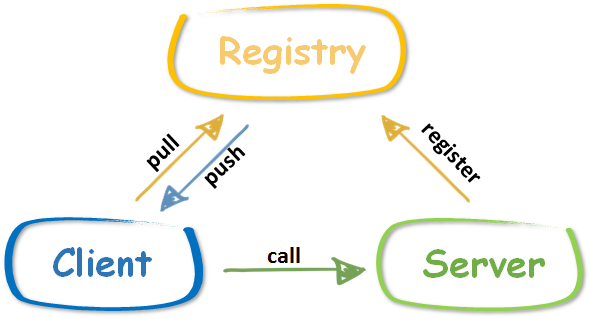

TODO：

1. 没有面向对象的方法，我们如何调用。关键问题。
2. 服务注册的etcd和zookeeper如何使用。

# 1. rpc介绍

## 1.1 rpc是什么

1. rpc（remote procedure call）是一个计算机通信协议。（http也是）
2. rpc采用c/s（client/server）模型, http一般是b/s模型（broser/server）。
3. rpc架构图：


服务的调用过程为：

- client调用client stub，这是一次本地过程调用
- client stub将参数打包成一个消息，然后发送这个消息。打包过程也叫做 marshalling
- client所在的系统将消息发送给server
- server的的系统将收到的包传给server stub
- server stub解包得到参数。 解包也被称作 unmarshalling
- 最后server stub调用服务过程. 返回结果按照相反的步骤传给client

## 1.2 rpcx功能

### 1.1.1 rpcx和beego mvc的区别

1. 从<https://rpcx.site/>这里面给的例子来看，是去除了url到函数的映射这一层，改为直接调用服务（controller）的成员函数（通过函数名调用）。
2. 服务注册，与beego的路由注册类似。
3. rpc相当于走post请求、router里面路由规则是controller名称作为url的注释路由（controller内直接以函数名称作为下下一级路由，所以直接省去路由注释）、加上参数对象解析和返回值对象封装。省去我们操心：
   1. 各种请求方式：目前看，各种请求方式是非必须的，大家也没用到，去掉是可以的。
   2. 合适的restful url：对内部服务，可以直接暴露函数名，所以url封装是不必要的。对外接口，还是提供url封装。
   3. 将restful url和函数名称绑定：直接调用函数名，所以可以省去这个有些繁琐的定义url到函数的路由过程。
   4. 请求参数解析和返回参数封装：省去了unmarshal的过程。（由必须走post接口，定义一个输入参数类型决定的。）

### 1.1.2 rpcx新增加的功能

1. 服务发现：服务发布、订阅、通知等，支持多种发现方式如ZooKeeper、Etcd等
2. 高可用策略：失败重试（Failover）、快速失败（Failfast）
3. 负载均衡：支持随机请求、轮询、低并发优先、一致性 Hash等
4. 规模可扩展，可以根据性能的需求增减服务器
5. 其他：调用统计、访问日志等

## 1.3 rpc框架选型

目前的 RPC 框架大致有两种不同的侧重方向，一种偏重于服务治理，另一种偏重于跨语言调用。

服务治理型的 RPC 框架有Alibab Dubbo、Motan 等，这类的 RPC 框架的特点是功能丰富，提供高性能的远程调用以及服务发现和治理功能，适用于大型服务的微服务化拆分以及管理，对于特定语言（Java）的项目可以十分友好的透明化接入。但缺点是语言耦合度较高，跨语言支持难度较大。

跨语言调用型的 RPC 框架有 Thrift、gRPC、Hessian、Finagle 等，这一类的 RPC 框架重点关注于服务的跨语言调用,但这类框架没有服务发现相关机制，实际使用时一般需要代理层进行请求转发和负载均衡策略控制。

### 1.3.1 rpcx vs gRPC

1. rpcx 性能远远高于 Dubbo、Motan、Thrift等框架，是gRPC性能的两倍。在

```shell
CPU: Intel(R) Xeon(R) CPU E5-2630 v3 @ 2.40GHz, 32 cores
Memory: 32G
Go: 1.9.1
OS: CentOS 7 / 3.10.0-229.el7.x86_64
```

测试：

- 吞吐率：rpcx: 192300 request/second *(grpc-go: 106886 request/second)*
- 平均时间/中位数时间：rpcx: 25/12 ms *(grpc-go: 46/41 ms)*
- 

2. rpcx支持部署在Windows/Linux/MacOS等平台，支持各种编程语言的调用（如果序列化？借助什么中间序列化工具）
3. gRPC的目标是跨语言开发，服务治理方面需要自己去实现(thrift也是)。

### 1.3.2  rpcx vs [net/rpc](https://golang.org/pkg/net/rpc/)

1. net/rpc 只是实现了点对点(End-to-End)的通讯框架，缺乏服务治理的功能，比如服务注册和发现、
   负载均衡、容灾、服务监控等功能。因此作者基于Go net/rpc框架实现了一个类似Dubbo的分布式框架。

### 1.3.3 thrift,gRPC,rpcx,motan,dubbox等rpc框架对比

1. 详见[thrift,gRPC,rpcx,motan,dubbox等rpc框架对比](https://blog.csdn.net/xuduorui/article/details/77938644)

### 1.3.4 Go语言rpc方案调研

1. 详见[Go语言rpc方案调研](https://scguoi.github.io/DivisionByZero/2016/11/15/GO%E8%AF%AD%E8%A8%80RPC%E6%96%B9%E6%A1%88%E8%B0%83%E7%A0%94.html)

### 1.3.5 问题：rpc框架要求固定个数的输入参数和输出参数

筛选golang写的，或者跨语言的rpc框架。

1. grpc：<https://grpc.io/docs/guides/concepts/>  要求输出参数和输出参数都是一个
2. rpcx：<https://doc.rpcx.site/part1/server.html#service> 要求输入参数是三个，输出参数是error
3. go-micro：<https://micro.mu/docs/writing-a-go-service.html#2-defining-the-api> 单输入、单输出的形式。
4. thift-file: <https://thrift-tutorial.readthedocs.io/en/latest/thrift-file.html> thift似乎并不限制输入参数和输出参数个数。但是需要定义较复杂的服务代码，然后有工具转化为远程调用的格式。


# 2. rpc能解决我们什么问题

1. 服务拆分后，不同的功能分布在不同的模块。服务之间的功能调用，要么通过http请求，但是这要求将原来的函数都转化为RESTful url，需要较大的开发量；要么，拷贝代码，一份代码在使用的地方都拷贝一份，这样带来了维护升级的困难，并且有并发修改的风险。

   通过rpc，直接调用其他服务的函数，能解决这个问题。

2. 成熟的rpc库相对http容器，封装了“服务发现”，"负载均衡"，“熔断降级”一类面向服务的高级特性。减轻了我们重复开发的工作量。

## 2.1 总结

1. 总上面的rpc选型来看，要接入rpc，要么需要定义类似于`.proto`、`.thift`这样的服务描述文件，要么需要将函数的输入和输出参数按照指定要求改造。违背了我们想通过rpc直接调用其他服务的功能，减少写http接口工作量的初衷。
2. 换一个思路，我们可以通过直接调用其他服务的函数来编译，解决我们关于拷贝代码带来的版本复杂性的担忧。
   - 最简单解耦：例如task里面使用了access/models里面`GetRoleById`函数，我们可以进行如下的解耦：

```go
import (
	access_model "yiplatform-access/models"
    "yiplatform-task/models"
)

func XXX(roleid,taskid int) (err error){
    role,err := access_models.GetRoleById(roleid)
    task,err := models.GetTaskById(taskid)
}
```

- 定义接口层解耦：

```go
import (
	"yiplatform-task/utils/access_models"
    "yiplatform-task/models"
)

func XXX(roleid,taskid int) (err error){
    role,err := access_models.GetRoleById(roleid)
    task,err := models.GetTaskById(taskid)
}
```

接口层：

```go
package access_model
import (
	"yiplatform/access/models"
)

func GetRoleById(roleid int) (role models.Role,err error) {
    return models.GetRoleById(roleid)
}
```


# 3. 接入rpcx，我们需要做什么

## 3.1 调用方法

### 3.1.1 服务端定义

详见：<https://doc.rpcx.site/part1/function.html>

#### 3.1.1.1 注册类方法

1. 作为服务提供者，首先你需要定义服务。 当前rpcx仅支持 可导出的 `methods` （一个struct方法） 作为服务的函数，并且这个可导出的方法必须满足以下的要求：

- 必须是可导出类型的方法：首字母大写

- ##### 接受3个参数，第一个是 `context.Context`类型，其他2个都是可导出（或内置）的类型。

- ##### 第3个参数是一个指针

- ##### 有一个 error 类型的返回值

2. 使用`Register`或者`RegisterName`来注册，一次可以注册一个类。

#### 3.1.1.2 注册函数

1. 可以注册纯函数

- 函数可以是可导出的或者不可导出的（**对大小写没有要求**）
- 接受3个参数，第一个是 `context.Context`类型，其他2个都是可导出（或内置）的类型。
- 第3个参数是一个指针
- 有一个 error 类型的返回值

2. 服务端必须使用 `RegisterFunction` 来注册一个函数并且提供一个服务名。

```go
type Reply struct { C int }
func mul(ctx context.Context, args Args, reply Reply) error { 
    reply.C = args.A * args.B 
    return nil 
}
func main() { 
    flag.Parse()
	s := server.NewServer()
	s.RegisterFunction("a.fake.service", mul, "")
	s.Serve("tcp", *addr)
}
```

客户端可以通过服务名和函数名来调用服务

```go client.go
    d := client.NewPeer2PeerDiscovery("tcp@"+*addr, "")
    xclient := client.NewXClient("a.fake.service", client.Failtry, client.RandomSelect, d, client.DefaultOption)
    defer xclient.Close()

    args := &example.Args{
        A: 10,
        B: 20,
    }

    reply := &example.Reply{}
    err := xclient.Call(context.Background(), "mul", args, reply)
    if err != nil {
        log.Fatalf("failed to call: %v", err)
    }

    log.Printf("%d * %d = %d", args.A, args.B, reply.C)
```

### 3.1.2 客户端调用


## 3.2 调试方法

1. 官方提供了调试工具：<https://github.com/smallnest/rpcxdump>（20颗星，4个fork）


## 3.3 鉴权方法

rpcx提供了身份授权的功能,详见<https://doc.rpcx.site/part4/auth.html>，也是基于token的方案。

## 3.4 可视化服务管理

1. 详见<https://github.com/smallnest/rpcx-ui>


# 4 RPCX

3812颗星，642个fork。

## 4.1 RPCX的特点

- 基于net/rpc,可以将net/rpc实现的RPC项目轻松的转换为分布式的RPC
- 插件式设计，可以配置所需的插件，比如服务发现、日志、统计分析等
- 基于TCP长连接,只需很小的额外的消息头
- 支持多种编解码协议，如Gob、Json、MessagePack、gencode、ProtoBuf等
- 服务发现：服务发布、订阅、通知等，支持多种发现方式如ZooKeeper、Etcd等
- 高可用策略：失败重试（Failover）、快速失败（Failfast）
- 负载均衡：支持随机请求、轮询、低并发优先、一致性 Hash等
- 规模可扩展，可以根据性能的需求增减服务器
- 其他：调用统计、访问日志等

## 4.2 RPCX的架构

1. rpcx中有服务提供者 RPC Server，服务调用者 RPC Client 和服务注册中心 Registry 三个角色


2. Server 向 Registry 注册服务，并向注册中心发送心跳汇报状态(基于不同的registry有不同的实现，当前rpcx支持zookeeper, etcd等注册中心)。
3. Client 需要向注册中心查询 RPC 服务者列表，Client 根据 Registry 返回的服务者列表，选取其中一个 Sever 进行 RPC 调用。可选地，Server可以定期向Registry汇报调用统计信息，Client可以根据调用次数选择压力最小的Server。
4. 当 Server 发生宕机时，Registry 会监测到服务者不可用(zookeeper session机制或者手工心跳)，Client 感知后会对本地的服务列表作相应调整。client可能被动感知(zookeeper)或者主动定时拉取。

## 4.3 RPCX的特性

### 4.3.1 服务器特性

#### 1. 序列化

#### 2. 注册中心

#### 3. 扩展点

### 4.3.2 客户端特性

#### 1. 负载均衡

#### 2. 容错

#### 3. 重选算法

#### 4. 扩展点

## 4.4 常见例子

# 5. 风险点

1. 如<https://blog.rpcx.site/posts/why-did-i-develop-rpcx/>介绍的，作者16年开始开发的项目。虽然有3000多个星，但是目前列举的用户就`拍够购`。有哪些坑，目前还不明确。