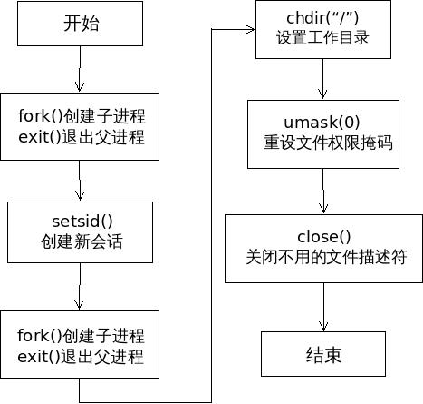

[TOC]


# 1. 如何让进程变成守护进程

## 1.1 变成守护进程需要做什么

### 1.1.1 Linux系统退出时做了什么

1. 用户退出 session 过程

> 用户准备退出 session
> 系统向该 session 发出SIGHUP信号
> **session 将SIGHUP信号发给所有子进程**
> **子进程收到SIGHUP信号后，自动退出**

上面的流程解释了，为什么"前台任务"会随着 session 的退出而退出：因为它收到了`SIGHUP`信号。那么，"后台任务"是否也会收到`SIGHUP`信号？这由 Shell 的`huponexit`参数决定的,大多数Linux系统，这个参数默认关闭（`off`），可以通过以下命令查看`huponexit`是否是关闭的：

```shell
$ shopt | grep huponexit
```

2. 退出 session 以后，如果后台进程与标准I/O有交互，它还是会挂掉。这是因为"后台任务"的标准 I/O 继承自当前 session,一旦"后台任务"读写标准 I/O，就会发现它已经不存在了，所以就报错终止执行。为了解决这个问题，需要对"后台任务"的标准 I/O 进行重定向。

## 1.2 变成守护进程的方案

### 1.2.1 nohup: 阻止向程序发送hup信号并重定向标准输入输出

1. nohup做如下几件事

> - 阻止`SIGHUP`信号发到这个进程。
> - 关闭标准输入。该进程不再能够接收任何输入，即使运行在前台。
> - 重定向标准输出和标准错误到文件`nohup.out`

- 也就是说，`nohup`命令实际上将子进程与它所在的 session 分离了。
- 注意，`nohup`命令不会自动把进程变为"后台任务"，所以必须加上`&`符号。如:

```shell
$ nohup node server.js &
```

### 1.2.2 Systemd

除了专用工具以外，Linux系统有自己的守护进程管理工具 Systemd 。它是操作系统的一部分，直接与内核交互，性能出色，功能极其强大。我们完全可以将程序交给 Systemd ，让系统统一管理，成为真正意义上的系统服务。详见[Systemd 入门教程：命令篇](<http://www.ruanyifeng.com/blog/2016/03/systemd-tutorial-commands.html>)


### 1.2.3 Unix网络编程中的方法

1. 一次fork得到子进程，父进程退出。

   1. **目的：让进程在后台执行**，**并让子进程不是组长进程进而能够调用`setpid`**
   2. 问题：系统调用 fork 创建子进程，子进程便复制了原父进程的进程控制块（PCB），相应地继承了一些信息，包括会话、进程组、控制终端等信息。尽管父进程已经退出，但**子进程的会话、进程组、控制终端的信息没有改变**。

2. 一次子进程调用 `setsid` 函数，创建新会话

   1. 注意：组长进程调用 setsid ，则出错返回，无法新建会话。
   2. 进程组和回话

   - `进程组`：一个或多个进程的集合。拥有唯一的标识进程组 ID，每个进程组都有一个组长进程，该进程的进程号等于其进程组的 ID。进程组 ID 不会因组长进程退出而受到影响，fork 调用也不会改变进程组 ID。
   - `会话`：一个或多个进程组的集合。**新建会话时，当前进程（会话中唯一的进程）成为会话首进程，也是当前进程组的组长进程，其进程号为会话 ID，同样也是该进程组的 ID**。它通常是登录 shell，**也可以是调用 setsid 新建会话的孤儿进程**。

   3. **目的：使当前进程脱离原会话的控制；使当前进程脱离原进程组的控制；使当前进程脱离原控制终端的控制**

3. **再次 fork() 一个子进程并让父进程退出**

   1. 目的：一次fork子进程成为无终端的会话组长，但它可以重新申请打开一个控制终端. 二次fork子进程不是会话首进程，该进程将不能重新打开控制终端。

4. **在子进程中调用 chdir() 函数，让根目录 ”/” 成为子进程的工作目录**

   1. 目的：fork创建的子进程继承了父进程的当前工作目录。由于在进程运行中，当前目录所在的文件系统（如“/mnt/usb”）是不能卸载的，这对以后的使用会造成诸多的麻烦（比如系统由于某种原因要进入单用户模式）。因此，通常的做法是让"/"作为守护进程的当前工作目录，这样就可以避免上述的问题，当然，如有特殊需要，也可以把当前工作目录换成其他的路径，如/tmp。改变工作目录的常见函数是chdir。

5. **在子进程中调用 umask() 函数，设置进程的文件权限掩码为0**

   1. 目的：文件权限掩码是指屏蔽掉文件权限中的对应位。比如，有个文件权限掩码是050，它就屏蔽了文件组拥有者的可读与可执行权限。由于使用fork函数新建的子进程继承了父进程的文件权限掩码，这就给该子进程使用文件带来了诸多的麻烦。因此，把文件权限掩码设置为0，可以大大增强该守护进程的灵活性。设置文件权限掩码的函数是umask。在这里，通常的使用方法为umask(0)。

6. **在子进程中关闭任何不需要的文件描述符**

   1. ork函数新建的子进程会从父进程那里继承一些已经打开了的文件。这些被打开的文件可能永远不会被守护进程读写，但它们一样消耗系统资源，而且可能导致所在的文件系统无法卸下。
      在上面的第二步之后，守护进程已经与所属的控制终端失去了联系。因此从终端输入的字符不可能达到守护进程，守护进程中用常规方法（如printf）输出的字符也不可能在终端上显示出来。所以，文件描述符为0、1和2 的3个文件（常说的输入、输出和报错）已经失去了存在的价值，也应被关闭。

7. **守护进程退出处理**

   1. 当用户需要外部停止守护进程运行时，往往会使用 kill 命令停止该守护进程。所以，守护进程中需要编码来实现 kill 发出的signal信号处理，达到进程的正常退出



## 1.3 golang成为守护进程的方式

1. https://stackoverflow.com/a/10068950 推荐使用`daemonize`这个工具,并给了一个例子：

```shell
daemonize -p /var/run/myapp.pid -l /var/lock/subsys/myapp -u nobody /path/to/myapp.exe
```

- p pid指定pid文件存放位置
- l lock，单实例启动时将会检查这个文件
- u user,指定用哪个账户去执行

1. https://stackoverflow.com/a/23736264 实现了一个库，但是也说如果daemonization发生在goroutine启动之后，会有一些问题。<https://segmentfault.com/q/1010000000699471>这里面有提到不能通过简单fork来实现的原因：

> go 程序里面因为使用了线程，不能够简单的通过 fork 来实现子进程，否则会出现各种错乱。我记得官方文档里面有提到这个事情的，不过一时找不到链接了。

### 1.3.1 daemonize使用

1. 详见[Linux守护进程运行命令daemonize](<https://blog.csdn.net/erlang_hell/article/details/51187205>)
2. 安装`sudo apt-get install daemonize`
3. 常见参数：

```shell
-e
重定向输出标准错误到指定的文件中，替代/dev/null
-o
重定向输出标准到指定的文件中，替代/dev/null
-E name=value
增加环境变量给给后台程序。这个这个参数类型一定要是name=value格式。参数可以设置多次。
-c directory
定制运行命令前的目录。
-p pidfile
定制自己的pid存放位置。
-l lockfile
单实例启动时将会检查这个文件。
-u user
定制程序以谁的身份运行的。
-v
将会触发daemonize将自己程序的运行详细的日志输出到标准输出中。
-a
挂载到输出文件，而不是冲掉默认值。只有应用了-e and/or -o 被指定的情况。
```

### 1.3.2 nohup & 方案 和 daemonize方案的区别

1. 详见<https://stackoverflow.com/a/958454>，简言之，nohup直接忽略一些信号；而daemonize似乎是将上面介绍的《unix网络高级编程》中的两次fork方案做成了一个工具。

# 参考资料

1. [Linux 守护进程的启动方法](<http://www.ruanyifeng.com/blog/2016/02/linux-daemon.html>)
2. [如何实现守护进程](<https://github.com/selfboot/CS_Offer/blob/master/Linux_OS/Daemon.md>)
3. [【Linux编程】守护进程(daemon)详解与创建](<https://blog.csdn.net/woxiaohahaa/article/details/53487602>)
4. [Linux守护进程运行命令daemonize](<https://blog.csdn.net/erlang_hell/article/details/51187205>)