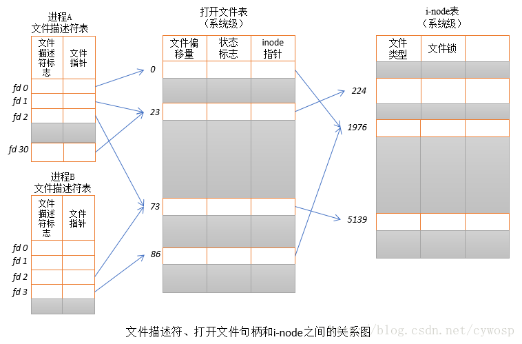

[TOC]

# 1. 文件、文件描述符、文件句柄

1. 每一个进程都有一个打开的文件句柄表，文件描述符是文件句柄表的下标，两者数量不一定相同。lsof查看的是用户空间的文件描述符。

2. 一个文件句柄可能对应多个文件描述符，文件句柄有引用计数。

3. linux把文件 目录 socket 共享内存 epoll连接等都当做文件

4. POSIX标准要求每次打开文件时（含socket）必须使用当前进程中最小可用的文件描述符号码，因此，在网络通信过程中稍不注意就有可能造成串话。

5. > 每一个文件描述符会与一个打开文件相对应，同时，不同的文件描述符也会指向同一个文件。相同的文件可以被不同的进程打开也可以在同一个进程中被多次打开。系统为每一个进程维护了一个文件描述符表，该表的值都是从0开始的，所以在不同的进程中你会看到相同的文件描述符，这种情况下相同文件描述符有可能指向同一个文件，也有可能指向不同的文件。具体情况要具体分析，要理解具体其概况如何，需要查看由内核维护的3个数据结构。
   >     1. 进程级的文件描述符表
   >     2. 系统级的打开文件描述符表
   >     3. 文件系统的i-node表
   >
   > 进程级的描述符表的每一条目记录了单个文件描述符的相关信息。
   >     1. 控制文件描述符操作的一组标志。（目前，此类标志仅定义了一个，即close-on-exec标志）
   >     2. 对打开文件句柄的引用
   >
   > 内核对所有打开的文件的文件维护有一个系统级的描述符表格（open file description table）。有时，也称之为打开文件表（open file table），并将表格中各条目称为打开文件句柄（open file handle）。一个打开文件句柄存储了与一个打开文件相关的全部信息，如下所示：
   >     1. 当前文件偏移量（调用read()和write()时更新，或使用lseek()直接修改）
   >         2. 打开文件时所使用的状态标识（即，open()的flags参数）
   >         3. 文件访问模式（如调用open()时所设置的只读模式、只写模式或读写模式）
   >         4. 与信号驱动相关的设置
   >         5. 对该文件i-node对象的引用
   >         6. 文件类型（例如：常规文件、套接字或FIFO）和访问权限
   >         7. 一个指针，指向该文件所持有的锁列表
   >         8. 文件的各种属性，包括文件大小以及与不同类型操作相关的时间戳
   >
   > 下图展示了文件描述符、打开的文件句柄以及i-node之间的关系，图中，两个进程拥有诸多打开的文件描述符。



6. 总结

>     1. 由于进程级文件描述符表的存在，不同的进程中会出现相同的文件描述符，它们可能指向同一个文件，也可能指向不同的文件
>     2. 两个不同的文件描述符，若指向同一个打开文件句柄，将共享同一文件偏移量。因此，如果通过其中一个文件描述符来修改文件偏移量（由调用read()、write()或lseek()所致），那么从另一个描述符中也会观察到变化，无论这两个文件描述符是否属于不同进程，还是同一个进程，情况都是如此。
>     3. 要获取和修改打开的文件标志（例如：O_APPEND、O_NONBLOCK和O_ASYNC），可执行fcntl()的F_GETFL和F_SETFL操作，其对作用域的约束与上一条颇为类似。
>     4. 文件描述符标志（即，close-on-exec）为进程和文件描述符所私有。对这一标志的修改将不会影响同一进程或不同进程中的其他文件描述符


# 2. close fork与文件描述符
1. 打开文件后，没有close，可能导致文件描述符一直占用。
2. 父子进程是通过各自进程的文件表项共享同一个文件的索引节点来实现共享文件的。
  也就是说在fork之后父子进程中指向同一个文件的`fd`是一样的。
3. 每当一个进程执行完毕之后，Linux 系统会将与进程相关的文件句柄自动释放。但是，如果进程一直处于执行状态，文件的句柄只能通过“关闭文件”操作来自我释放。


# 3. 句柄泄露

1. 造成句柄泄露的主要原因，是进程在调用系统文件之后，没有释放已经打开的文件句柄。
2. Linux 系统对进程可以调用的文件句柄数做了限制，在默认情况下，每个进程可以调用的最大句柄数为 1024 个
3. `ulimit –n`查看系统定义的最大文件句柄数量，`ulimit -n 2048`设置系统定义的最大文件句柄数量为2048.
4. 在 Linux 平台上，`lsof（list open files）`是一个列出当前系统打开文件的工具。

```shell
$ sudo lsof|head -5
COMMAND PID TID USER  FD TYPE DEVICE SIZE/OFF   NODE NAME
systemd   1     root cwd  DIR    8,1     4096      2 /
systemd   1     root rtd  DIR    8,1     4096      2 /
systemd   1     root txt  REG    8,1  1595792 417679 /lib/systemd/systemd
systemd   1     root mem  REG    8,1  1700792 400524 /lib/x86_64-linux-gnu/libm-2.27.so
$ lsof -p 1583|head -5
COMMAND    PID USER   FD TYPE DEVICE SIZE/OFF   NODE NAME
gnome-sof 1583  lhf  cwd  DIR    8,1     4096 295498 /home/lhf
gnome-sof 1583  lhf  rtd  DIR    8,1     4096      2 /
gnome-sof 1583  lhf  txt  REG    8,1   986816    409 /usr/bin/gnome-software
gnome-sof 1583  lhf  mem  REG    8,1    75872 428868 /lib/x86_64-linux-gnu/libnss_myhostname.so.2

```

> COMMAND：进程的名称
> PID：进程标识符
> USER：进程所有者
> FD：文件描述符，应用程序通过文件描述符识别该文件。如 cwd、txt 等
> TYPE：文件类型，如 DIR、REG 等
> DEVICE：指定磁盘的名称
> SIZE：文件的大小
> NODE：索引节点（文件在磁盘上的标识）
> NAME：打开文件的确切名称

# 参考资料

1. [每天进步一点点——Linux中的文件描述符与打开文件之间的关系](<https://blog.csdn.net/cywosp/article/details/38965239>)