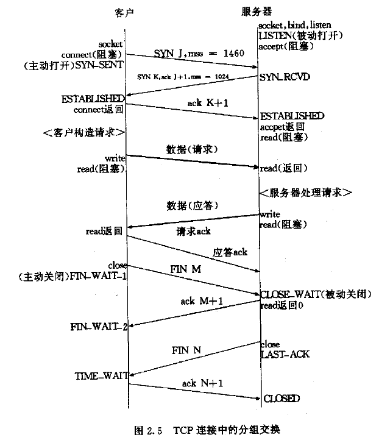

# 概览
netstat可用来查看socket套接字情况，包括TCP、UDP、unix domain socket。
# 常用筛选命令
- 筛选状态
	- `-a, --all`: 所有状态
	- `-l, --listening`: 正在监听的套接字
- 筛选套接字协议类型：
	- `-t`: TCP
	- `-u`: UDP
	- `-x`: unix domain socket
- 域名解析、用户名解析
	- `-n, --numeric`: 不解析
	- 默认进行解析
- PID/Program name：
	- `-p, --programs`: 打印
	- 默认不打印
- 用户名等其他信息：
	- `-e, --extend`: 打印
	- 默认不打印
- 统计
	- `-s, --statistics`:  display networking statistics (like SNMP)
# TCP端口状态详解

## TIME_WAIT状态过多怎么办
### TIME_WAIT状态代表什么
1. `TIME_WAIT`代表主动关闭的一方，已经收到对方回复的`FIN`并发送了`ACK`，等待一段时间就可以直接进入`CLOSED`状态了。
2. 只有首先调用`close()`发起主动关闭的一方才会进入`TIME_WAIT`状态，进入TIME_WAIT状态的TCP连接需要经过`2MSL`才能回到初始状态，其中，MSL是指`Max Segment Lifetime`，即数据包在网络中的最大生存时间。每种TCP协议的实现方法均要指定一个合适的MSL值，如RFC1122给出的建议值为2分钟，又如Berkeley体系的TCP实现通常选择30秒作为MSL值。**这意味着TIME_WAIT的典型持续时间为1-4分钟**。
### TIME_WAIT状态有什么作用
 如果没有`TIME_WAIT`状态，那么主动关闭端在在收到对端发送的`FIN`后，会发送一个`ACK`，然后进入`CLOSED`状态。此时如果这个`ACK`丢失，那么对端会重发一个`FIN`，此时`CLOSED`状态的socket会返回一个`RST`, **这会被对方认为有错误发生（而事实上，这是正常的关闭连接过程，并非异常）**. 所以为了实现TCP全双工连接的终止可靠性需要`TIME_WAIT`状态。另外如果在这个处于`CLOSED`状态的socket马上被重用，那么有可能收到原来对端在网络中延时到达的包；由于TCP连接由四元组唯一标识，TCP协议栈是无法区分前后两条TCP连接的不同的连接，这样**会引起数据错乱进而导致各种无法预知的诡异现象**，所以为使旧的数据包在网络因过期而消失，需要`TIME_WAIT`状态。

### TIME_WAIT状态过多会发生什么
1. `TIME_WAIT`过多说明有很多连接处于即将进入`CLOSED`状态。由于新建对外连接会临时分配端口号，默认`TIME_WAIT`状态的链接不能被重用，所以此时有可能发生**主动发起对外连接时端口不够用的情况**。
- `sudo sysctl -a | grep ipv4.ip_local_port_range`: Linux系统端口范围, `/etc/sysctl.conf`中修改
2. tcp连接数量还受限于linux系统能打开的最大文件数量，见[Linux 内核优化-调大TCP最大连接数](https://blog.csdn.net/Just_shunjian/article/details/78288229)、[Linux下高并发socket最大连接数所受的各种限制](https://blog.csdn.net/guowake/article/details/6615728)
- `ulimit -n`:用户最大打开的文件数量，`/etc/security/limits.conf`中修改
- `sudo sysctl -a|grep file-max`:Linux系统中所有用户同时打开文件数上限，`/etc/sysctl.conf`中修改
3. tcp连接数量还受限于linux系统最大追踪TCP连接数量
- `sysctl -a | grep ipv4.ip_conntrack_max`:Linux系统最大追踪TCP连接数量,`/etc/sysctl.conf`中修改

### 什么时候TIME_WAIT状态会很多
默认TCP配置下，短时间进行了大量的主动关闭动作。
### 如何优化`TIME_WAIT`过多的情况
1. **允许重用`TIME_WAIT`状态的链接**：在/etc/sysctl.conf中，设置`net.ipv4.tcp_tw_reuse = 1`后，执行`sysctl -p`生效。（在重启服务时提醒端口已被占用时比较有用）
2. **让`TIME_WAIT`状态的socket快速回收**：在/etc/sysctl.conf中，设置`net.ipv4.tcp_tw_reuse=1`和`net.ipv4.tcp_timestamps = 1`后，执行`sysctl -p`生效。
3. 增加本地端口的范围，在Windows下，你可以调整 MaxUserPort 注册表项，很多Windows系统下默认的端口范围比较小，大约4000个左右。
### nat设备的问题
1. 在nat模式下（服务器一般会用到dnat，用户一般会用到snat），nat设备（or服务器）会修改目的ip和源ip，以屏蔽内部信息。试想很多用户snat出来，通过dnat访问网站，在dnat这层，时而会产生时间戳错乱的问题，那么基于tcp的时间戳的tcp_tw_recycle，就会出错。
2. **tcp会记录每个连接的时间戳，如果后续时间戳比之前记录的时间戳小，就会认为这是错误的连接，拒绝这个连接。如果tcp_tw_recycle开启，那么这种规则就会被激活（那样才能快速回收连接）。**所以在lvs使用nat的情况下，用户请求到lvs，LVS会修改地址数据后将请求转发给后端服务器，但不会修改时间戳（因为nat的机制就是只修改源地址和目的地址）。**在后端服务器看来，请求的源地址永远都是LVS的地址，并且端口复用，原本不同客户端的请求经过LVS的转发，就可能会被认为是同一个连接，加之不同客户端的时间可能不一致，所以就会出现时间戳错乱的现象，于是后面的数据包就被丢弃了，具体的表现通常是是客户端明明发送的SYN，但服务端就是不响应ACK**，就会出现部分用户能连接服务器，部分用户不能连接服务器的情况。但在LVS使用用dr模式情况下，lvs只会修改mac和ip地址的映射关系，后端服务器看到的还是不通的用户ip，所以激活这一规则，也不会有问题。我们这里能使用这个策略，最大的原因也是在这里。
- [TCP/IP详解--TCP连接中TIME_WAIT状态过多](https://blog.csdn.net/yusiguyuan/article/details/21445883) 讲了`TIME_WAIT`的作用，发生的场景，和在非nat情况下的解决办法。
- [服务器tcp连接timewait过多优化及详细分析](https://blog.csdn.net/cheng_fangang/article/details/49778161)  讲了如何处理`TIME_WAIT`过多，和为什么nat情况下这样处理会有问题。

# 参考资料
- [netstat 的10个基本用法](https://linux.cn/article-2434-1.html)
- [netstat命令中的TCP SOCKET 状态](https://blog.csdn.net/konga/article/details/8265146)
- [TCP/IP详解--TCP连接中TIME_WAIT状态过多](https://blog.csdn.net/yusiguyuan/article/details/21445883) 讲了`TIME_WAIT`的作用，发生的场景，和在非nat情况下的解决办法。这篇文章被人指出有问题，好像危害没弄明白，乱改。
- [服务器tcp连接timewait过多优化及详细分析](https://blog.csdn.net/cheng_fangang/article/details/49778161)  讲了如何处理`TIME_WAIT`过多，和为什么nat情况下这样处理会有问题。和回滚。
- [time_wait状态的产生原因，危害，如何避免？](http://www.voidcn.com/article/p-aogsoptp-hw.html) 讲了为什么要有`TIME_WAIT`状态，过多有什么问题。
- [netstat命令中的TCP SOCKET 状态](https://blog.csdn.net/konga/article/details/8265146) TCP状态变化图
- [Linux 内核优化-调大TCP最大连接数](https://blog.csdn.net/Just_shunjian/article/details/78288229)
- [Linux下高并发socket最大连接数所受的各种限制](https://blog.csdn.net/guowake/article/details/6615728)
