# 一些notation

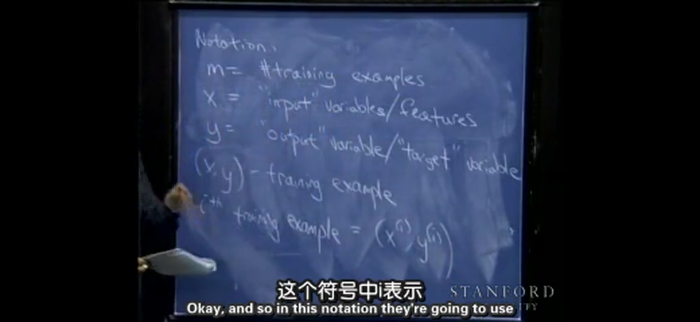

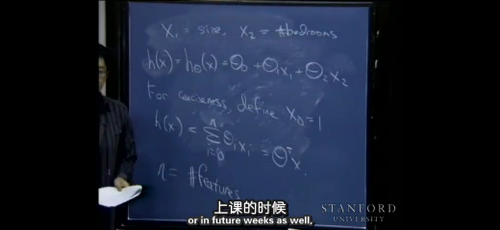

- m：`#training example`
- n：`#features`

## 矩阵求导

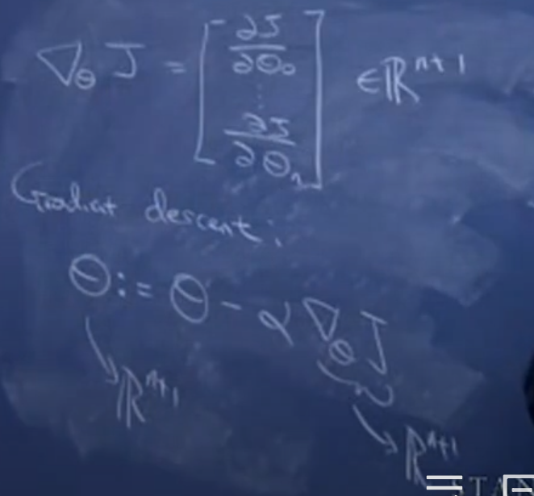

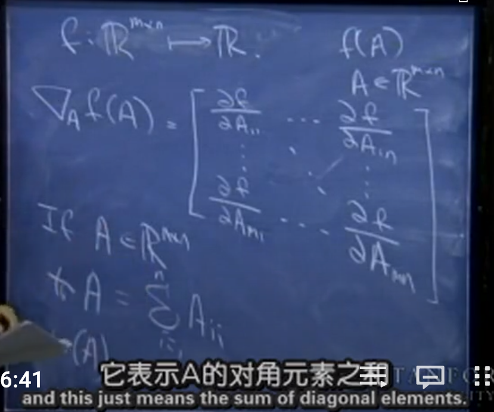

- f(A)是一个从`m*n`维度映射到一维的函数。trA表示矩阵的迹,上图中，对`n*n`维矩阵的迹进行了额外的说明。等于对角线元素之和。这个似乎有印象，为什么还不懂。需要看一下线性代数相关的：TODO。
  - 迹是对角线元素之和。
- 关于举证的迹的一些定理

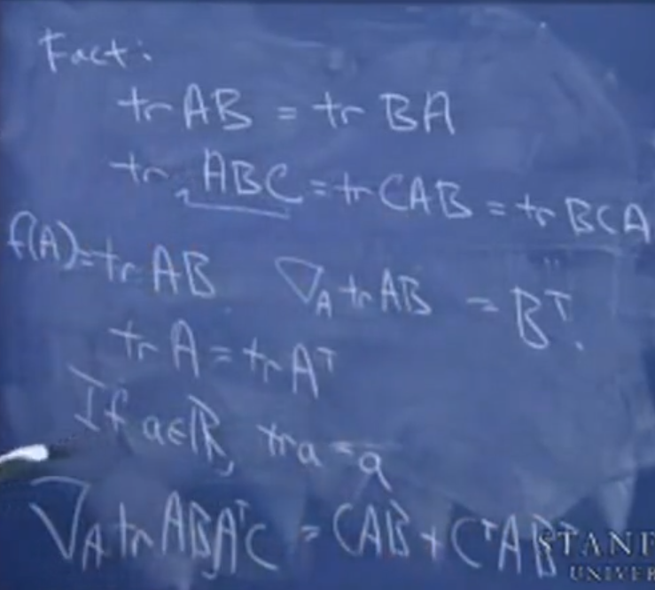

- TODO:prove

# 如何评判假说

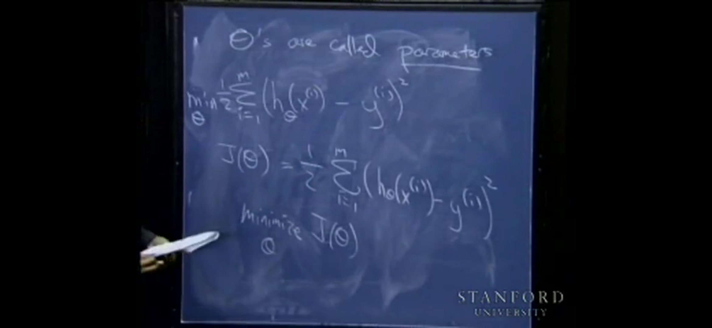

# gradient descent

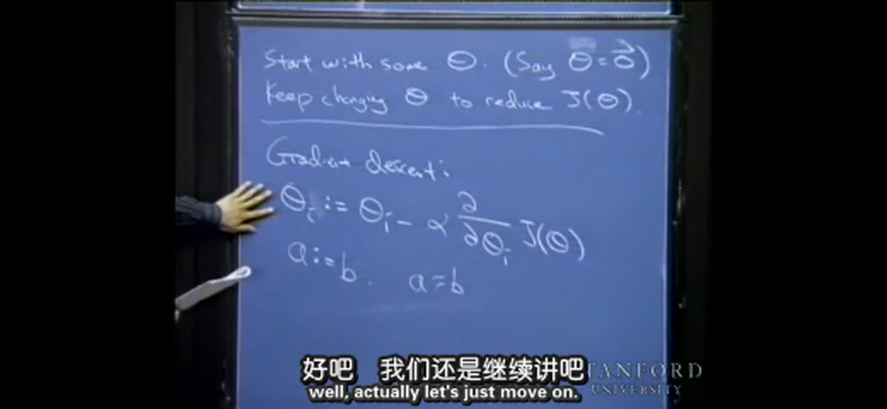

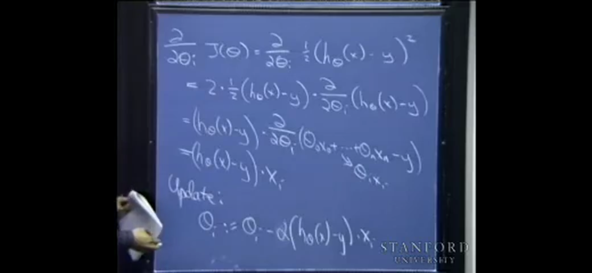

## gradient descent的缺点

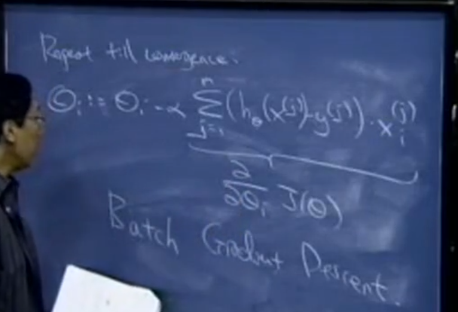

- batch指每一次迭代时进行的求和操作，在数据量比较大的时候，会成为一个batch。

## 随机的（stochastic）gradient descent

- 在大的数据集时，batch gradient descent会比较慢。此时会用到stochastic gradient descent。伪代码如上图，对每一个样板进行迭代，而不是一开始就对所有样本进行迭代。一般会在全局最小值附近徘徊，如上图等高线所示路径。
- 上面m代表对所有的数据集进行一步步迭代，for all i代表对n个feature进行相同的操作。这个原理还没怎么读懂，需要看一下讲义：TODO

## 使用向量来进行迭代的过程

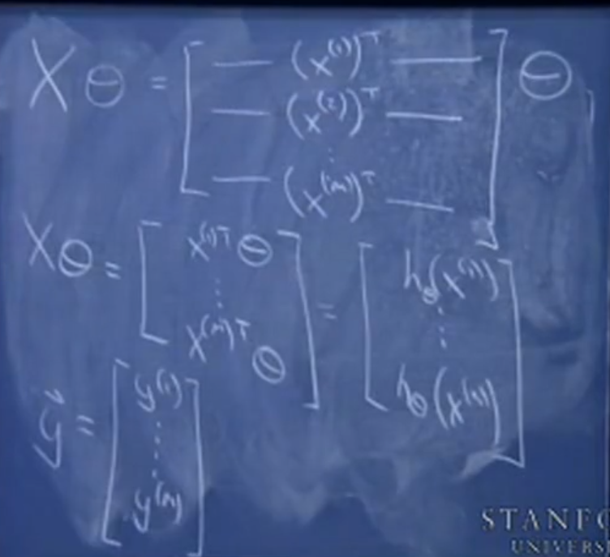

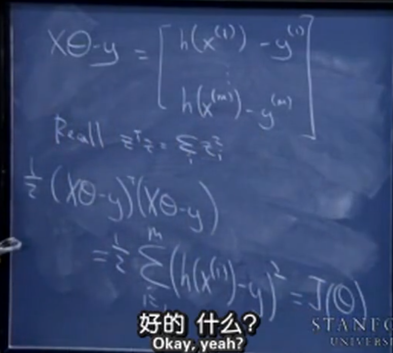

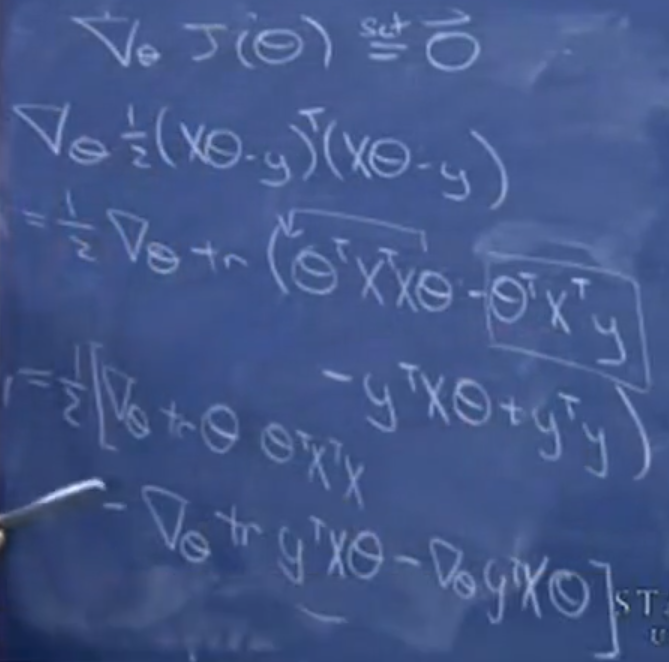

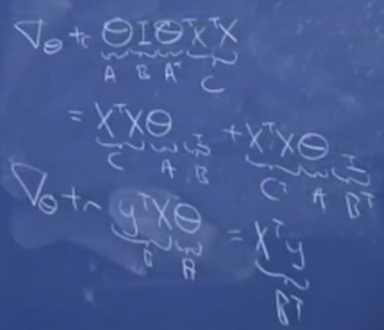

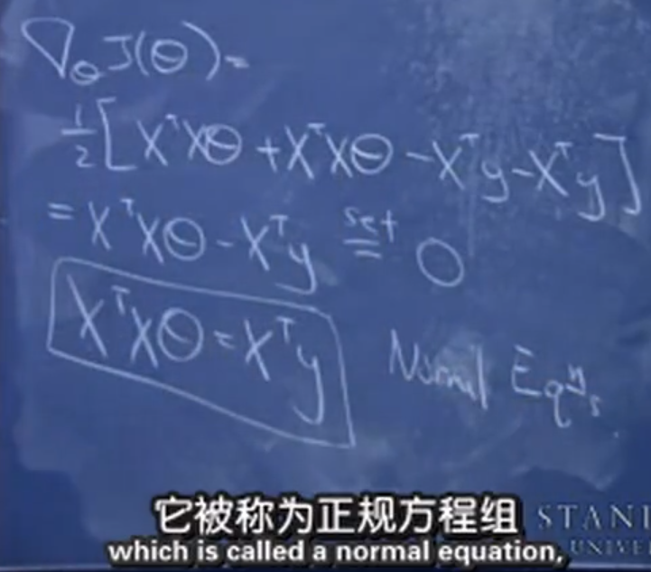

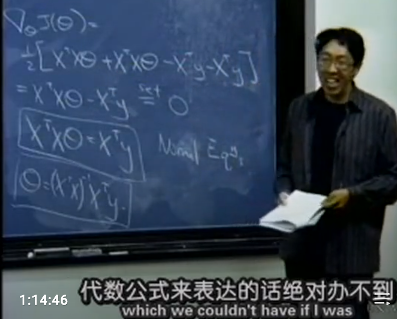

