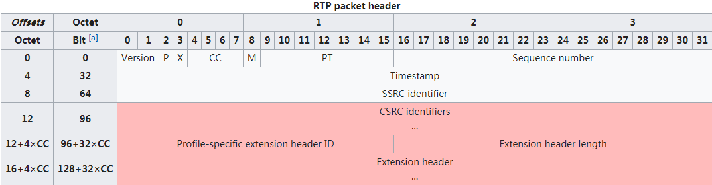
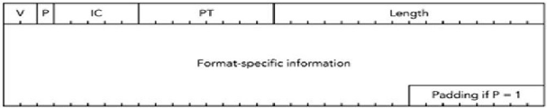

TODO：RTCP报文格式

# 1. RTP概述

1. 协议层级：应用程序通常在 `UDP` 上运行 `RTP` 以便使用其多路结点和校验服务；这两种协议都提供了传输层协议的功能。
2. 可靠性： `RTP` 并不保证传送或防止无序传送，也不确定底层网络的可靠性。 `RTP` 实行有序传送， `RTP`中的序列号允许接收方重组发送方的包序列，同时序列号也能用于决定适当的包位置，例如：在视频解码中，就不需要顺序解码。RTP提供抖动补偿和数据无序到达检测的机制。由于IP网络的传输特性，数据的无序到达是很常见的。 RTP允许数据通过IP组播的方式传送到多个目的地。
3. 组成：RTP标准定义了两个子协议，RTP和RTCP
   1. 数据传输协议RTP：用于实时传输数据。该协议提供的信息包括：时间戳（用于同步）、序列号（用于丢包和重排序检测）、以及负载格式（用于说明数据的编码格式）
   2. 控制协议`RTCP`：用于`QoS`反馈和同步媒体流。相对于`RTP`来说，`RTCP`所占的带宽非常小，通常只有5%
4. RTP回话：每一个多媒体流会建立一个`RTP`会话，一个会话包含带有`RTP`和`RTCP`端口号的`IP`地址。形成会话的端口由其他协议（例如`RTSP`和SIP）来协商。RTP和RTCP使用UDP端口1024 - 65535。
5. 功能：
   1. RTP：实时传输媒体信息、消除抖动、排序、防止丢包、在一定场景下可以传输一些信令。
   2. RTCP：质量反馈、传输层标识（cname）、给参与者发送RTCP控制报文、最小回话控制消息。
      1. 封装在UDP中
      2. 端口号是RTP端口号+1
6. 默认端口号：RTP：5004 RTCP：5005
# 2. 和RTCP RTSP RTMP等的关系

1. 主流RTP实现构建在 [User Datagram Protocol](https://en.wikipedia.org/wiki/User_Datagram_Protocol) (UDP)协议上.[[3\]](https://en.wikipedia.org/wiki/Real-time_Transport_Protocol#cite_note-Perkins_46-3) 其他专门为多媒体回话构建的传输层协议包括 [SCTP](https://en.wikipedia.org/wiki/SCTP)[[5\]](https://en.wikipedia.org/wiki/Real-time_Transport_Protocol#cite_note-5) and [DCCP](https://en.wikipedia.org/wiki/DCCP),[[6\]](https://en.wikipedia.org/wiki/Real-time_Transport_Protocol#cite_note-6) 但是到2102年他们还没有被广泛使用.[[7\]](https://en.wikipedia.org/wiki/Real-time_Transport_Protocol#cite_note-7)
2. RTSP：Real Time Streaming Protocol

# 3. 报文格式

## 3.1 rtp报文格式

1. `rtp`包在应用层创建，被传到传输层去传输。`RTP`包头格式如下：
2. rtp协议头格式如下：

- 最小12 bytes，After the header, optional header extensions may be present.
- **Version**: (2 bits) Indicates the version of the protocol. Current version is 2
- **P (Padding)**: (1 bit)表名RTP包结尾是否有填充字节。如果有的话，最后一个字节表示填充字节长度（包括自身)(填充字节可以设置加密算法)
- **X (Extension)**: (1 bit) Indicates presence of an *extension header* between the header and payload data.
- CC（CSRC Count）：本头部包含的CSRC源的数目（TODO：）
- M（Marker）：有具体协议制定，用来允许标记重要事件（TODO：）
- **PT (Payload type)**: (7 bits) 负载类型，根据应用不同，可以动态加载。
- **Sequence number**: (16 bits)发送方每发送一个RTP数据包，sequence number加一。接收方使用sequence number来检测包丢失和乱序到达。初始值应该随机化，以加强安全性。
- **Timestamp**: (32 bits) 反应RTP包中第一个比特的抽样瞬间，抽样精度必须满足同步需求，以便进行同步和抖动计算。
- SSRC：同步源标识。用于识别RTP报文发送者，标识符被随机生成，以便同一个RTP回话期中没有任何两个同步源有相同的SSRC标识符。（有可能冲突，所以RTP实现要检测和解决冲突）
- CSRC列表：0~15项，每项32byte，数目由CC给定。标识此包中负载的有贡献源。若贡献源超过15个，仅仅识别15个。
- **Header extension**: (optional, presence indicated by *Extension* field) 最开始是一个profile-specific identifier (16 bits)和a length specifier (16 bits)。length specifier表示extension hender的长度，32bit为单位，包含第一个32比特。

## 3.2 RTCP报文格式

# 4. 协议工作方式和原理

1. RTP 使用偶数端口号接收发送数据，相应的RTCP则使用相邻的下一位奇数端口号。

# 附录

## 标准文档

- [RFC](https://en.wikipedia.org/wiki/Request_for_Comments_(identifier)) [1889](https://tools.ietf.org/html/rfc1889), *RTP: A Transport Protocol for Real-Time Applications*, Obsoleted by [RFC](https://en.wikipedia.org/wiki/Request_for_Comments_(identifier)) [3550](https://tools.ietf.org/html/rfc3550).
- [RFC](https://en.wikipedia.org/wiki/Request_for_Comments_(identifier)) [3550](https://tools.ietf.org/html/rfc3550), Standard 64, *RTP: A Transport Protocol for Real-Time Applications*
- [RFC](https://en.wikipedia.org/wiki/Request_for_Comments_(identifier)) [3551](https://tools.ietf.org/html/rfc3551), Standard 65, *RTP Profile for Audio and Video Conferences with Minimal Control*
- [RFC](https://en.wikipedia.org/wiki/Request_for_Comments_(identifier)) [3190](https://tools.ietf.org/html/rfc3190), *RTP Payload Format for 12-bit DAT Audio and 20- and 24-bit Linear Sampled Audio*
- [RFC](https://en.wikipedia.org/wiki/Request_for_Comments_(identifier)) [6184](https://tools.ietf.org/html/rfc6184), *RTP Payload Format for H.264 Video*
- [RFC](https://en.wikipedia.org/wiki/Request_for_Comments_(identifier)) [4103](https://tools.ietf.org/html/rfc4103), *RTP Payload Format for Text Conversation*
- [RFC](https://en.wikipedia.org/wiki/Request_for_Comments_(identifier)) [3640](https://tools.ietf.org/html/rfc3640), *RTP Payload Format for Transport of MPEG-4 Elementary Streams*
- [RFC](https://en.wikipedia.org/wiki/Request_for_Comments_(identifier)) [6416](https://tools.ietf.org/html/rfc6416), *RTP Payload Format for MPEG-4 Audio/Visual Streams*
- [RFC](https://en.wikipedia.org/wiki/Request_for_Comments_(identifier)) [2250](https://tools.ietf.org/html/rfc2250), *RTP Payload Format for MPEG1/MPEG2 Video*
- [RFC](https://en.wikipedia.org/wiki/Request_for_Comments_(identifier)) [4175](https://tools.ietf.org/html/rfc4175), *RTP Payload Format for Uncompressed Video*
- [RFC](https://en.wikipedia.org/wiki/Request_for_Comments_(identifier)) [6295](https://tools.ietf.org/html/rfc6295), *RTP Payload Format for MIDI*
- [RFC](https://en.wikipedia.org/wiki/Request_for_Comments_(identifier)) [4696](https://tools.ietf.org/html/rfc4696), *An Implementation Guide for RTP MIDI*
- [RFC](https://en.wikipedia.org/wiki/Request_for_Comments_(identifier)) [7587](https://tools.ietf.org/html/rfc7587), *RTP Payload Format for the Opus Speech and Audio Codec*
- [RFC](https://en.wikipedia.org/wiki/Request_for_Comments_(identifier)) [7656](https://tools.ietf.org/html/rfc7656), *A Taxonomy of Semantics and Mechanisms for Real-Time Transport Protocol (RTP) Sources*
- [RFC](https://en.wikipedia.org/wiki/Request_for_Comments_(identifier)) [7798](https://tools.ietf.org/html/rfc7798), *RTP Payload Format for High Efficiency Video Coding (HEVC)*