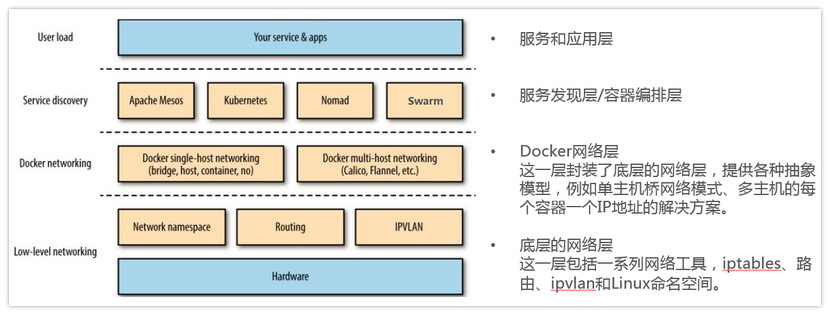

[TOC]

# 1. Kubernetes 基本网络模型

1. Kubernetes 对于网络具体实现方案，没有什么限制，也没有给出特别好的参考案例。Kubernetes 对一个容器网络是否合格做出了限制，也就是 Kubernetes 的容器网络模型。

## 1.1 约法三章

1. 第一条：任意两个 pod 之间其实是可以直接通信的，无需经过显式地使用 NAT 来接收数据和地址的转换；
2. 第二条：node 与 pod 之间是可以直接通信的，无需使用明显的地址转换；
3. 第三条：pod 看到自己的 IP 跟别人看见它所用的 IP 是一样的，中间不能经过转换。

## 1.2 四大目标

1. 四大目标其实是在设计一个 K8s 的系统为外部世界提供服务的时候，从网络的角度要想清楚，外部世界如何一步一步连接到容器内部的应用？
   1. **外部世界和 service 之间是怎么通信的？**就是有一个互联网或者是公司外部的一个用户，怎么用到 service？service 特指 K8s 里面的服务概念。
   2. **service 如何与它后端的 pod 通讯？**
   3. **pod 和 pod 之间调用是怎么做到通信的？**
   4. **最后就是 pod 内部容器与容器之间的通信？**

## 1.3 对基本约束的解释

1. 因为容器的网络发展复杂性就在于它其实是寄生在 Host 网络之上的。从这个角度讲，可以把容器网络方案大体分为 **Underlay/Overlay** 两大派别：
   1. Underlay 的标准是它与 Host 网络是同层的，从外在可见的一个特征就是它是不是使用了 Host 网络同样的网段、输入输出基础设备、容器的 IP 地址是不是需要与 Host 网络取得协同（来自同一个中心分配或统一划分）。这就是 Underlay；
   2. Overlay 不一样的地方就在于它并不需要从 Host 网络的 IPM 的管理的组件去申请 IP，一般来说，它只需要跟 Host 网络不冲突，这个 IP 可以自由分配的。

# 2. Netns (network namespace)探秘

1. **网络的命名空间：**Linux在网络栈中引入网络命名空间，将独立的网络协议栈隔离到不同的命令空间中，彼此间无法通信；docker利用这一特性，实现不容器间的网络隔离
2. **Veth设备对：**Veth设备对的引入是为了实现在不同网络命名空间的通信。
3. **Iptables/Netfilter：**Netfilter负责在内核中执行各种挂接的规则(过滤、修改、丢弃等)，运行在内核 模式中；Iptables模式是在用户模式下运行的进程，负责协助维护内核中Netfilter的各种规则表；通过二者的配合来实现整个Linux网络协议栈中灵活的数据包处理机制。
4. **网桥：**网桥是一个二层网络设备,通过网桥可以将linux支持的不同的端口连接起来,并实现类似交换机那样的多对多的通信。
5. **路由：**Linux系统包含一个完整的路由功能，当IP层在处理数据发送或转发的时候，会使用路由表来决定发往哪里。
6. docker生态分层:

# 3. 主流网络方案简介

1. 单机网络模式：Bridge 、Host、Container、None，这里具体就不赘述了。
2. **多机网络模****式：**一类是 Docker 在 1.9 版本中引入Libnetwork项目，对跨节点网络的原生支持；一类是通过插件（plugin）方式引入的第三方实现方案，比如 Flannel，Calico 等等。

## 3.1 pod内容器间通信

1. 同一个[Pod](https://www.kubernetes.org.cn/tags/pod)的容器共享同一个网络命名空间，它们之间的访问可以用localhost地址 + 容器端口就可以访问。

## 3.2 **同一Node中Pod间通信**

1. 同一Node中Pod的**默认路由**都是docker0的地址，由于它们关联在同一个docker0网桥上，地址网段相同，所有它们之间应当是能直接通信的。

## 3.3 **不同Node中Pod间通信**

1. 不同Node中Pod间通信要满足2个条件： Pod的IP不能冲突； 将Pod的IP和所在的Node的IP关联起来，通过这个关联让Pod可以互相访问

## 3.4 Pod到service到外部网络的通信

### 3.4.1 service 和 **Kube-proxy**

1. Service是一组Pod的服务抽象，相当于一组Pod的LB，负责将请求分发给对应的Pod；Service会为这个LB提供一个IP，一般称为ClusterIP。
2. Kube-proxy是一个简单的网络代理和负载均衡器，它的作用主要是负责Service的实现，具体来说，**就是实现了内部从Pod到Service和外部的从NodePort向Service的访问**。
3. 实现方式：
   - userspace是在用户空间，通过kuber-proxy实现LB的代理服务，这个是kube-proxy的最初的版本，较为稳定，但是效率也自然不太高。
   - iptables是纯采用iptables来实现LB，是目前kube-proxy默认的方式。
     - 在这种模式下，kube-proxy监视Kubernetes主服务器添加和删除服务和端点对象。对于每个服务，它安装iptables规则，捕获到服务的clusterIP（虚拟）和端口的流量，并将流量重定向到服务的后端集合之一。
     - 默认情况下，后端的选择是随机的。可以通过将service.spec.sessionAffinity设置为“ClientIP”（默认为“无”）来选择基于客户端IP的会话关联。
     - 与用户空间代理一样，最终结果是绑定到服务的IP:端口的任何流量被代理到适当的后端，而客户端不知道关于Kubernetes或服务或Pod的任何信息。**这应该比用户空间代理更快，更可靠。然而，与用户空间代理不同，如果最初选择的Pod不响应，则iptables代理不能自动重试另一个Pod，因此它取决于具有工作准备就绪探测。**

### 3.4.2 **Kube-dns介绍**

1. Kube-dns用来为kubernetes service分配子域名，在集群中可以通过名称访问service；通常kube-dns会为service赋予一个名为“service名称.namespace.svc.cluster.local”的A记录，用来解析service的clusterip。

2. Kube-dns组件：

   - 在Kubernetes v1.4版本之前由“Kube2sky、Etcd、Skydns、Exechealthz”四个组件组成。
   - 在Kubernetes v1.4版本及之后由“Kubedns（通过k8s api监控service资源变化并更新dns，树形结构内存中存储）、dnsmasq（dns查询和缓存）、exechealthz(健康检查)”三个组件组成。

# 4. CNI(container network interface)

1. CNI意为容器网络接口，它是一种标准的设计，为了让用户在容器创建或销毁时都能够更容易地配置容器网络
2. 常见cni插件Flannel、Calico、Weave和Canal对比见 [Kubernetes CNI网络最强对比：Flannel、Calico、Canal和Weave](https://segmentfault.com/a/1190000018698263)
   - Flannel简单成熟，初期适合使用，直到需要一些它无法提供的东西。
   - Calico以其性能和灵活性闻名，在出现网络问题时，用户还可以用更常规的方法进行故障排除。Calico听商业支持。
   - Canel想结合Flannel和Calico的优点，后来发现两者提供的功能已经足够，这个项目已经不复存在。
   - 对于那些寻求功能丰富的网络、同时希望不要增加大量复杂性或管理难度的人来说，Weave是一个很好的选择。此外，Weave也提供收费的技术支持，可以为企业用户提供故障排除等等技术服务。

# 参考资料

1. [从零开始入门 K8s：Kubernetes 网络概念及策略控制](<https://www.infoq.cn/article/ERuLek5gPfUxdHC5cMTO>)

2. [Kubernetes网络原理及方案](https://www.kubernetes.org.cn/2059.html)

3. [Kubernetes CNI网络最强对比：Flannel、Calico、Canal和Weave](https://segmentfault.com/a/1190000018698263)