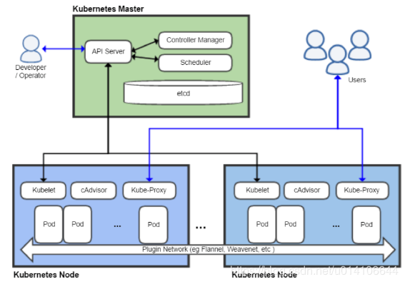
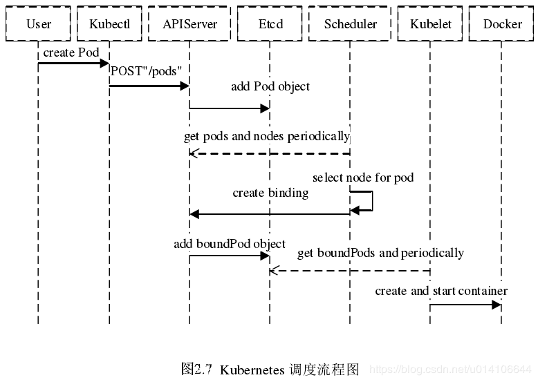

# 1. 问题

## 1.1 k8s是否会进行资源判断和等待，使用k8s的系统是否需要自己进行资源管理

答案：有的，在预调度阶段会进行资源判断，资源不满足时处于pending状态，此时优先级高的会被优先调度。

# 2. 知识点

## 2.1 vm和容器的区别

1. Containers are similar to VMs, but they have relaxed isolation properties to share the Operating System (OS) among the applications. Therefore, containers are considered lightweight. Similar to a VM, **a container has its own filesystem, CPU, memory, process space, and more.** As they are decoupled from the underlying infrastructure, they are portable across clouds and OS distributions.

## 2.2 k8s能做什么

1. **Service discovery and load balancing**

Kubernetes can expose a container using the DNS name or using their own IP address. If traffic to a container is high, Kubernetes is able to load balance and distribute the network traffic so that the deployment is stable.

2. 存储挂载

Kubernetes allows you to automatically mount a storage system of your choice, such as local storages, **public cloud providers**, and more.

4. 自愈**Self-healing**

Kubernetes **restarts containers that fail, replaces containers, kills containers that don’t respond to your user-defined health check**, and doesn’t advertise them to clients until they are ready to serve.

## 2.3 k8s不能做什么

## 2.4 k8s架构



## 2.5 k8s调度过程



1. Scheduler 采用 watch 机制，一旦 Etcd 存储 Pod 信息成功便会立即通知APIServer，APIServer会立即把Pod创建的消息通知Scheduler，Scheduler发现 Pod 的属性中 Dest Node 为空时（Dest Node=””）便会立即触发调度流程进行调度。

2. 调度过程：对应的代码在·[kubernetes](https://github.com/kubernetes/kubernetes)/[pkg](https://github.com/kubernetes/kubernetes/tree/master/pkg)/**scheduler**//scheduler.go
   1. 首先，客户端通过API Server的REST API/kubectl/helm创建pod/service/deployment/job等，支持类型主要为JSON/YAML/helm tgz。
   2. 接下来，API Server收到用户请求，存储到相关数据到etcd。
   3. 调度器通过API Server查看(应该有轮询和主动触发两种机制)未调度（bind）的Pod列表，循环遍历地为每个Pod分配节点，尝试为Pod分配节点。调度过程分为2个阶段：
      1. 第一阶段：预选过程，过滤节点，调度器用一组规则过滤掉不符合要求的主机。**比如Pod指定了所需要的资源量，那么可用资源比Pod需要的资源量少的主机会被过滤掉**。
      2. 第二阶段：优选过程，节点优先级打分，对第一步筛选出的符合要求的主机进行打分，在主机打分阶段，调度器会考虑一些整体优化策略，比如把容一个Replication Controller的副本分布到不同的主机上，使用最低负载的主机等。
   4. 选择主机：选择打分最高的节点，进行binding操作，结果存储到etcd中。所选节点对于的kubelet根据调度结果执行Pod创建操作。

3. 调度的选择过程：

   1. 预选过程：  源码位置[kubernetes](https://github.com/kubernetes/kubernetes)/[pkg](https://github.com/kubernetes/kubernetes/tree/master/pkg)/[scheduler](https://github.com/kubernetes/kubernetes/tree/master/pkg/scheduler)/[algorithm](https://github.com/kubernetes/kubernetes/tree/master/pkg/scheduler/algorithm)/[predicates](https://github.com/kubernetes/kubernetes/tree/master/pkg/scheduler/algorithm/predicates)/**predicates.go**

      - 主要包括主机的目录，端口，cpu内存资源等条件进行物理主机的筛选，筛选出可以进行调度的物理机节点，然后进行优选环节，通过某种策略进行可用节点的评分，最终选出最优节点。

   2. 优选过程： 源码位置 [kubernetes](https://github.com/kubernetes/kubernetes)/[pkg](https://github.com/kubernetes/kubernetes/tree/master/pkg)/[scheduler](https://github.com/kubernetes/kubernetes/tree/master/pkg/scheduler)/[algorithm](https://github.com/kubernetes/kubernetes/tree/master/pkg/scheduler/algorithm)/**priorities**/

      - 用一组优先级函数处理每一个通过预选的节点，每一个优先级函数会返回一个0-10的分数，分数越高表示节点越优， 同时每一个函数也会对应一个表示权重的值。最终主机的得分用以下公式计算得出：`finalScoreNode = (weight1 * priorityFunc1) + (weight2 * priorityFunc2) + … + (weightn * priorityFuncn)`
        

4. 优先级策略：<https://blog.csdn.net/u014106644/article/details/84372230>

   1. `LeastRequestedPriority`：节点的优先级就由节点空闲资源与节点总容量的比值，即由（总容量-节点上Pod的容量总和-新Pod的容量）/总容量）来决定。CPU和内存具有相同权重，**资源空闲比越高的节点得分越高**。

      ```go
      cpu((capacity – sum(requested)) * 10 / capacity) + memory((capacity – sum(requested)) * 10 / capacity) / 2
      ```

   2. `BalancedResourceAllocation`：CPU和内存使用率越接近的节点权重越高，该策略不能单独使用，必须和`LeastRequestedPriority`组合使用，**尽量选择在部署Pod后各项资源更均衡的机器**。如果请求的资源（CPU或者内存）大于节点的capacity，那么该节点永远不会被调度到。

   3. `SelectorSpreadPriority`：**为了更好的容灾，对同属于一个service、replication controller或者replica的多个Pod副本，尽量调度到多个不同的节点上**。如果指定了区域，调度器则会尽量把Pod分散在不同区域的不同节点上。当一个Pod的被调度时，会先查找Pod对于的service或者replication controller，然后查找service或replication controller中已存在的Pod，运行Pod越少的节点的得分越高。

   4. `ImageLocalityPriority`：根据Node上是否存在一个pod的容器运行所需镜像大小对优先级打分，分值为0-10。遍历全部Node，**8如果某个Node上pod容器所需的镜像一个都不存在，分值为0；如果Node上存在Pod容器部分所需镜像，则根据这些镜像的大小来决定分值，镜像越大，分值就越高；如果Node上存在pod所需全部镜像，分值为10**。

   5. `MostRequestedPriority` : 在 `ClusterAutoscalerProvider` 中，替换 `LeastRequestedPriority`，给使用多资源的节点，更高的优先级。计算公式为：`(cpu(10 sum(requested) / capacity) + memory(10 sum(requested) / capacity)) / 2`.

## 2.6 **Pod优先级（Priority）和抢占（Preemption）**

1. pod priority指的是Pod的优先级，高优先级的Pod会优先被调度，或者在资源不足低情况牺牲低优先级的Pod，以便于重要的Pod能够得到资源部署.

2. 当节点没有足够的资源供调度器调度Pod、导致Pod处于pending时，抢占（preemption）逻辑会被触发。Preemption会尝试从一个节点删除低优先级的Pod，从而释放资源使高优先级的Pod得到节点资源进行部署。

3. 例子：

   - 定义`PriorityClass`对象：

   ```yaml
   apiVersion: scheduling.k8s.io/v1alpha1
   kind: PriorityClass
   metadata:
   name: high-priority
   value: 1000000
   globalDefault: false
   description: "This priority class should be used for XYZ service pods only."
   ```

   - 在Pod的`spec. priorityClassName`中指定已定义的`PriorityClass`名称

   ```yaml
   apiVersion: v1
   kind: Pod
   metadata:
   name: nginx
   labels:
   env: test
   spec:
   containers:
   - name: nginx
   image: nginx
   imagePullPolicy: IfNotPresent
   priorityClassName: high-priority
   ```

   