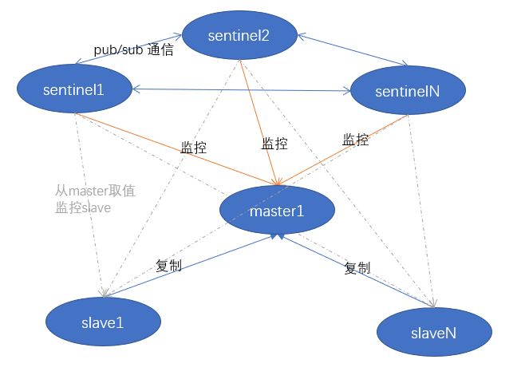
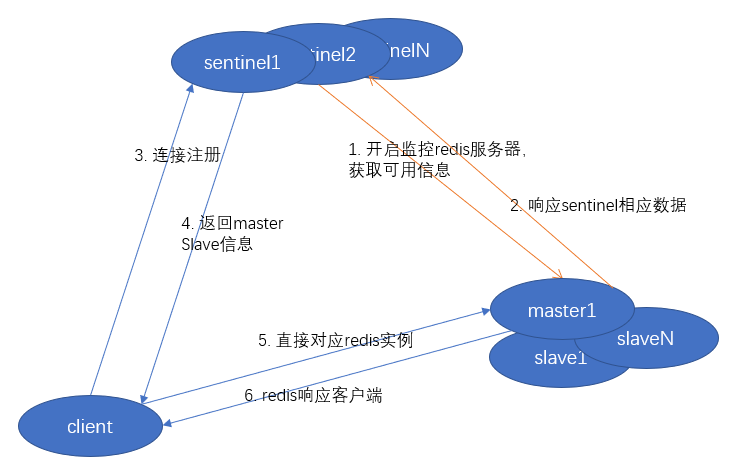
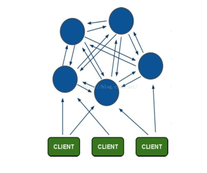
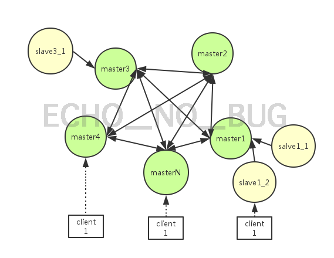

[TOC]

# Redis部署方式对比

|对比项| 单机 | 主从 | 哨兵 | cluster |
|-| ---- | ---- | ---- | ------- |
|介绍| 单个Redis | 主从（可多从） | Redis Sentinel 集群和 Redis 数据集群。其中 Redis Sentinel 集群是由若干 Sentinel 节点组成的分布式集群，可以实现故障发现、故障自动转移、配置中心和客户端通知。Redis Sentinel 的节点数量要满足 2n+1(n>=1)的奇数个 | Redis Cluster 采用虚拟槽分区，所有的键根据哈希函数映射到 0～16383 个整数槽内，每个节点负责维护一部分槽以及槽所印映射的键值数据 |
|扩展性|  |  | 不能动态扩展 | 可线性扩展到 1000 多个节点，节点可动态添加或删除。数据按照 slot 存储分布在多个节点，节点间数据共享，可动态调整数据分布。 |
|部署难度| 简单 |      | 部署较简单 |         |
|空间利用率| 高 | 50% | Redis 数据节点中 slave 节点作为备份节点不提供服务 | Slave 在集群中充当“冷备”，不能缓解读压力，当然可以通过 SDK 的合理设计来提高 Slave 资源的利用率 |
|高可用| 无（一般配以supervisor或crontab 保证） | 可以 | 能够解决 Redis 主从模式下的高可用切换问题 | 部分节点不可用时，集群仍可用。通过增加 Slave 做 standby 数据副本，能够实现故障自动 failover，节点之间通过 gossip 协议交换状态信息，用投票机制完成 Slave 到 Master 的角色提升 |
|高性能| 高，受限于单核CPU处理能力 | 高，可以读写分离。但也受限于单机能力 | 方便实现 Redis 数据节点的线形扩展，轻松突破 Redis 自身单线程瓶颈，可极大满足 Redis 大容量或高性能的业务需求 | |
|数据可靠性| 可以，因为可以持久化                   | 可以，因为可以持久化 | | |
|数据持久化| 可以 | 可以 | | |
|故障恢复|  | 复杂，如果没有RedisHA系统，需要手动切换，并通知业务方更新配置 | 能够解决 Redis 主从模式下的高可用切换问题 | |
|常见部署模式|  |  | 3哨兵3Redis，Redis一主二从 | 最小配置 6 个节点以上(3 主 3 从) |
|读写分离|  |  | 不能解决读写分离问题，实现起来相对复杂 | 主节点提供读写操作，从节点作为备用节点，不提供请求，只作为故障转移使用 |
| 客户端       |  |  |  | Client 实现复杂，驱动要求实现 Smart Client，缓存 slots mapping 信息并及时更新，提高了开发难度，客户端的不成熟影响业务的稳定性。目前仅 JedisCluster 相对成熟，异常处理部分还不完善，比如常见的“max redirect exception”。 |
| 缺点         |  |  |  | 1. 不支持多数据库空间，单机下的 redis 可以支持到 16 个数据库，集群模式下只能使用 1 个数据库空间，即 db 0 |

1. 数据通过异步复制，不保证数据的强一致性（Redis事物是假事物，所以不能保证强一致性）

# Redis Sentiment

1. 架构图

# cluster模式

1. 架构图

- 从redis 3.0之后版本支持redis-cluster集群.Redis-Cluster采用无中心结构，每个节点保存数据和整个集群状态,每个节点都和其他所有节点连接

- slave是master 的replicas，salve本身不占哈希槽slots.一个master可以没有或有任意个slave,每个master拥有的salve数量是任意的。
- 当某个master 挂掉(failover)时候，slave会自动顶替它的master
- 如果某个master恰巧没有slave,挂掉之后，整个redis集群就都挂掉了

# 参考资料

1. [Redis Cluster详解](https://www.jianshu.com/p/87e06d81b597)

2. [redis cluster集群方案详解](https://www.jianshu.com/p/1ff269e8869d)

3. [**搭建redis（单机、集群和哨兵）**](<https://juejin.im/post/5cfe39e4f265da1bb2772510>)

4. [03.Redis单实例部署之基于RDB持久化](https://www.cnblogs.com/chenliangc/p/12329733.html)