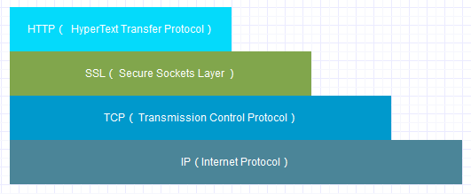
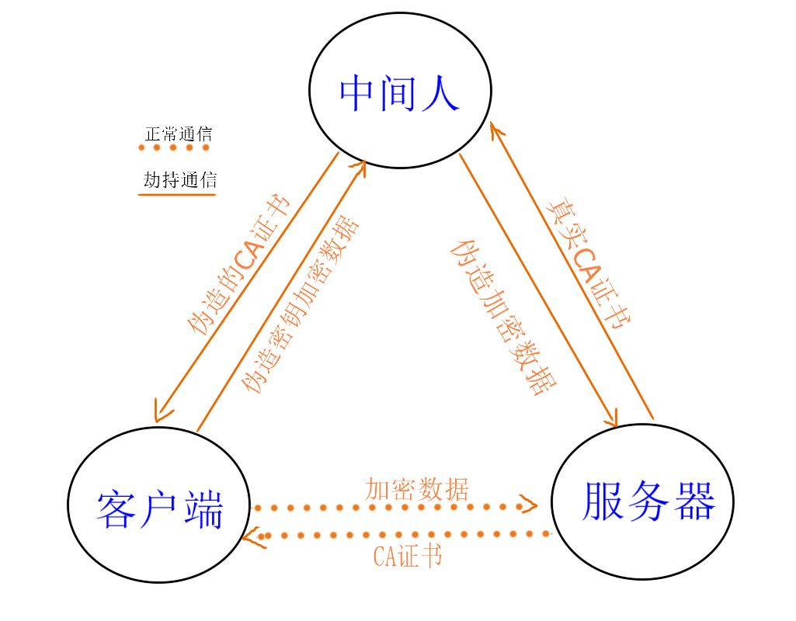

# 1. 常见安全问题
1. 窃听：加密防窃听
2. 篡改：摘要防篡改
3. 冒用：非对称加密防冒充(能被公钥解密的，一定是对应私钥加密的)

# 2. 加密防窃听
## 2.1 对称加密

### 2.1.1 特征

1. 对称加密的加密秘钥和解密秘钥相同。

### 2.1.2 优缺点

1. 对称加密相比非对称加密算法来说，加解密的效率要高得多、加密速度快。
2. 密钥的管理和分发上比较困难，不是非常安全，密钥管理负担很重。
3. 对称加密加密与解密使用的是同样的密钥，所以速度快，但由于需要将密钥在网络传输，所以安全性不高。

### 2.1.3 常用算法

1. DES，AES

## 2.2 非对称加密

### 2.2.1 特征

1. 加密秘钥和解密秘钥不用。
2. 公钥加密的信息，只有私钥才能解密。反之，私钥加密的信息，只有对应的公钥才能解密（能被公钥解密的，一定是对应私钥加密的信息）。

### 2.2.2 优缺点

1. 非对称加密使用了一对密钥，公钥与私钥，所以安全性高，但加密与解密速度慢。

### 2.2.3 常用算法

1. RSA（用在https上）、ECC（椭圆曲线加密算法）。（根据<https://www.jianshu.com/p/e27ab5222fa9>, ECC破解难度大于RSA）

## 2.3 总结

1.  **解决的办法是将对称加密的密钥使用非对称加密的公钥进行加密，然后发送出去，接收方使用私钥进行解密得到对称加密的密钥，然后双方可以使用对称加密来进行沟通**
2.  公钥加密，只有对应私钥能解开（**保密**）。私钥加密，只有对应公钥能解开；也即能被公钥解密的，一定是对应私钥加密的（**不可抵赖，防伪造**，但是不能保密，因为此时公钥是公有的）。

# 3. 摘要防篡改

## 3.1 特征

1. 消息摘要算法的主要特征是加密过程不需要密钥（**无秘钥**），并且**经过加密的数据无法被解密**（**不可逆**），只有输入相同的明文数据经过相同的消息摘要算法才能得到相同的密文。
2. 数据摘要算法也被称为哈希（Hash）算法或散列算法。
3. 无论输入的消息有多长，计算出来的消息摘要的长度总是固定的（**等长**）。
4. 一般地，只要输入的消息不同，对其进行摘要以后产生的摘要消息也必不相同；但相同的输入必会产生相同的输出。好的摘要算法，没有人能从中找到“碰撞”或者说极度难找到，虽然“碰撞”是肯定存在的（碰撞即不同的内容产生相同的摘要）。（**少碰撞**：算法把无限的映射成有限，因此可能会有碰撞（两个不同的信息，算出的摘要相同））

## 3.2 常用算法

### 3.2.1 MD5、CRC32、SHA256介绍

1. MD5（Message-Digest Algorithm 5，消息摘要算法版本5）、SHA-256（Secure Hash Algorithm，摘要长度256）、CRC32（Cyclic Redundancy Check，循环冗余校验，32指结果32位，如WinRAR、WinZIP）
2. CRC算法的优点在于简便、速度快，严格的来说，CRC更应该被称为数据校验算法，但其功能与数据摘要算法类似，因此也作为测试的可选算法。
3. MD5由Ron Rivest（RSA公司）在1992年提出，产生16字节（128位）的校验值。目前在互联网上进行大文件传输时，都要得用MD5算法产生一个与文件匹配的、存储MD5值的文本文件（后缀名为 .md5或.md5sum）
4. 由于SHA产生的数据摘要的长度更长，因此更难以发生碰撞，因此也更为安全，它是未来数据摘要算法的发展方向。由于SHA系列算法的数据摘要长度较长，因此其运算速度与MD5相比，也相对较慢。

> SHA-1 is a 160-bit hash. SHA-2 is actually a “family” of hashes and comes in a variety of lengths, the most popular being 256-bit.           -- 见<https://www.thesslstore.com/blog/difference-sha-1-sha-2-sha-256-hash-algorithms/>

目前SHA1的应用较为广泛，主要应用于CA和数字证书中，另外在目前互联网中流行的BT软件中，也是使用SHA1来进行文件校验的。

### 3.2.2 MD5、CRC32、SHA256对比

1. 校验值的长度不同。CRC校验位的长度跟其多项式有关系，一般为16位或32位；MD5是16个字节（128位）；SHA1是20个字节（160位）；
2. 安全性不同。这里的安全性是指检错的能力，即数据的错误能通过校验位检测出来。CRC的安全性跟多项式有很大关系，相对于MD5和SHA1要弱很多；MD5的安全性很高，不过大概在04年的时候被山东大学的王小云破解了；SHA1的安全性最高（2017年初 Google 表示其已成功破解了 SHA-1 加密 , Google 晒出的两份特制 PDF 文档 , 虽然它们拥有相同的 SHA-1 哈希值 , 但内容上却不尽相同 ）。

## 3.3 应用

### 3.3.1 数字签名

1. **把对一个信息的摘要用私钥加密后称为该消息的指纹或数字签名**。数字签名是**保证信息的完整性**和**不可否认性**的方法。
2. 数据的**完整性**是指信宿接收到的消息一定是信源发送的信息，而中间绝无任何更改
3. 信息的**不可否认性**是指信源不能否认曾经发送过的信息。其实，通过数字签名还能实现对信源的身份识别（认证），即确定“信源”是否是信宿意定的通信伙伴。
4. 数字签名应该具有唯一性，即不同的消息的签名是不一样的；同时还应具有不可伪造性，即不可能找到另一个消息，使其签名与已有的消息的签名一样。
5. 不可逆性，即无法根据签名还原被签名的消息的任何信息

### 3.3.2 大文件下载

1. 主要是MD5

### 3.3.3 用来对比原始的是否相同

1. 对比用户输入的密码和数据库中的密码是否相同，不需要存储原密码。
2. 对比得到的文件和原始的文件是否相同。

# 4. 非对称加密防冒用

## 4.1 摘要、数字签名、数字证书的区别

1. 一段信息，经过摘要算法得到一串定长哈希值，就是摘要。摘要经过私钥加密，就得到数字签名（接收方先用公钥解密得到摘要（为了鉴定发送者身份，否则任何人都可以生成信息及对应摘要），然后用收到的内容重新计算摘要，看与数字签名里面的摘要是否相等（鉴定信息是否被中途修改））。
   1. 为什么不直接对内容进行非对称加密，而是先生成摘要，然后对摘要进行非对称加密？非对称加密慢，摘要算法可以将任意长度的内容映射成固定长度的哈希值，这样进行非对称加解密时间是可以预估的。
2. 上述过程中，如果公钥被人替换，那么会有问题。解决办法是由可以信赖的CA来统一管理公钥：发送方将自己的公钥发送给CA，CA用自己的私钥给发送方的公钥加密，得到发送方的数字证书。接收方维护了一个受信赖的CA列表及其公钥（如浏览器中的不受信任的CA警告），然后用CA的公钥对发送方的数字证书进行解密得到发送方的公钥。然后用发送方的公钥解密数字签名得到摘要。个人可以自己在浏览器上添加受信任的CA。

# 5. https

## 5.1 https是什么

## 5.3 https如何解决问题

### 5.3.1 https工作流程图

> 1. Client发起一个HTTPS（https:/demo.linianhui.dev）的请求，根据RFC2818的规定，Client知道需要连接Server的443（默认）端口。
> 2. Server把事先配置好的**公钥证书**（public key certificate）返回给客户端。
> 3. Client验证**公钥证书**：比如是否在有效期内，证书的用途是不是匹配Client请求的站点，是不是在CRL吊销列表里面，它的上一级证书是否有效，这是一个递归的过程，直到验证到根证书（操作系统内置的Root证书或者Client内置的Root证书）。如果验证通过则继续，不通过则显示警告信息。
> 4. Client使用**伪随机数生成器**生成加密所使用的**会话密钥**，然后用证书的公钥加密这个**会话密钥**，发给Server。
> 5. Server使用自己的**私钥**（private key）解密这个消息，得到**会话密钥**。至此，Client和Server双方都持有了相同的**会话密钥**。
> 6. Server使用**会话密钥**加密“**明文内容A**”，发送给Client。
> 7. Client使用**会话密钥**解密响应的密文，得到“**明文内容A**”。
> 8. Client再次发起HTTPS的请求，使用会话密钥加密请求的“**明文内容B**”，然后Server使用**会话密钥**解密密文，得到“**明文内容B**”。
>
> 见：[[信息安全\] 3.HTTPS工作流程](https://www.cnblogs.com/linianhui/p/security-https-workflow.html)

2. HTTPS是使用RSA进行身份验证和交换密钥，然后再使用交换的密钥进行加解密数据。身份验证是使用RSA的非对称加密，而数据传输是双方使用相同的密钥进行的对称加密。

## 5.4 https的问题

### 5.4.1 中间人攻击

1. 关键在于**黑客通过特殊途径在被攻击者的手机上安装根证书；**：

> - 黑客通过特殊途径在被攻击者的手机上安装根证书；
> - 客户端发起连接请求，代理服务器（Fiddler）在中间截取请求，返回自己签名的伪造证书；
> - 客户端收到证书后会在系统中查找信任的根证书，因为黑客已经事先在被攻击者手机上安装了自己的根证书，因此客户端验证通过；
> - 客户端后续就会把Fiddler当成合法的服务器；
> - 而Fiddler会与真实的服务器通信，截获密钥，解密数据。
>
> ​                                           ---- [中间人攻击，HTTPS也可以被碾压](https://blog.fundebug.com/2019/09/17/mitm-for-https/)

# 参考资料

1. [常用的安全算法](https://tojohnonly.github.io/25-%E5%B8%B8%E7%94%A8%E7%9A%84%E5%AE%89%E5%85%A8%E7%AE%97%E6%B3%95.html)

2. [常用消息摘要算法介绍](https://www.cnblogs.com/schips/p/9952158.html)

3. [数据安全之MD5、SHA-1、CRC32区别](https://www.cnblogs.com/qlqwjy/p/8594271.html)

4. [【区别】摘要、数字签名、数字证书](https://zhuanlan.zhihu.com/p/32754315)

5. [[信息安全\] 3.HTTPS工作流程](https://www.cnblogs.com/linianhui/p/security-https-workflow.html)

6. [中间人攻击，HTTPS也可以被碾压](https://blog.fundebug.com/2019/09/17/mitm-for-https/)