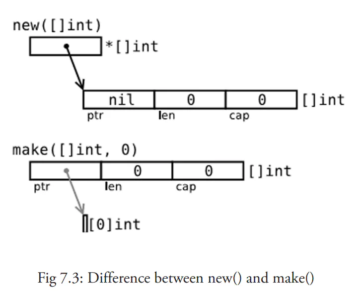

[TOC]

# golang相关
1. main函数挂掉，协程是否会结束?

   1. main函数结束时，会一同结束所有关联的协程；普通协程结束时，不会结束关联的子协程。也就是说，协程与main函数同生命周期。见:[goroutine_life_cycle](../golang/routine/goroutine_life_cycle/main.go)

2. 协程和线程的区别？
   1. 见[routine_thread_process](../golang/routine/routine_thread_process.md)
      - go协程是用户态的goruntime调度的，线程是os内核来调度的。go协程底层维护了专有的线程池来执行协程，专有的调度策略比内核通用的调度策略高效。
      - go协程初始栈大小为2K，后面根据需要动态扩缩容；线程初始大小默认8M，大小不变，超过之后会报错。

3. 如何保证协程结束后，main函数才结束。

   1. 详见 [01 等待所有goroutine结束](../golang/sync/01%20等待所有goroutine结束.md), 被动等待直接就`sync.WaitGroup`就行；主动结束，则需要finish chan加`sync.WaitGroup`。

4. golang垃圾回收？c返回struct数组，b返回struct数组的一个成员的指针，a里面访问这个指针出错？

   1. 详见：[TODO：Go GC 20 问](../golang/gc/learning_go_gc_20_question.md) 追踪式，三色标记法。
   2. TODO:测试

5. append操作是怎么执行的？
   1. 详见[golang slice 是如何进行 append 操作的](<https://icell.io/how-golang-slice-append-works/>), 这里面的一个例子分析，很有意思。
   2. 简单的说：cap为1024前，每次扩容是两倍；cap达到1024后，每次扩容1/4.
   3. slice是一个三元组：`(arrayPointer,len,cap)`

6. 同步异步channel，定时channel

   1. 见 [01 阻塞式channel和非阻塞式channel](../golang/channel/01%20阻塞式channel和非阻塞式channel.md)
   2. chan默认缓冲区大小为0，默认是阻塞的；select 里面加default语句是非阻塞的，select里面加`time.After`语句是定时的

7. new 和make的区别。new申请可能在堆和栈上。

   1. new 和make的目的不同：
      - new用来分配内存，但与其他语言中的同名函数不同，它不会**初始化**内存为有意义的值，只会将内存**置零**。
      - make用于slice,map,channel的创建，并返回类型为T（非指针）的**已初始化（非零值）**的值；出现这种差异的原因在于，这三种类型本质上为引用类型，**它们在使用前必须初始化**
   2. new和make**都在堆上分配内存**，但是它们的行为不同，适用于不同的类型

   

8. C++的vector怎么实现的，和slice的区别。slice共享底层数组？？？slice使用链表实现的？底层机构是什么？切面的底层数据结构：数组指针的封装？？

   1. slice是`(len,cap,pointer)`的三元组，`pointer`指向底层一片连续的内存。
   2. slice可能共享数组，看扩容措施：cap还没满就不会更新pointer，此时两个slice的len可能不同。
      1. 如果期望容量大于当前容量的两倍就会使用期望容量；
      2. 如果当前切片容量小于 1024 就会将容量翻倍；
      3. 如果当前切片容量大于 1024 就会每次增加 25% 的容量，直到新容量大于期望容量；
   3. slice的拷贝用copy:
      1. Go语言的内置函数 copy() 可以将一个数组切片复制到另一个数组切片中，如果加入的两个数组切片不一样大，就会按照其中较小的那个数组切片的元素个数进行复制。详见： [Go语言copy()：切片复制（切片拷贝）](<http://c.biancheng.net/view/29.html>)

9. golang里面与select、epoll对应的。golang如何实现对应的功能。

   1. TODO：golang里面网络编程的内容
10. golang服务热更新。（fork一个子进程，beego代码里面有，去看）

    1. 见：<https://github.com/hustlihaifeng/codeinterview/blob/master/architecture/go_server_hot_upgrade.md>

# 网络相关的
1. 三次握手和四次挥手？time_wait过多怎么处理？为什么握手是三次，挥手是四次？tcp的等待队列？三次握手的过程和队列变化？什么时候会出现time_wait?
2. udp和和tcp的区别？UDP上实现可靠传输？
3. 短连接和长链接各有什么好处和弊端？time_wait和重连机制
4. 2M udp怎么传？考虑ant转换协议，2M/574，会分包丢包？ MTU等。2M的TCP传输呢？路由次数与应用层规避问题？为什么time_wait要2*MSL（防重用tcp链接，为了不接受旧链接的数据）？ 什么时候可以缩短MSL的时间？（四元组在加一个维度）如何加这个维度呢？
5. 常用的网络分析工具与用法？netstat/lsof ping(禁止 ，ping攻击) telnet（ping不通但是telnet能通。禁ping） route_path/trace_route tcpdump(转码工具：wireshark)
6. select、poll、epoll区别？epoll的边缘触发和水平触发。
7. tcp的拥塞控制。
8. 如何理解五层网络协议

## 网络协议
1. rpc的原理是什么？
### http协议

# 操作系统
1. 一个fd是什么？文件句柄（lsof）。fork后父子进程中的文件描述符关系（关掉其中一个另一个是否能访问）
2. 线程和进程的区别？进程间通信方式有哪几种，各如何实现？线程间通信方式？线程局部变量。
3. kill 做了什么？如何做的？有那几中类型。
4. 优雅的终止程序？结束处理。
5. 如何用代码生成后台进程？unix网路编程。
6. 僵尸进程和孤儿进程，过多怎么办？
## docker和k8s

## linux
1. 10000行里面找1000，2000行
2. 网络 cpu 内存 磁盘io：这些状况查看
3. gdb相关的
4. 程序性能优化：perf strace 。。。。
5. linux的内存管理。自己实现一个内存池，线程池，连接池。

# 数据库相关的
## redis
1. redis有哪几种数据？string set hash 。。。
2. redis的数据结构是什么？哈希函数是什么
3. 哈希表如何进行扩缩容？两个哈希表...如何变化
4. 哈希表如何防止碰撞
5. redis的高可用架构？哨兵和主从。具体怎么实现。redis cluster
6. zset 怎么实现的（跳表），set怎么实现的
7. redis的数据持久化？区别：rdb aof
8. redis访问不了？怎么定位。如何知道redis使用哪个配置文件。
9. redis加密和不加密怎么配

## mysql
1. myisam和innodb的级别，底层数据结构，怎么变化的
2. mysql性能优化，查询优化。
3. 查询索引命中情况。聚集索引，二级索引。联合索引。什么语句查看索引命中情况，explain各个列代表什么意思。
4. 锁：乐观锁和悲观锁， 表锁 行锁 间隙锁 读锁写锁 排它锁共享锁
5. 数据一致性 隔离界别（脏读 。。。）ACID MVCC（多版本并发控制，innodb的实现） 默认隔离级别（如何实现，各个隔离级别怎么实现）
6. 服务的数据一致性（电商，金融）。数据一致性有哪些协议。分布式服务的数据一致性。
7. MYSQL架构: 主从架构 proxy 分布式 多主架构 读写分离
8. MYSQL不能访问，你怎么定位。
9. 自适应哈希，哈希索引？？
10. innodb表空间
11. 慢查询日志，这些日志
12. mysql性能，能承载多少用户
13. mysql配置：缓存大小，双一配置（落盘）
14. 左连接和右链接。join 默认全连接。
15. 如何优化MySQL主从同步延时
16. MySQL怎样的分布式架构才能集群化提高并发访问。

# 服务架构
1. 12306并发超卖问题。
  - 不同区间分不同时段卖
  - 把票分段
2. 输出了一个网址到展示页面发生了哪些操作。网址缓存在了哪些地方？
3. 如何实现session和cookie

# 问题定位

1. 线上内存/cpu/磁盘负载突然变高，如何定位？
2. 线上用户投诉访问慢?

# 以往工作经历

## 1. 并行备份

## 1.1 问题

1. 线上服务主要是mysql5.5、mysql5.6版本，备份程序mysqldump是单线程的。在数据量比较大的时候，会出现一整天都备份不完的情况。

## 1.2 解决办法

1. 实现一个表级多线程备份，来加快备份速度。

## 1.3 亮点与扩展

### 1.3.1 多线程备份如何保证数据一致性并尽量减少对业务影响

### 1.3.2 多线程之间如何同步

#### 1.3.2.1 并行的数据结构

#### 1.3.2.2 同步、等待这些

##### 1.3.2.2.1 pthread_mutex、pthread_cond

##### 1.3.2.2.2 其他线程同步方案如信号量

> 由于信号量只能进行两种操作等待和发送信号，即P(sv)和V(sv),他们的行为是这样的：
>
> - P(sv)：如果sv的值大于零，就给它减1；如果它的值为零，就挂起该进程的执行
> - V(sv)：如果有其他进程因等待sv而被挂起，就让它恢复运行，如果没有进程因等待sv而挂起，就给它加1.

##### 1.3.2.2.3 多进程同步方案

### 1.3.3 并发度如何控制

#### 1.3.3.2 cpu、磁盘、读写速度如何监控

### 1.4.4 无锁编程与各种锁

#### cas无锁编程

1. 如何防止ABA的问题

### 1.4.5 官方方案与本方案对比

### 1.4.6 本方案的缺陷，如何进一步提高并发度

### 1.4.7 数据的备份恢复概要方案

### 1.4.8 数据库的高可用切换方案

### 1.4.9 数据库应对大流量时的分布式方案

### 1.4.10 常见分布式一致性方案

### 1.4.11 其他相关工作的原理

#### 1.4.11.1 blob大字段压缩

#### 1.4.11.2 binlog限速

#### 1.4.12.3 在线加字段

